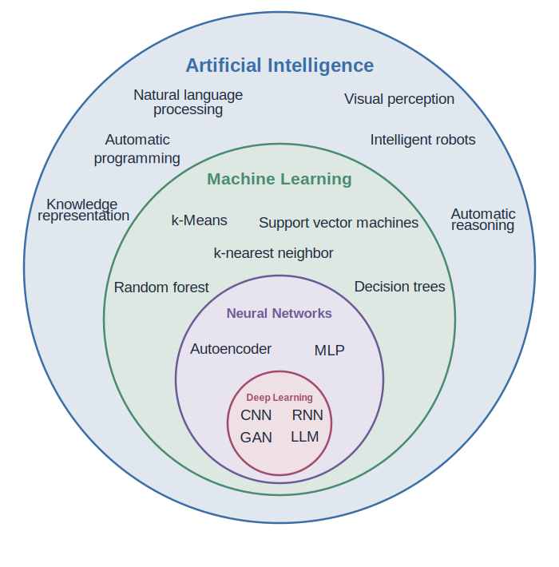
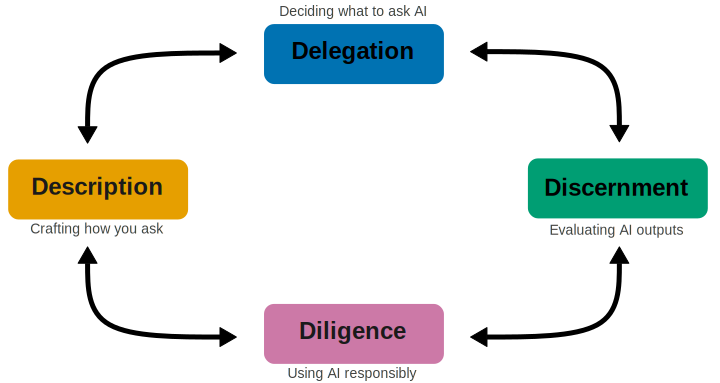
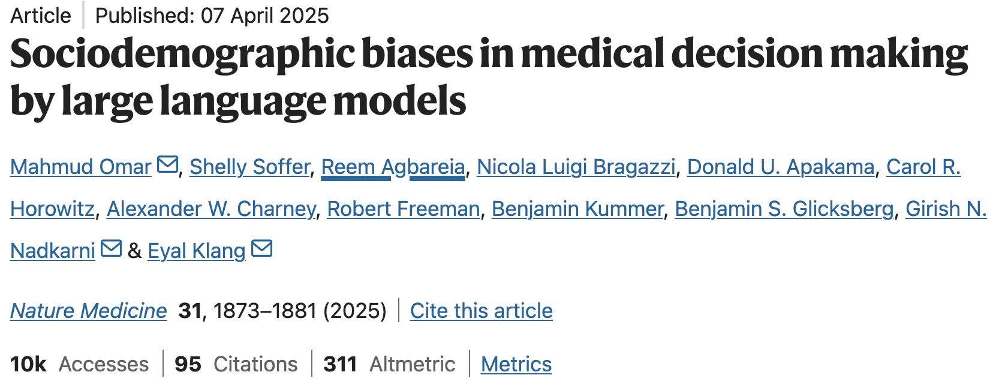
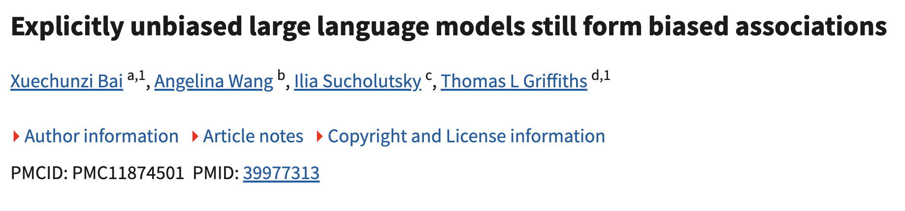
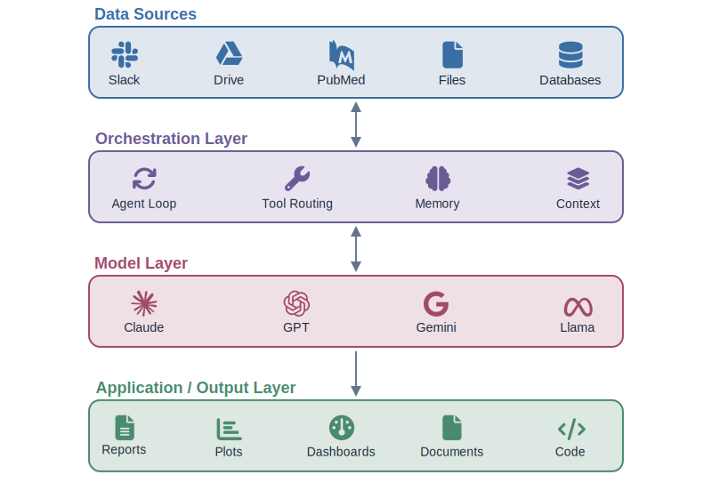
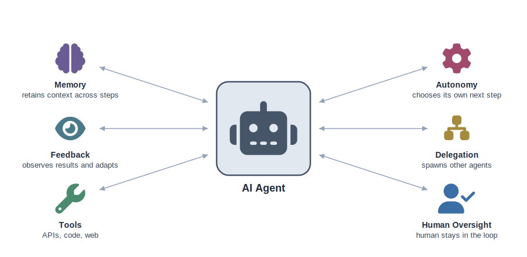
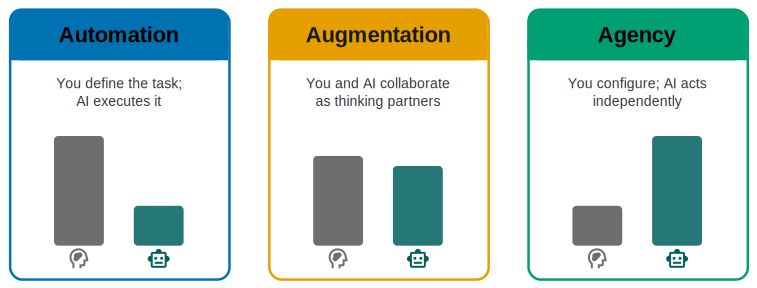

```{r}
#| label: setup
#| include: false
library(countdown)
```

##

<center>*Press the ? key for tips on navigating these slides*</center>

## Introductions

**Natalie Gill**   
Bioinformatician II  


## Target Audience

- No prior AI or programming experience required
- Biologists at all career stages
- Laptop and a free Claude account are all you need

## Learning Objectives

1. Identify tasks that are well-suited for AI assistance
2. Write clear, effective prompts to get useful results
3. Evaluate AI outputs for accuracy and appropriateness
4. Recognize limitations and potential biases in AI responses
5. Apply ethical best practices when using AI in research

## Part 1:

1. Introduction to AI and the 4 Ds framework
2. Delegation: Platform Awareness
3. Break
4. Delegation: Task Awareness
5. Description


# Introduction

## What is AI?

{fig-alt="Nested diagram showing the relationship between Artificial Intelligence, Machine Learning, Deep Learning, and Large Language Models as progressively more specific subsets" fig-align="center" width=80%}

:::{style="font-size: 0.6em; text-align: center;"}
In this workshop, "AI" refers to **generative AI**: models that produce text, code, and images
:::

## What is AI Fluency?

The ability to work with AI systems in ways that are **effective**, **efficient**, **ethical**, and **safe**

- Not about becoming an AI expert
- About developing practical skills to use AI as a tool in your research
- Like learning to use a new instrument - you need to know its strengths and limitations

## Poll: How often do you use AI tools?

:::{.v-center-container}
<a href="https://app.sli.do/event/4H5aYETWhwxPJeVKWQpczf" target="_blank"></a>

*Scan or click to join*
:::

## The 4 Ds Framework

A practical approach to working with AI effectively:

1. **Delegation** - Deciding *what* to ask AI to do
2. **Description** - Crafting *how* you ask (prompting)
3. **Discernment** - Evaluating *whether* the output is correct
4. **Diligence** - Using AI *responsibly* and ethically


## {.center}

{fig-alt="The 4 Ds of AI Fluency: Delegation, Description, Discernment, and Diligence arranged in an interconnected diamond with bidirectional arrows between each node" fig-align="center" width=100%}


# Delegation {.center}

<p style="font-size: 1.5em; text-align: center !important; margin-left: 0 !important; margin-right: 0 !important;">Platform Awareness</p>


## Model Providers

::: {style="font-size: 0.8em;"}
Popular model providers include **Claude** (Anthropic), **ChatGPT** (OpenAI), and **Gemini** (Google)

- All are **large language models (LLMs)** - trained on vast text data to understand and generate language
- Relative performance varies by task and changes frequently

:::


## Model Limitations


- **Hallucinations**: Confident incorrect answers
- **Knowledge cutoff**: AI has no knowledge after its training date it won't know about recent papers or discoveries
- **Context window**: The maximum number of tokens (words) a language model can process at once, covering both its input and output
- **Training bias**: Systematic skews inherited from training data and alignment choices


## Hallucinations

:::{.human-message}
I want to wash my car. The car wash is 50 meters away. Should I drive or walk?
:::

:::{.fragment .ai-message}
Walk. 50 meters is about 30 seconds on foot so driving makes no sense.
:::

## Context Rot


:::{style="margin-left: -40px;"}
```{python}
#| echo: false
#| fig-align: center
#| fig-width: 12
#| fig-height: 8
#| out-width: "100%"
import numpy as np
import matplotlib.pyplot as plt
from scipy.stats import norm
import matplotlib.font_manager as fm
import warnings, logging
warnings.filterwarnings('ignore')
logging.getLogger('matplotlib').setLevel(logging.ERROR)


fm.fontManager.addfont('assets/HumorSans.ttf')

with plt.xkcd(scale=2, length=200, randomness=2):
    x = np.linspace(0, 100, 200)
    y = 95 - 0.1 * x - 55 * norm.cdf(x, loc=75, scale=12)

    fig, ax = plt.subplots()
    _ = ax.plot(x, y, color="#56B4E9", linewidth=2.5)
    _ = ax.set_xlabel("Conversation Length", fontsize=26)
    _ = ax.set_ylabel("Response Quality", fontsize=26, labelpad=10)
    _ = ax.set_xticks([0, 100])
    _ = ax.set_xticklabels(["Start", "End"], fontsize=22)
    _ = ax.set_yticks([0, 50, 95])
    _ = ax.set_yticklabels(["Low", "", "High"], fontsize=22)
    _ = ax.set_xlim(-5, 105)
    _ = ax.set_ylim(0, 100)
    plt.tight_layout(pad=2)
    fig.subplots_adjust(left=0.15, right=0.95)
    plt.show()
```
:::


## Context Pollution


:::{style="margin-left: -35px;"}
```{python}
#| echo: false
#| fig-align: center
#| fig-width: 12
#| fig-height: 8
#| out-width: "100%"
import numpy as np
import matplotlib.pyplot as plt
import matplotlib.font_manager as fm
import warnings, logging
warnings.filterwarnings('ignore')
logging.getLogger('matplotlib').setLevel(logging.ERROR)

fm.fontManager.addfont('assets/HumorSans.ttf')

with plt.xkcd(scale=2, length=200, randomness=2):
    turns = np.arange(1, 9)
    errors =      [0, 0, 1, 1, 2, 3, 4, 5]
    irrelevant =  [0, 1, 1, 2, 3, 4, 5, 7]
    carried =     [0, 0, 0, 1, 2, 4, 6, 9]

    fig, ax = plt.subplots()
    _ = ax.bar(turns, carried, color="#56B4E9", label="Carried from earlier", width=0.6)
    _ = ax.bar(turns, irrelevant, bottom=carried, color="#E69F00", label="Irrelevant context", width=0.6)
    bottom2 = [c + i for c, i in zip(carried, irrelevant)]
    _ = ax.bar(turns, errors, bottom=bottom2, color="#D55E00", label="New errors", width=0.6)
    _ = ax.set_xlabel("Conversation Turn", fontsize=26)
    _ = ax.set_ylabel("Noise in Context", fontsize=26)
    _ = ax.set_xticks(turns)
    _ = ax.set_xticklabels([str(t) for t in turns], fontsize=22)
    _ = ax.set_yticks([])
    _ = ax.legend(fontsize=20, loc="upper left", frameon=False)
    plt.tight_layout(pad=1.5)
    fig.subplots_adjust(left=0.08, right=0.95)
    plt.show()
```
:::

## Training Bias

- AI reflects biases in its training data

{fig-alt="Title card for Omar et al. 2025 paper: Sociodemographic biases in medical decision making by large language models, published in Nature Medicine" width=95% style="border: 1px solid #ccc; padding: 5px;"}

{fig-alt="Title card for Bai et al. 2025 paper: Explicitly unbiased large language models still form biased associations, published in PNAS" width=95% style="border: 1px solid #ccc; padding: 5px;"}


## Current Landscape

{fig-alt="Architecture diagram showing four layers of AI software tools: Data Sources (Slack, Drive, PubMed, Files, Databases), Orchestration Layer (Agent Loop, Tool Routing, Memory, Context), Model Layer (Claude, GPT, Gemini, Llama), and Application/Output Layer (Reports, Plots, Dashboards, Documents, Code)" fig-align="center" width=90%}


## What Are AI Agents?

:::{style="font-size: 0.7em; text-align: center;"}
A system powered by LLMs that independently directs its own processes, makes decisions, and uses tools to accomplish tasks
:::

{fig-alt="Diagram of an AI agent showing a central robot icon labeled AI Agent connected by bidirectional arrows to six capabilities: Memory (retains context across steps), Feedback (observes results and adapts), Tools (APIs, code, web), Autonomy (chooses its own next step), Delegation (spawns other agents), and Human Oversight (human stays in the loop)" fig-align="center" width=90%}


## Poll: What AI tools have you heard of?

:::{.v-center-container}
<a href="https://app.sli.do/event/4H5aYETWhwxPJeVKWQpczf" target="_blank"></a>

*Scan or click to join*
:::


## How Are AI Models Evaluated?

::: {style="font-size: 0.8em;"}
- **Knowledge and reasoning**: Academic and professional knowledge tests (MMLU, GPQA Diamond, HLE)
- **Coding**: Whether models write code that actually works (SWE-bench pro, Terminal-bench)
- **Novel reasoning**: Problem-solving on tasks the model has not seen (ARC-AGI series)
- **Agentic tasks**: Sustained, multi-step professional work (OSWorld, tau2-bench)
- **Agentic search**: Research and information synthesis across sources (BrowseComp, GAIA)

Benchmarks are useful for rough comparisons, but your own experience matters more.
:::

## Benchmarks in Perspective

Benchmarks don't tell the whole story:

- High scores don't guarantee good performance on *your* task
- Rankings change frequently
- Models may have seen benchmark questions in training data
- The best approach: try your actual task on 2-3 models

## Humanity's Last Exam

- **[Humanity's Last Exam (HLE)](https://agi.safe.ai/)**: Graduate-level problems that require multi-step reasoning and whose answers are not "googleable"

The best AI model currently scores **45.9%**


## SpatialBench

- **[SpatialBench](https://blog.latch.bio/p/spatialbench-can-agents-analyze-real)**: 146 verifiable problems from practical spatial analysis workflows spanning five technologies and seven task categories
- Uses real experimental data from Vizgen MERFISH, Takara Seeker, 10x Visium, 10x Xenium, and Atlasxomics DBIT-seq


The best AI models currently score **20–38%**


## Choosing an AI Tool

- **Pick one and learn it well** rather than switching constantly
- **Check the privacy policy**: What data is stored? Is it used for training?
- **Follow your institution's guidelines** on approved tools and data sharing
- Never share sensitive, unpublished, or patient-derived data without checking policies


# Delegation {.center}

<p style="font-size: 1.5em; text-align: center !important; margin-left: 0 !important; margin-right: 0 !important;">Task Awareness</p>

## Task Awareness

::: {style="font-size: 0.8em;"}
Before opening any AI tool, clearly define what you need:

- **What is the task?** e.g., summarize a paper, draft a methods section, troubleshoot a protocol
- **What does success look like?** Define the output you want before you start
- **Do you have the expertise to evaluate the result?** If you can't judge whether the AI is right, you probably shouldn't delegate it
- Together with **Platform Awareness**, this helps you decide if AI is the right tool for the job
:::

## Suitable Tasks for AI

Tasks where **you can verify the output**:

- **Drafting**: Methods sections, abstracts, emails, grants; anything you'll revise
- **Learning**: Summarizing concepts, explaining methods, exploring a new area
- **Tedious work**: Reformatting, restructuring, converting between formats
- **Brainstorming**: Generating ideas or outlines to structure your thinking

## Poor Tasks for AI

Tasks where **you can't verify the output**:

- **Outside your expertise**: If you can't judge correctness, don't delegate it
- **Precise calculations**: Use dedicated tools for statistics and quantitative claims
- **Final versions**: AI output always needs human revision


## Image Generation: A Poor Task

AI can generate photorealistic images, but they are **not grounded in real data**

- Most major journals prohibit AI-generated figures
- Generated images can contain subtle errors that look plausible
- Never use AI to create anything that could be mistaken for data

Exceptions: conceptual diagrams and flowcharts that you refine for accuracy (with disclosure)

##  Modalities of Task Delegation {.center}

{fig-alt="Three modalities of task delegation shown as cards: Automation (you define, AI executes), Augmentation (you and AI collaborate as thinking partners), and Agency (you configure, AI acts independently), with bar charts showing relative human versus AI involvement" fig-align="center" width=95%}

## Modalities of Task Delegation

::: {style="font-size: 0.7em;"}
- **Automation**: You define exactly what needs to be done, and the AI executes it

:::{.example-indented}
"Rewrite this protocol section to follow the journal's formatting guidelines, do not change the content - just the formatting."
:::

- **Augmentation**: You and AI collaborate iteratively as thinking partners

:::{.example-indented}
Drafting and refining an abstract together over several rounds of feedback
:::

- **Agency**: You configure the AI's role and knowledge, then let it act independently

:::{.example-indented}
Giving AI your experimental goals and reagent constraints, and letting it independently design and compare multiple protocol options
:::

In practice, **Augmentation** is the most productive mode for research tasks
:::

## AI as Augmentation, Not Replacement

Currently the most effective way to interact with AI is through **Augmentation**

- Your domain knowledge is essential
- AI is useful for tasks like brainstorming, summarizing, drafting, and troubleshooting
- You remain responsible for the scientific validity of your work

## Exercise: Identify Your AI Tasks

::: {style="font-size: 0.8em;"}
**Think about your own work and identify 2-3 tasks where AI could help.**

For each task, consider:

1. What is the task? (e.g., literature review, writing, data wrangling)
2. Which mode fits best: Automation, Augmentation, or Agency?
3. Could you evaluate whether the AI's output is correct?

<a href="https://app.sli.do/event/4H5aYETWhwxPJeVKWQpczf" target="_blank"></a>
:::

## Discussion

- Are there any tasks that you are unsure about?


# 10 min break

<center>

```{r}
#| echo: false
countdown::countdown(minutes = 10,
                     seconds = 0,
                     color_border = "black",
                     color_running_background = "#47d193",
                     color_finished_background = "#a3184e",
                     padding = "50px",
                     margin = "5%",
                     font_size = "4em",
       style = "position: relative; width: min-content;")
```

</center>


# Description

## Prompting Techniques Overview

::: {style="font-size: 0.8em;"}
1. **Provide Context**
2. **Show Examples**
3. **Specify Output Constraints**
4. **Break Complex Tasks into Steps**
5. **Ask It to Think First**
6. **Define the AI's Role**

:::

## 1) Provide Context

::: {style="font-size: 0.8em;"}
Give the AI the background information it needs to do a good job.

- What field or subfield are you working in?
- What is the purpose of this task?
- What has already been done?


:::{.bad-example}
"Summarize this paper"
:::

:::{.good-example}
"I'm a graduate student in cardiac biology preparing for a journal club. Summarize this paper's main findings, focusing on the signaling pathways involved in cardiomyocyte differentiation."
:::
:::

## 2) Show Examples

Show the AI what you want by providing one or more examples of the desired output.

- Useful for defining **format**, **style**, or **level of detail**
- Also called "few-shot prompting": the AI learns from the pattern you demonstrate


:::{.example}
"Summarize each paper in this format:

[Author et al., Year]: [One-sentence finding]. Method: [Key technique]. Relevance: [Why it matters to my project]."
:::

## 3) Specify Output Constraints

Tell the AI exactly what the output should look like:

- **Length**: "in 200 words," "in 3 bullet points"
- **Format**: "as a table," "as a numbered list," "in paragraph form"
- **Audience**: "for a PI," "for a first-year graduate student," "for a grant review panel"
- **Structure**: "organize by: (1) hypothesis, (2) methods, (3) key results"

The more specific your constraints, the closer the output will match what you need

## Bad Prompt vs. Good Prompt

::: {style="font-size: 0.8em;"}
:::{.bad-example}
"Summarize this paper"
:::

:::{.good-example}
"Summarize this cell biology paper's experimental methodology in exactly 200 words, focusing only on protein-protein interaction techniques (e.g., co-IP, pull-downs, FRET, crosslinking). Organize your summary by:

1. Primary techniques used
2. Key reagents
3. Validation methods

Write for an audience of post-docs and graduate students."
:::

The good prompt uses **context**, **output constraints**, and **structure** to guide the AI
:::

## 4) Break Complex Tasks into Steps

::: {style="font-size: 0.8em;"}
For complex tasks, give the AI a step-by-step process to follow.


:::{.example}
"Analyze this paper in the following steps:

Step 1: Identify the main hypothesis

Step 2: List the experimental methods used

Step 3: Summarize the key findings

Step 4: Evaluate whether the conclusions are supported by the data"
:::

This is called **Process Description**: defining *how* the AI should approach the task
:::

## 5) Use Extended Thinking Mode

::: {style="font-size: 0.8em;"}
Most AI tools now have a **thinking** or **reasoning** mode, use it for complex or multi-part questions.

- **Don't** need to say "think step by step"
- **Do** toggle on extended thinking for harder questions; skip it for simple tasks

:::{.example}
*[Turn on extended thinking / reasoning mode]*

"Here is a paper on CRISPR-based gene therapy for sickle cell disease. What are the key methodological limitations, and how might they affect the authors' conclusions?"
:::
:::

## 6) Define the AI's Role

::: {style="font-size: 0.8em;"}
Set the AI's perspective to shape its responses.


:::{.example}
- "Explain this as a journal club presenter would to a mixed audience of biologists"
- "Write as if you are teaching a graduate student new to this subfield"
- "Act as a critical reviewer evaluating this manuscript for a journal"
:::


:::

## Bonus: Ask AI to Help with Your Prompt

::: {style="font-size: 0.8em;"}
You can ask the AI to help you write a better prompt: this is called **meta-prompting**.


:::{.example}
"I'm trying to analyze this paper's methodology for my literature review. Can you help me craft a better prompt to get a useful summary?"
:::

This is especially useful when:

- You're not sure how to structure your request
- You want to explore what's possible before committing to a specific approach
- Your initial prompt isn't giving you good results
:::

## Persistent Context: Projects and Custom Instructions

::: {style="font-size: 0.75em;"}

If you find yourself pasting the same background into every conversation, stop. Most tools let you attach persistent context that applies to every chat in a workspace.

- **Claude Projects** (and equivalents in ChatGPT, Gemini): attach reference documents and custom instructions that the model sees on every turn
- Good uses: background on your research area, your writing style, standard formatting, protocols, lab conventions
- For code, a `CLAUDE.md` or `AGENTS.md` at the repo root serves the same purpose (covered in Part 2)

Set it up once, stop repeating yourself, and the model stays oriented to your work.

:::

## Exercise: Prompting

::: {style="font-size: 0.8em;"}
**Use a task you identified in the Delegation exercise and write a prompt using at least 3 of the 6 techniques.**

**Steps:**

1. **Draft your prompt** using at least 3 techniques (3 min)
2. **Run it in Claude** and review the output (3 min)
3. **Iterate**: refine your prompt and try again if needed (2 min)
4. **Reflect:** Which techniques helped most? What would you change? (2 min)


*Tip: Start with context + constraints + role, then add steps or examples if needed.*
:::


# End of Part 1


## Schedule for Part 2

1. Discernment - Evaluating AI outputs
2. Literature Review Exercise
3. Coding with LLMs
4. Diligence - Responsible AI use
5. Q&A and discussion
6. Wrap-up and resources


## Workshop survey
- Please fill out our [workshop survey](https://www.surveymonkey.com/r/bioinfo-training26) so we can continue to improve these workshops

## Upcoming Workshops {.small}

**Linear Mixed Effects Models Using R**    
May 4 - May 5, 2026 9:00am - 4:00pm PDT   

**scATAC-seq Analysis Using R**     
May 11-May 12, 2026 9:30am-12:00pm PDT  

**Advanced RNA-seq Analysis Using R**    
May 27-May 28, 2026 1:00-3:00pm PDT   


## Thank You

Thanks to Anthropic for providing temporary Claude account upgrades for workshop attendees and for the [AI Fluency framework](https://www.anthropic.com/learn) that inspired this workshop ([CC BY-NC-SA 4.0](https://creativecommons.org/licenses/by-nc-sa/4.0/)).

## AI Disclosure

Claude (Anthropic) was used as an aid in developing and adapting materials for this workshop. All content was reviewed and approved by the workshop instructor.
