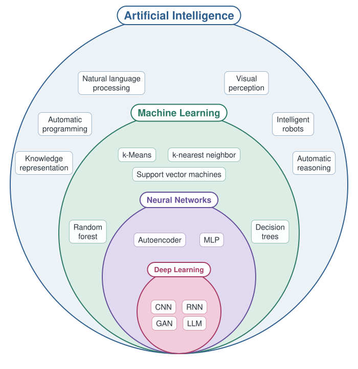
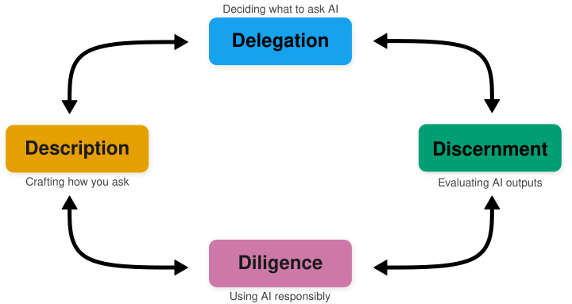
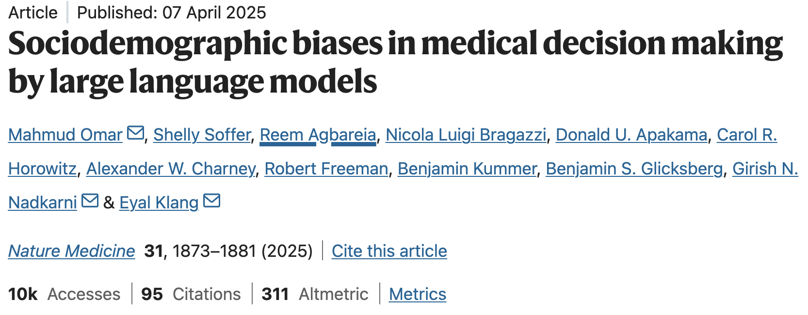
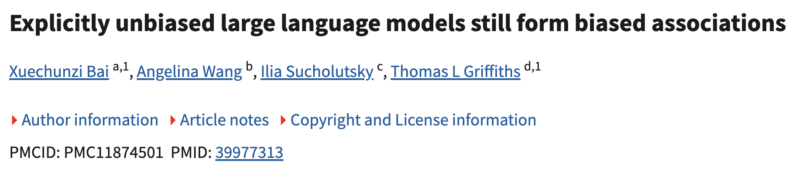
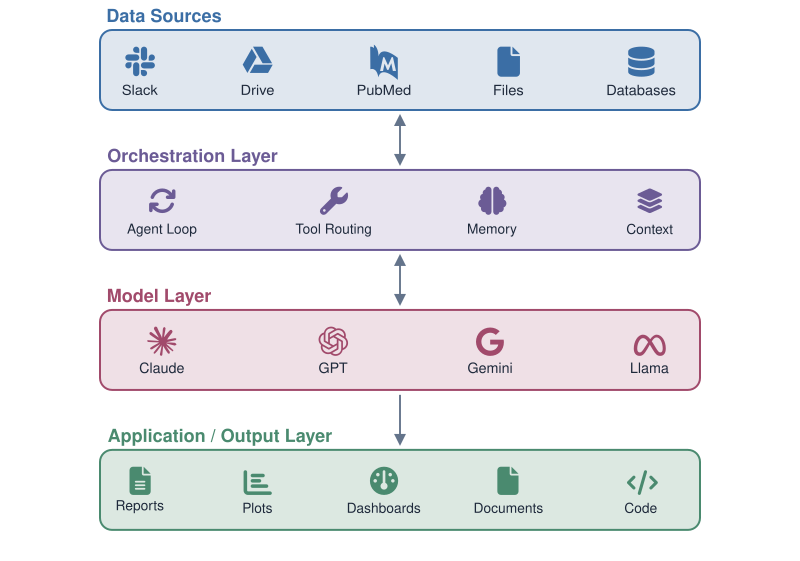
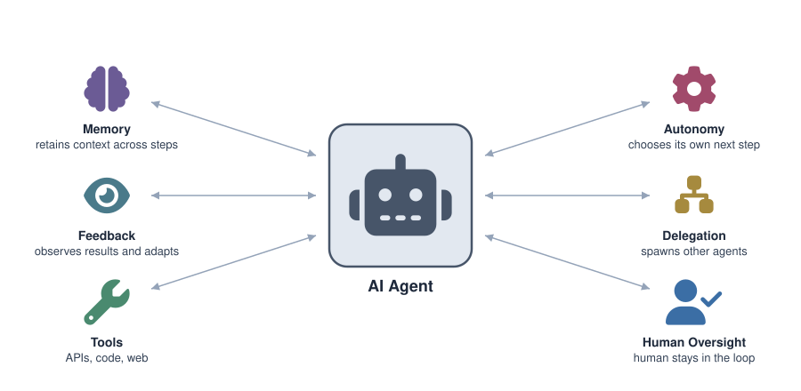
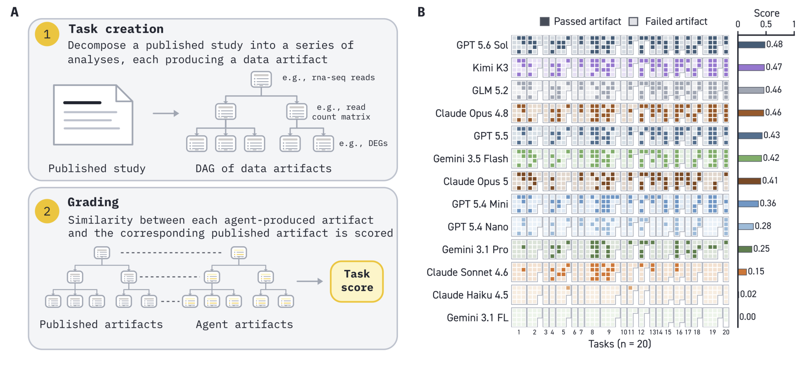
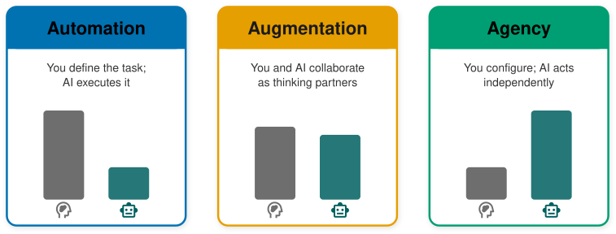

```{r}
#| label: setup
#| include: false
library(countdown)
```

##

<center>*Press the ? key for tips on navigating these slides*</center>


## Introductions


**Natalie Gill**      
Bioinformatician II


## Target Audience

- No prior AI or programming experience required
- Biologists at all career stages
- Laptop and a Claude Pro account are all you need

## Learning Objectives

::: {style="font-size: 0.8em;"}
1. Describe what current AI tools can do, including agents, connectors, and skills
2. Identify tasks that are well-suited for AI assistance
3. Write clear, effective prompts and task descriptions
4. Evaluate AI outputs for accuracy and appropriateness
5. Set up a workflow that lets you review AI-generated code
6. Apply ethical best practices when using AI in research
:::

## Part 1:

1. Introduction to AI and the 4 Ds framework
2. Delegation: Platform Awareness
3. Break
4. Delegation: AI Workbenches for Science
5. Delegation: Task Awareness
6. Description: Prompting Techniques


# Introduction

## What is AI?

{fig-alt="Nested diagram showing the relationship between Artificial Intelligence, Machine Learning, Deep Learning, and Large Language Models as progressively more specific subsets" fig-align="center" width=80%}

:::{style="font-size: 0.6em; text-align: center;"}
In this workshop, "AI" refers to **generative AI**: models that produce text, code, and images
:::

## What is AI Fluency?

The ability to work with AI systems in ways that are **effective**, **efficient**, **ethical**, and **safe**

- Not about becoming an AI expert
- About developing practical skills to use AI as a tool in your research
- Like learning to use a new instrument, you need to know its strengths and limitations

## Poll: How often do you use AI tools?

:::{.v-center-container}
<a href="https://app.sli.do/event/iVhSSEPQq7KVcXJ9EGP19k" target="_blank"></a>

*Scan or click the image to join*
:::

## The 4 Ds Framework

A practical approach to working with AI effectively:

1. **Delegation** - Deciding *what* to ask AI to do
2. **Description** - Crafting *how* you ask (prompting)
3. **Discernment** - Evaluating *whether* the output is correct
4. **Diligence** - Using AI *responsibly* and ethically


## {.center}

{fig-alt="The 4 Ds of AI Fluency: Delegation, Description, Discernment, and Diligence arranged in an interconnected diamond with bidirectional arrows between each node" fig-align="center" width=100%}


# Delegation {.center}

<p style="font-size: 1.5em; text-align: center !important; margin-left: 0 !important; margin-right: 0 !important;">Platform Awareness</p>


## Same Features, Different Names

- We use Claude for demonstrations
- Every major platform offers its own version of the features in this workshop
- Product names, features, and plan tiers change every few months
- The concepts transfer between platforms and stay useful when the products change


## Model Providers

::: {style="font-size: 0.8em;"}
Popular model providers include **Claude** (Anthropic), **ChatGPT** (OpenAI), and **Gemini** (Google)

- All are **large language models (LLMs)** - trained on vast text data to understand and generate language
- Relative performance varies by task and changes frequently

:::


## Model Limitations


- **Hallucinations**: Confident incorrect answers
- **Knowledge cutoff**: The model only knows about recent papers if a tool such as web search retrieves them
- **Context window**: The input/output token budget; once it fills up, accuracy drops and earlier details get lost
- **Training bias**: Systematic skews inherited from training data and alignment choices


## Hallucinations

:::{.human-message}
I want to wash my car. The car wash is 50 meters away. Should I drive or walk?
:::

:::{.fragment .ai-message}
Walk. 50 meters is about 30 seconds on foot so driving makes no sense.
:::

## Common Misunderstandings About Hallucinations

::: {style="font-size: 0.8em;"}
- **"Hallucinations are just made-up facts"**
    - Also: misreading your document, or citing a real paper that does not support the claim
- **"Web search or connectors prevent them"**
    - Grounding reduces made-up sources but does not stop misreading them
- **"A second model can check the first"**
    - Models share training data and make similar errors, so agreement does not confirm an answer
:::

## Context Rot


:::{style="margin-left: -40px;"}
```{python}
#| echo: false
#| fig-align: center
#| fig-width: 12
#| fig-height: 8
#| out-width: "100%"
import numpy as np
import matplotlib.pyplot as plt
from scipy.stats import norm
import matplotlib.font_manager as fm
import warnings, logging
warnings.filterwarnings('ignore')
logging.getLogger('matplotlib').setLevel(logging.ERROR)


fm.fontManager.addfont('assets/HumorSans.ttf')

with plt.xkcd(scale=2, length=200, randomness=2):
    x = np.linspace(0, 100, 200)
    y = 95 - 0.1 * x - 55 * norm.cdf(x, loc=75, scale=12)

    fig, ax = plt.subplots()
    _ = ax.plot(x, y, color="#56B4E9", linewidth=2.5)
    _ = ax.set_xlabel("Conversation Length", fontsize=26)
    _ = ax.set_ylabel("Response Quality", fontsize=26, labelpad=10)
    _ = ax.set_xticks([0, 100])
    _ = ax.set_xticklabels(["Start", "End"], fontsize=22)
    _ = ax.set_yticks([0, 50, 95])
    _ = ax.set_yticklabels(["Low", "", "High"], fontsize=22)
    _ = ax.set_xlim(-5, 105)
    _ = ax.set_ylim(0, 100)
    plt.tight_layout(pad=2)
    fig.subplots_adjust(left=0.15, right=0.95)
    plt.show()
```
:::


## Context Pollution


:::{style="margin-left: -35px;"}
```{python}
#| echo: false
#| fig-align: center
#| fig-width: 12
#| fig-height: 8
#| out-width: "100%"
import numpy as np
import matplotlib.pyplot as plt
import matplotlib.font_manager as fm
import warnings, logging
warnings.filterwarnings('ignore')
logging.getLogger('matplotlib').setLevel(logging.ERROR)

fm.fontManager.addfont('assets/HumorSans.ttf')

with plt.xkcd(scale=2, length=200, randomness=2):
    turns = np.arange(1, 9)
    errors =      [0, 0, 1, 1, 2, 3, 4, 5]
    irrelevant =  [0, 1, 1, 2, 3, 4, 5, 7]
    carried =     [0, 0, 0, 1, 2, 4, 6, 9]

    fig, ax = plt.subplots()
    _ = ax.bar(turns, carried, color="#56B4E9", label="Carried from earlier", width=0.6)
    _ = ax.bar(turns, irrelevant, bottom=carried, color="#E69F00", label="Irrelevant context", width=0.6)
    bottom2 = [c + i for c, i in zip(carried, irrelevant)]
    _ = ax.bar(turns, errors, bottom=bottom2, color="#D55E00", label="New errors", width=0.6)
    _ = ax.set_xlabel("Conversation Turn", fontsize=26)
    _ = ax.set_ylabel("Noise in Context", fontsize=26)
    _ = ax.set_xticks(turns)
    _ = ax.set_xticklabels([str(t) for t in turns], fontsize=22)
    _ = ax.set_yticks([])
    _ = ax.legend(fontsize=20, loc="upper left", frameon=False)
    plt.tight_layout(pad=1.5)
    fig.subplots_adjust(left=0.08, right=0.95)
    plt.show()
```
:::

## Training Bias

- AI reflects biases in its training data

{fig-alt="Title card for Omar et al. 2025 paper: Sociodemographic biases in medical decision making by large language models, published in Nature Medicine" width=95% style="border: 1px solid #ccc; padding: 5px;"}

{fig-alt="Title card for Bai et al. 2025 paper: Explicitly unbiased large language models still form biased associations, published in PNAS" width=95% style="border: 1px solid #ccc; padding: 5px;"}


## Poll: What AI tools have you heard of?

:::{.v-center-container}
<a href="https://app.sli.do/event/iVhSSEPQq7KVcXJ9EGP19k" target="_blank"></a>

*Scan or click the image to join*
:::


## Current Landscape

{fig-alt="Architecture diagram showing four layers of AI software tools: Data Sources (Slack, Drive, PubMed, Files, Databases), Orchestration Layer (Agent Loop, Tool Routing, Memory, Context), Model Layer (Claude, GPT, Gemini, Llama), and Application/Output Layer (Reports, Plots, Dashboards, Documents, Code)" fig-align="center" width=90%}


## Model vs. Harness

<!-- FIGURE: the model as a core inside a harness, with tools, files, and the user around it. -->

- The **model** is the LLM: it takes text in and produces text out
- The **harness** is the software around the model
    - The chat app, Cowork, Claude Code, and science workbenches are all harnesses
    - In the previous diagram, the harness is the orchestration layer
- The same model can behave very differently in different harnesses


## What a Harness Does

::: {style="font-size: 0.8em;"}
- **Builds the context**: adds instructions, your files, and memory to each request
- **Provides tools**: web search, code execution, connectors
- **Runs the loop**: sends tool results back to the model until the task is done
- **Manages the context window**: summarizes or drops old content as it fills up
- **Asks permission**: checks with you before actions such as editing files

Connectors, skills, and plugins are features you add to a harness.
:::


## From Chat to Agent

<!-- FIGURE: a sequence or ladder diagram where each step adds one capability, could replace this list. -->

::: {style="font-size: 0.75em;"}
Each step adds one harness capability to a plain chat:

- **Chat**: answers from training data only
- **Persistent context**: documents and instructions that apply to every chat in a workspace
- **Research mode**: searches current sources and cites them
- **Connectors**: read from your files, apps, and scientific databases
- **Skills**: reusable instructions for a task you repeat
- **Agents**: take many steps on their own and use tools
- **Scheduled tasks**: agents that run at set times without you present
:::


## What Are AI Agents?

:::{style="font-size: 0.7em; text-align: center;"}
A system powered by LLMs that independently directs its own processes, makes decisions, and uses tools to accomplish tasks
:::

{fig-alt="Diagram of an AI agent showing a central robot icon labeled AI Agent connected by bidirectional arrows to six capabilities: Memory (retains context across steps), Feedback (observes results and adapts), Tools (APIs, code, web), Autonomy (chooses its own next step), Delegation (spawns other agents), and Human Oversight (human stays in the loop)" fig-align="center" width=90%}


## Connectors and MCP

- A **connector** gives the AI access to an outside data source or app
    - Examples: PubMed, UniProt, Google Drive, your email
- Most connectors use the **Model Context Protocol (MCP)**
    - MCP is an open standard supported by Anthropic, OpenAI, and Google
- With a connector, the AI retrieves real records instead of recalling them from training data


## "Can It Delete All My Emails?"


::: {style="font-size: 0.9em;"}
- A connector can only take the actions its builder included
    - Examples: search, read, draft, send, delete
- You can set a permission for each action
    - **Always allow**, **Needs approval**, or **Blocked**
- Block the write and delete actions to make a connector read-only
- Risks that remain:
    - Approving requests without reading them
    - Hidden instructions inside an email or document
:::

## Skills

::: {style="font-size: 0.85em;"}
- A **skill** is a packaged set of instructions for a task you repeat
    - It can also include reference files and scripts
- The AI loads a skill only when a task needs it
    - This keeps unused instructions out of the context window
- Skills follow an open format that several platforms support
- Example: a **journal submission check**
    - Instructions: check word limits, figure rules, and required statements
    - Reference file: the journal's author guidelines
    - Script: counts the words in each section
:::


## Plugins

- A **plugin** bundles several features into one installable package
    - Skills, connectors, commands, and specialized agents
- Plugins let a lab or institution share a configured setup
- Example: a plugin for a field that includes its databases and standard analyses

<!-- FIGURE: nested diagram showing a plugin that contains skills, connectors, commands, and agents. -->


## Scheduled Tasks

- A **scheduled task** runs a prompt or an agent at set times
    - Daily, weekly, or on demand
- The results are waiting for you when you return
- Example: a weekly summary of new papers on your topic
- Nobody watches a scheduled task while it runs, so Diligence matters more (Part 2)


## The Same Concepts Across Platforms


::: {style="font-size: 0.9em;"}
| Concept | Claude | ChatGPT | Gemini |
|---|---|---|---|
| Persistent context | Projects | Projects, custom GPTs | Gems, NotebookLM |
| Research with citations | Research | Deep research | Deep Research |
| Connectors | Connectors (MCP) | Apps and connectors (MCP) | Connected apps, extensions |
| Skills | Skills | Skills | Agent skills (Gemini CLI) |
| Agent on your computer | Cowork | ChatGPT agent | Gemini Agent |
| Scheduled tasks | Scheduled tasks | Tasks | Scheduled actions |
| Coding agent | Claude Code | Codex | Gemini CLI |
:::


- MCP, the skills format, and AGENTS.md are open standards shared across vendors


## Demo: An Agent Working on Your Files

::: {style="font-size: 0.7em;"}
**Task:** a folder of 11 downloaded papers whose filenames are publisher IDs (e.g., `2509.04664v1.pdf`)

:::{.example}
This folder has 11 research papers I downloaded. The filenames are publisher IDs, so I can't tell what each one is.

1. Rename each PDF to `FirstAuthor_Year_ShortTitle.pdf` (e.g., `Smith_2025_Gene_Regulation.pdf`).
2. Create one spreadsheet, `paper_summary.xlsx`, in this folder with one row per paper and these columns: new filename, authors, year, title, journal or preprint server, and a one-sentence summary of the main finding.

Read only the first two pages of each paper. Do not delete or move any files. Before you change anything, show me your plan and the full list of new filenames, and wait for my approval.
:::
:::

::: {.notes}
Demo folder: ~/Downloads/organize papers (11 arXiv, Nature, and Science PDFs). Copy a fresh set before each session, because the demo renames the files.
If the run takes longer than about 4 minutes in rehearsal, remove the Co-Scientist paper (2502.18864v2.pdf, 157 pages) first, then Kosmos (2511.02824v2.pdf).
Keep a screen recording of a rehearsal run as a backup.
:::


## Demo: What to Watch For

- **The plan**: what the agent proposes before it changes anything
- **Permission requests**: where it stops and asks you to approve
- **The output**: what it produces and where it saves it
- **Spot check**: open one paper and compare it with its row in the spreadsheet


# 10 min break

<center>

```{r}
#| echo: false
countdown::countdown(minutes = 10,
                     seconds = 0,
                     color_border = "black",
                     color_running_background = "#47d193",
                     color_finished_background = "#a3184e",
                     padding = "50px",
                     margin = "5%",
                     font_size = "4em",
       style = "position: relative; width: min-content;")
```

</center>


# Delegation {.center}

<p style="font-size: 1.5em; text-align: center !important; margin-left: 0 !important; margin-right: 0 !important;">AI Workbenches for Science</p>


## What Is a Science Workbench?

- A harness built for research tasks rather than general chat
- Typical parts:
    - A coordinating agent that plans and delegates to other agents
    - Skills and connectors for scientific databases and analysis tools
    - Access to compute, such as your laptop or an HPC cluster
    - A record of the code, data, and steps behind each result


## Examples


::: {style="font-size: 0.8em;"}
- **Claude Science** (Anthropic): desktop research workbench
- **Biomni** (Stanford): open-source biomedical research agent
- **Kosmos** (Edison Scientific): long-running literature and data analysis agent
- **AI co-scientist** (Google): hypothesis generation and research planning
- **Prism** (OpenAI): AI workspace for writing scientific papers
:::


## Claude Science


::: {style="font-size: 0.8em;"}
- A coordinating agent with 60+ skills and connectors for biology and chemistry
    - Examples: UniProt, PDB, Ensembl, GEO, ClinVar
- A reviewer agent flags incorrect citations and numbers that cannot be traced to a source
- Each figure is saved with the code and environment that produced it
- Runs on your laptop, or on a remote machine or HPC login node over SSH
:::


## What a Workbench Is Not

- It is a new harness, not a new model
    - It runs the same models as the general chat apps
- A reviewer agent usually runs on the same model as the agent it checks
    - Does not substitute for human verification
- It should not choose the analysis method for you


## Demo: A Science Workbench

::: {style="font-size: 0.6em;"}
**Task:** differential expression in a public single-cell dataset (Kang et al. 2018, GEO: GSE96583)

:::{.example}
**Goal:** identify genes differentially expressed between interferon-beta stimulated and control cells in CD14+ monocytes, using the Kang et al. 2018 PBMC dataset (GEO: GSE96583).

**Data:** load a packaged copy of the dataset (for example the pertpy loader for Kang 2018). Before any analysis, list every metadata column and what it contains. Use the existing cell type annotations; do not recluster.

**Constraints:** Python, local CPU only, no GPU or remote compute. Total run time under 10 minutes.

In the plan, name the statistical test you will use for differential expression.

**Outputs:**

1. Table of all tested genes with log2 fold change, p-value, and adjusted p-value.
2. Number of genes with adjusted p < 0.05.
3. Volcano plot.
4. A methods paragraph describing the test and the experimental design.
:::
:::

::: {.notes}
Turn on auto-review before the demo: it is off by default on Pro plans.
The metadata listing should show a donor column (the cells come from multiple donors, each with a control and a stimulated sample).
If the plan names a test that treats each cell as an independent sample, such as a per-cell Wilcoxon test, point out that the donors are the replicates, not the cells. A pseudobulk test per donor with a paired design matches the experiment.
Anthropic's documentation says the reviewer checks claims against what ran, but does not judge whether the method was the right choice, so it will not flag this.
:::


## Workbench Demo: What to Watch For

- **The metadata**: what is the unit of replication in this experiment?
- **The plan**: which statistical test does it choose, and does it fit the design?
- **The reviewer**: what does it flag, and what does it not check?
- **The volcano plot**: can you trace it back to the code that made it?


## Discussion: Where Would a Workbench Fit?


- Which parts of your work could a workbench do?
- Which parts would you need to check most carefully?


## How Are AI Models Evaluated?

::: {style="font-size: 0.8em;"}
- **Knowledge and reasoning**: Academic and professional knowledge tests (MMLU, GPQA Diamond, HLE)
- **Coding**: Whether models write code that actually works (SWE-bench pro, Terminal-bench)
- **Novel reasoning**: Problem-solving on tasks the model has not seen (ARC-AGI series)
- **Agentic tasks**: Sustained, multi-step professional work (OSWorld, tau2-bench)
- **Agentic search**: Research and information synthesis across sources (BrowseComp, GAIA)

Benchmarks are useful for rough comparisons, but your own experience matters more.
:::

## Benchmarks in Perspective

Benchmarks don't tell the whole story:

- High scores don't guarantee good performance on *your* task
- Rankings change frequently
- Models may have seen benchmark questions in training data
- The best approach: try your actual task on 2-3 models

## Science Benchmarks

::: {style="font-size: 0.8em;"}
- **[Humanity's Last Exam (HLE)](https://agi.safe.ai/)**: Graduate-level problems that require multi-step reasoning and whose answers are not "googleable"
    - The best AI model currently scores **54.6%**
- **[BixBench3](https://arxiv.org/abs/2608.25286)** (Aug 2026): agents get the research question, methods, and raw data from a published study
    - The best model reproduced about **half** of the published results
- **[SpatialBench-Long](https://arxiv.org/abs/2605.28065)** (May 2026): agents must choose their own methods to reach a biological conclusion
    - The best agents succeeded in about **1 of 9** runs
- The two benchmarks differ in data and scoring, so compare them with caution
:::


## BixBench3

{fig-alt="BixBench3 overview. Panel A: a published study is broken into a tree of analyses, each producing a data artifact such as RNA-seq reads, a read count matrix, or a list of differentially expressed genes; each artifact the agent produces is scored against the corresponding published artifact to give a task score. Panel B: pass and fail results for 13 models across 20 tasks, with overall scores from 0.48 for the best model down to 0.00" fig-align="center" width=100% style="border: 1px solid #ccc; padding: 5px;"}

<div class="bottom-message">Figure 1 from Koch et al. 2026, BixBench3 (arXiv 2608.25286)</div>


## Choosing an AI Tool

::: {style="font-size: 0.9em;"}
- **Pick one and learn it well** rather than switching constantly
- **Check the privacy policy**: What data is stored? Is it used for training?
- **Check what each connector can access** before you turn it on
- **Follow your institution's guidelines** on approved tools and data sharing
- Never share sensitive, unpublished, or patient-derived data without checking policies
:::


# Delegation {.center}

<p style="font-size: 1.5em; text-align: center !important; margin-left: 0 !important; margin-right: 0 !important;">Task Awareness</p>

## Task Awareness

::: {style="font-size: 0.8em;"}
Before opening any AI tool, clearly define what you need:

- **What is the task?** e.g., summarize a paper, draft a methods section, troubleshoot a protocol
- **What does success look like?** Define the output you want before you start
- **Do you have the expertise to evaluate the result?** If you can't judge whether the AI is right, you probably shouldn't delegate it
- Together with **Platform Awareness**, this helps you decide if AI is the right tool for the job
:::

## Suitable Tasks for AI

Tasks where **you can verify the output**:

- **Drafting**: Methods sections, abstracts, emails, grants; anything you'll revise
- **Learning**: Summarizing concepts, explaining methods, exploring a new area
- **Tedious work**: Reformatting, restructuring, converting between formats
- **Brainstorming**: Generating ideas or outlines to structure your thinking

## Poor Tasks for AI

Tasks where **you can't verify the output**:

- **Outside your expertise**
    - If you can't judge correctness, don't delegate it
- **Choosing statistical methods**
    - The AI can *run* any test, but you must *decide* which test fits your data
- **Final versions**
    - AI output always needs human revision


## Image Generation: A Poor Task

AI can generate photorealistic images, but they are **not grounded in real data**

- Most major journals prohibit AI-generated figures
- Generated images can contain subtle errors that look plausible
- Never use AI to create anything that could be mistaken for data

Exceptions: conceptual diagrams and flowcharts that you refine for accuracy (with disclosure)


##  Modalities of Task Delegation {.center}

{fig-alt="Three modalities of task delegation shown as cards: Automation (you define, AI executes), Augmentation (you and AI collaborate as thinking partners), and Agency (you configure, AI acts independently), with bar charts showing relative human versus AI involvement" fig-align="center" width=95%}

## Modalities of Task Delegation

::: {style="font-size: 0.7em;"}
- **Automation**: You define exactly what needs to be done, and the AI executes it

:::{.example-indented}
"Rewrite this protocol section to follow the journal's formatting guidelines, do not change the content - just the formatting."
:::

- **Augmentation**: You and AI collaborate iteratively as thinking partners

:::{.example-indented}
Drafting and refining an abstract together over several rounds of feedback
:::

- **Agency**: You configure the AI's role and knowledge, then let it act independently

:::{.example-indented}
Giving AI your experimental goals and reagent constraints, and letting it independently design and compare multiple protocol options
:::

In practice, **Augmentation** is the most productive mode for research tasks
:::

## Demo: Flowchart creation

::: {style="font-size: 0.85em;"}
:::: {.columns}
::: {.column width="50%"}
:::{.bad-example}
**Automation:** "Make a flowchart of the peer review process"

- An image generator draws a picture of a flowchart
- Text is often misspelled and steps can be invented
- You cannot edit the result
:::
:::
::: {.column width="50%"}
:::{.good-example}
**Augmentation:** you supply the steps, the AI writes the drawing as code

- You check the plan before it draws
- You request changes over several rounds
- You finish the figure yourself in a drawing program
:::
:::
::::
:::

## Flowchart Demo: The Prompt

::: {style="font-size: 0.75em;"}
:::{.example}
Create a flowchart of the workflow below as an SVG file that I can edit in Inkscape.

Steps:

1. Submit manuscript
2. Editor screens it. Decision: send to review? No: "Desk reject: revise and submit elsewhere," which loops back to step 1
3. Peer review
4. Decision: accept, revise, or reject
    - Accept: "Proofs and publication"
    - Revise: "Revise and respond to reviewers," which loops back to step 3
    - Reject: "Revise and submit elsewhere," which loops back to step 1

Use editable text for every label, group each box with its label, and use colorblind-safe colors. Before you draw anything, list the boxes and arrows you plan to use so I can correct them.
:::
:::

::: {.notes}
The two loops return to different steps, and step 4 has three outcomes; check the planned arrows for these before approving the plan.
:::

## Matching Modalities to Tools


- **Automation**: skills and scheduled tasks
- **Augmentation**: chat, persistent context, and research mode
- **Agency**: agents and science workbenches
- More agency means more steps happen before you see the result
    - So you need a way to check each step

## AI as Augmentation, Not Replacement

Currently the most effective way to interact with AI is through **Augmentation**

- Your domain knowledge is essential
- AI is useful for tasks like brainstorming, summarizing, drafting, and troubleshooting
- You remain responsible for the scientific validity of your work

## Exercise: Delegation Plan


::: {style="font-size: 0.8em;"}
**Think about your own work and identify 2-3 tasks where AI could help.**

For each task, decide:

1. Which tool fits: chat, research mode, a connector, a skill, an agent, or a workbench?
2. Which mode fits: Automation, Augmentation, or Agency?
3. How would you check that the output is correct?


<a href="https://app.sli.do/event/iVhSSEPQq7KVcXJ9EGP19k" target="_blank"></a>
:::

## Discussion

- Are there any tasks that you are unsure about?


# Description

## Prompting Techniques Overview

::: {style="font-size: 0.8em;"}
1. **Provide Context**
2. **Show Examples**
3. **Specify Output Constraints**
4. **Break Complex Tasks into Steps**
5. **Set the Effort Level**
6. **Define the AI's Role**

Part 2 covers instructions you can reuse and how to describe work to an agent.
:::

## 1) Provide Context

::: {style="font-size: 0.8em;"}
Give the AI the background information it needs to do a good job.

- What field or subfield are you working in?
- What is the purpose of this task?
- What has already been done?


:::{.bad-example}
"Summarize this paper"
:::

:::{.good-example}
"I'm a graduate student in cardiac biology preparing for a journal club. Summarize this paper's main findings, focusing on the signaling pathways involved in cardiomyocyte differentiation."
:::
:::

## 2) Show Examples

Show the AI what you want by providing one or more examples of the desired output.

- Useful for defining **format**, **style**, or **level of detail**
- Also called "few-shot prompting": the AI learns from the pattern you demonstrate


:::{.example}
"Summarize each paper in this format:

[Author et al., Year]: [One-sentence finding]. Method: [Key technique]. Relevance: [Why it matters to my project]."
:::

## 3) Specify Output Constraints

::: {style="font-size: 0.9em;"}
Tell the AI exactly what the output should look like:

- **Length**: "in 200 words," "in 3 bullet points"
- **Format**: "as a table," "as a numbered list," "in paragraph form"
- **Audience**: "for a PI," "for a first-year graduate student," "for a grant review panel"
- **Structure**: "organize by: (1) hypothesis, (2) methods, (3) key results"

The more specific your constraints, the closer the output will match what you need
:::

## Bad Prompt vs. Good Prompt

::: {style="font-size: 0.8em;"}
:::{.bad-example}
"Summarize this paper"
:::

:::{.good-example}
"Summarize this cell biology paper's experimental methodology in exactly 200 words, focusing only on protein-protein interaction techniques (e.g., co-IP, pull-downs, FRET, crosslinking). Organize your summary by:

1. Primary techniques used
2. Key reagents
3. Validation methods

Write for an audience of post-docs and graduate students."
:::

The good prompt uses **context**, **output constraints**, and **structure** to guide the AI
:::

## 4) Break Complex Tasks into Steps

::: {style="font-size: 0.8em;"}
For complex tasks, give the AI a step-by-step process to follow.


:::{.example}
"Analyze this paper in the following steps:

Step 1: Identify the main hypothesis

Step 2: List the experimental methods used

Step 3: Summarize the key findings

Step 4: Evaluate whether the conclusions are supported by the data"
:::

This is called **Process Description**: defining *how* the AI should approach the task
:::

## 5) Set the Effort Level

::: {style="font-size: 0.8em;"}
Most AI tools now decide on their own how much to reason before answering.

- An **effort** or **reasoning** setting controls how thorough the model is
    - Higher effort: slower, but better for complex or multi-part questions
    - Lower effort: faster, and enough for simple tasks
- You **don't** need to say "think step by step"

:::{.example}
*[Set the effort level to high]*

"Here is a paper on CRISPR-based gene therapy for sickle cell disease. What are the key methodological limitations, and how might they affect the authors' conclusions?"
:::
:::

## 6) Define the AI's Role

::: {style="font-size: 0.8em;"}
Set the AI's perspective to shape its responses.


:::{.example}
- "Explain this as a journal club presenter would to a mixed audience of biologists"
- "Write as if you are teaching a graduate student new to this subfield"
- "Act as a critical reviewer evaluating this manuscript for a journal"
:::


:::

## Bonus: Ask AI to Help with Your Prompt

::: {style="font-size: 0.8em;"}
You can ask the AI to help you write a better prompt: this is called **meta-prompting**.


:::{.example}
"I'm trying to analyze this paper's methodology for my literature review. Can you help me craft a better prompt to get a useful summary?"
:::

This is especially useful when:

- You're not sure how to structure your request
- You want to explore what's possible before committing to a specific approach
- Your initial prompt isn't giving you good results
:::

## Exercise: Prompting

::: {style="font-size: 0.8em;"}
**Use a task you identified in the Delegation exercise and write a prompt using at least 3 of the 6 techniques.**

**Steps:**

1. **Draft your prompt** using at least 3 techniques (3 min)
2. **Run it in Claude** and review the output (3 min)
3. **Iterate**: refine your prompt and try again if needed (2 min)
4. **Reflect:** Which techniques helped most? What would you change? (2 min)


*Tip: Start with context + constraints + role, then add steps or examples if needed.*
:::


# End of Part 1


## Schedule for Part 2

1. Description: Reusable instructions and agents
2. Discernment: Evaluating AI outputs
3. Coding with AI agents
4. Diligence: Responsible AI use
5. Q&A and discussion
6. Wrap-up and resources


## Workshop survey
- Please fill out our [workshop survey](https://www.surveymonkey.com/r/bioinfo-training26) so we can continue to improve these workshops

## Upcoming Workshops {.small}

**Single Cell RNA-Seq Analysis Using R**\
October 12, 2026 9:30am-12:00pm PDT

**Introduction to Pathway Analysis**\
October 15, 2026 1:00-4:00pm PDT

**Statistics of Enrichment Analyses Methods**\
October 22, 2026 1:00-3:00pm PDT

[See all upcoming workshops](https://gladstone.org/events/?series=data-science-training-program)


## Thank You

Thanks to Anthropic for providing temporary Claude account upgrades for workshop attendees and for the [AI Fluency framework](https://www.anthropic.com/learn) that inspired this workshop ([CC BY-NC-SA 4.0](https://creativecommons.org/licenses/by-nc-sa/4.0/)).

## AI Disclosure

Claude (Anthropic) was used as an aid in developing and adapting materials for this workshop. All content was reviewed and approved by the workshop instructor.
