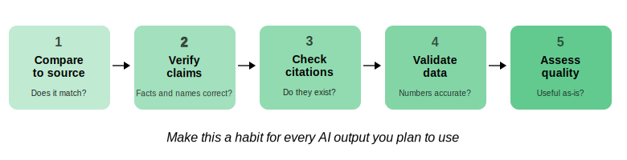
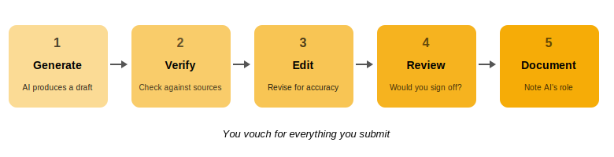

```{r}
#| label: setup
#| include: false
library(countdown)
```

##

<center>*Press the ? key for tips on navigating these slides*</center>

## Introductions
**Natalie Gill**     
Bioinformatician II


## Schedule

1. Discernment - Evaluating AI outputs
2. Coding with LLMs
3. Diligence - Responsible AI use
4. Q&A and discussion
5. Wrap-up and resources

# Discernment {.center}

## Three Types of Discernment

1. **Product Discernment**: Evaluating the quality of *what* AI produces
2. **Process Discernment**: Evaluating *how* the AI arrived at its output
3. **Performance Discernment**: Evaluating *how well* the AI is working for you

Think of it as: **What** did it produce? **How** did it get there? **How well** did it work with you?

## Product Discernment

::: {style="font-size: 0.8em;"}
Evaluate every AI output against four criteria:

- **Accuracy**: Are the facts correct? Are citations real? Are gene names and pathways right?
- **Precision**: Is the language specific enough, or vague and generic?
- **Completeness**: Are key findings, methods, or caveats missing?
- **Appropriateness**: Is the tone, depth, and format right for your audience and purpose?

Your domain expertise is what makes this evaluation possible.
:::

## Common AI Errors in Science

::: {style="font-size: 0.8em;"}
Watch out for these frequent mistakes:

- **Hallucinated citations**: AI invents plausible-sounding references that don't exist
- **Oversimplified mechanisms**: Complex signaling cascades reduced to linear pathways
- **Confused methodology**: Mixing up techniques (e.g., describing Western blot results as flow cytometry data)
- **Overstated conclusions**: Presenting preliminary findings as established facts
- **Fabricated details**: Inventing sample sizes, p-values, or experimental conditions that weren't in the source
:::


## Process Discernment

::: {style="font-size: 0.8em;"}
Evaluate how the AI is working *with* you, not just what it produces.

:::{.bad-example}

- AI consistently misunderstands technical terms in your field
- Outputs require more correction than writing from scratch would
- AI introduces errors faster than you can catch them
:::

:::{.good-example}

- AI helps structure your thinking in useful ways
- Iterations genuinely improve the output
- AI identifies aspects you hadn't considered
:::

:::

## When to Stop Using AI for a Task

::: {style="font-size: 0.8em;"}
Consider stopping when:

- You've spent more time fixing AI output than it would take to do the task yourself
- The AI keeps making the same type of error despite reprompting
- The task requires judgment or nuance that the AI can't provide
- You find yourself accepting AI output without critically evaluating it

**The goal is to save time and improve quality.** If AI isn't doing both, switch approaches
:::

<!-- ## {.center} 

{fig-alt="Five-step verification workflow shown as a horizontal pipeline: 1. Compare to source, 2. Verify claims, 3. Check citations, 4. Validate data, 5. Assess quality, with the reminder to make this a habit for every AI output" fig-align="center" width=100%} -->

## Performance Discernment: Verification

::: {style="font-size: 0.8em;"}
A systematic process for checking AI output:

1. **Compare to source**: Does the AI output accurately reflect the original text?
2. **Verify factual claims**: Are specific statements, numbers, and names correct?
3. **Check citations**: Do referenced papers actually exist? Do they say what the AI claims?
4. **Validate data**: Are numerical values, statistics, and units accurate?
5. **Assess overall quality**: Is the output useful, or does it need significant revision?

Make this a habit for every AI-generated output you plan to use
:::


## Cross-Model Verification

::: {style="font-size: 0.8em;"}

Running the same query through Claude and ChatGPT can feel like a second opinion. It isn't.

- Frontier models share overlapping training data and correlated errors
- Two models can confidently give the same wrong answer
- **Disagreement** is a useful flag for deeper checking
- **Agreement** is not confirmation

Use cross-model/cross-session comparison to surface things worth investigating, not to validate correctness.

:::


## Verification Without Domain Expertise

::: {style="font-size: 0.7em;"}

When you're learning something new, you can't rely on your own expertise to spot errors. Do what you can first:

- **Ask for specific sources**, then check they exist and say what's claimed
- **Triangulate** against authoritative reviews or textbooks
- **Re-ask adversarially**: "what's the strongest objection to this?"
- **Identify the claim type** (mechanistic, statistical, mathematical): different claims need different verification

Then reach out to a subject matter expert.

:::{.example}
**If you do, disclose that it's AI-generated.** Bioinformaticians, statisticians, and mathematicians are increasingly asked to review large, incorrect AI output. Reviewing AI output takes a different kind of attention than reviewing human work. 
:::

:::


## Exercise: Research Mode Discernment

::: {style="font-size: 0.6em;"}
**Let's test how well AI handles the cutting edge of *your* field.**

Open Claude, turn on **Research mode**, and ask it to summarize recent progress on a topic where you have genuine expertise.

Pick a topic that satisfies these criteria:

1. It involves actively evolving research, where conclusions are still debated or changing
2. You have read key papers on this topic and know the nuances
3. You could spot if the AI gets something wrong or leaves something out

:::{.example}
"Summarize the current state of research on [your topic] in 500-800 words, focusing on key findings from the last 2 years. Include any ongoing debates or unresolved questions in the field."
:::

Research mode takes a while, so we'll take a 10-minute break while it runs, then review the results together
:::


# 10 min break

<center>

```{r}
#| echo: false
countdown::countdown(minutes = 10,
                     seconds = 0,
                     color_border = "black",
                     color_running_background = "#47d193",
                     color_finished_background = "#a3184e",
                     padding = "50px",
                     margin = "5%",
                     font_size = "4em",
       style = "position: relative; width: min-content;")
```

</center>

## Exercise: Review Research Mode Output

::: {style="font-size: 0.7em;"}
**Read through the AI's summary. Look for:**

- **Oversimplified conclusions**: Did it present an active debate as settled science?
- **Missing nuance**: Did it leave out key caveats, conflicting findings, or minority viewpoints?
- **Hallucinated details**: Are the papers, authors, or findings it mentions real?
- **Overstated claims**: Did it present preliminary results as established facts?
- **Incorrect technical language**: Did it misuse or confuse domain-specific terms?

**Reflect:** What did the AI get right? What would a non-expert *not* have caught?
:::


# Coding with LLMs {.center}

## Coding with LLMs

::: {style="font-size: 0.8em;"}

Many researchers already use LLMs to write bioinformatics code. For the Bioinformatics Core's full stance, see our [position paper on responsible AI use in computational biology](https://www.dropbox.com/scl/fi/hyk0n0egz3rlxonuai6t7/Bioinformatics-Core-AI-Position-Paper-v1.0.pdf?rlkey=1gq3icconjym6jejm6aayrvup&dl=0).

**The discernment rule applies here too:**

:::{.bad-example}
If you cannot evaluate the correctness of the code, you should not be using LLMs to write it
:::

Bioinformatics code that looks right but is subtly wrong silently corrupts your results. AI can make arbitrary analysis decisions:

- Choosing inappropriate statistical methods
- Inserting "magic numbers" as thresholds or cutoffs
- Picking parameters from its training data rather than what your data actually requires

:::


## If You Can Evaluate Code, Raise the Bar

::: {style="font-size: 0.75em;"}

Agentic coding amplifies whatever habits you already have. When models make large-scale changes to a complex codebase, software engineering practices stop being optional:

- **Version control (git)**: Review every diff. Commit often. Revert when the model goes off the rails
- **Unit tests**: Catch regressions the moment the model refactors something it shouldn't have
- **System design**: Small, well-scoped modules (SOLID, layered architecture) are easier for both humans and models to reason about
- **Read every line**: A diff you didn't read is a diff you didn't review

Bioinformatics often skips these practices. Agentic coding makes them essential.

:::


## Tooling That Makes Agents More Reliable

::: {style="font-size: 0.75em;"}

Beyond coding practices, configuration that shapes how the model works with your project:

- **Project instructions** (CLAUDE.md, AGENTS.md): A file at the repo root describing your conventions, how to run tests, where data lives. The model reads it every session
- **Plan mode**: Create implementation plans for complex changes, iterate and refine them to improve performance
- **MCP servers**: Let the model connect directly to data sources like PubMed, bioRxiv, UniProt, or internal databases
- **Skills**: Packaged, reusable instructions + scripts for repeatable workflows (e.g., your lab's standard analysis pipeline)

:::


# Diligence {.center}

## Creation Diligence

::: {style="font-size: 0.7em;"}

Be thoughtful about which AI systems you use and how you interact with them.

- **Copyright and IP**: AI-generated text may inadvertently reproduce copyrighted material
- **Plagiarism**: Submitting AI-generated text as your own without disclosure can violate academic integrity policies
- **Scientific integrity**: AI should support your analysis, not replace your scientific judgment
- **Data privacy**: Never paste unpublished data, patient information, or proprietary sequences into AI tools without checking your institution's data use policies

:::

## Transparency Diligence

::: {style="font-size: 0.8em;"}

Be honest about AI's role in your work with everyone who needs to know.

- **In manuscripts**: Disclose AI use in Methods, Acknowledgments, or Author Contributions as required by the journal
- **In grant proposals**: AI use in grants is generally discouraged; check funder guidelines (e.g., NIH, NSF)
- **With collaborators and supervisors**: Let your team know when and how you used AI
- **General principle:** If someone would want to know AI was involved, disclose it

:::

## {.center}

{fig-alt="Five-step deployment diligence process shown as a horizontal pipeline: 1. Generate (AI produces a draft), 2. Verify (check against sources), 3. Edit (revise for accuracy), 4. Review (would you sign off?), 5. Document (note AI's role), with the principle that you vouch for everything you submit" fig-align="center" width=100%}

## Deployment Diligence

::: {style="font-size: 0.8em;"}

Take responsibility for verifying and vouching for every output you use or share.

1. **Generate**: Use AI to produce a draft or analysis
2. **Verify**: Check output against primary sources and your domain knowledge
3. **Edit and refine**: Revise for accuracy, tone, and completeness
4. **Final human review**: Read it as if you wrote it yourself; would you stand behind it?
5. **Document AI's role**: Note what AI contributed for transparency

**Principle:** You vouch for everything you submit

:::

## Journal AI Policies

::: {style="font-size: 0.8em;"}
Most major journals now have AI use policies. Common themes:

- **Disclosure required**: Authors must declare AI-assisted writing or analysis
- **AI cannot be an author**: AI tools do not meet authorship criteria
- **Human responsibility**: Authors are fully responsible for all content, including AI-generated portions
- **No AI-generated figures**: Many journals prohibit AI-generated images
- **Evolving landscape**: Policies change rapidly; always check your target journal's current guidelines

*Check your target journal's author guidelines before submission*
:::


## Open Discussion

**Let's discuss your questions about using AI in research.**

Some topics to consider:

- Challenges you've encountered with AI tools
- Edge cases: when is it unclear whether to use AI?
- How to handle situations where AI output is "good enough" but not verified


# Wrap-Up

## Key Takeaways

1. **Delegate** thoughtfully: Define your task, know your platform, choose the right mode
2. **Describe** clearly: Use prompting techniques to get the output you need
3. **Discern** critically: Evaluate what AI produces, how it got there, and how it works with you
4. **Act with Diligence**: Use AI responsibly, transparently, and always verify before you share

AI is a powerful tool for research, but it cannot replace **your** judgment

## Resources

- **AI Fluency Framework**: [Anthropic AI Fluency Curriculum](https://www.anthropic.com/learn) (CC BY-NC-SA 4.0)
- **Prompt Engineering Guide**: [docs.anthropic.com](https://docs.anthropic.com/en/docs/build-with-claude/prompt-engineering/overview)
- **Bioinformatics Core Position Paper**: [Responsible AI Use in Computational Biology](https://www.dropbox.com/scl/fi/hyk0n0egz3rlxonuai6t7/Bioinformatics-Core-AI-Position-Paper-v1.0.pdf?rlkey=1gq3icconjym6jejm6aayrvup&dl=0)


# End of Part 2

## Workshop survey
- Please fill out our workshop survey so we can continue to improve these workshops

## Thank You

Thanks to Anthropic for providing temporary Claude account upgrades for workshop attendees and for the [AI Fluency framework](https://www.anthropic.com/learn) that inspired this workshop ([CC BY-NC-SA 4.0](https://creativecommons.org/licenses/by-nc-sa/4.0/)).

## AI Disclosure

Claude (Anthropic) was used as an aid in developing and adapting materials for this workshop. All content was reviewed and approved by the workshop instructor.

## Upcoming Workshops

::: {style="font-size: 0.8em;"}
*Details coming soon, check our website for the latest schedule*
:::
