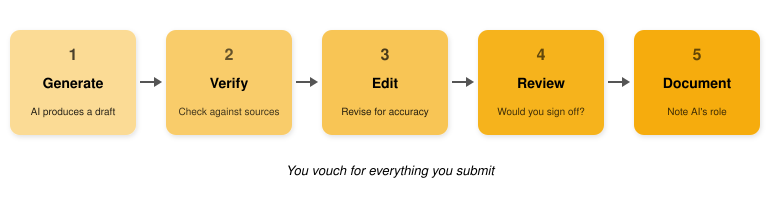

```{r}
#| label: setup
#| include: false
library(countdown)
```


##

<center>*Press the ? key for tips on navigating these slides*</center>

## Introductions


**Natalie Gill**     
Bioinformatician II   


## Schedule

1. Description: Reusable instructions
2. Discernment: Evaluating AI outputs
3. Coding with AI agents
4. Diligence: Responsible AI use
5. Q&A and discussion
6. Wrap-up and resources


# Description {.center}

<p style="font-size: 1.5em; text-align: center !important; margin-left: 0 !important; margin-right: 0 !important;">Reusable Instructions</p>


## Persistent Context: Projects and Custom Instructions

::: {style="font-size: 0.75em;"}

Most tools let you attach persistent context that applies to every chat in a workspace so you can avoid pasting the same information over and over again.

- **Projects** in Claude and ChatGPT, **Gems** in Gemini: attach reference documents and custom instructions that the model sees on every turn
- Good uses: background on your research area, your writing style, standard formatting, protocols, lab conventions
- For code, a `CLAUDE.md` or `AGENTS.md` file in the project folder serves the same purpose

:::

## Custom Instructions for Every Chat


- Account-wide instructions apply to every chat, not only one project
    - Claude: **Instructions for Claude** in Settings
    - ChatGPT: **Custom instructions**
    - Gemini: **Instructions for Gemini**
- Keep them short, because they take up context in every chat

## Example: Ask for Plain Writing

- Newer models can write in a verbose style that is harder to read and less precise
    - This style is called **mannered prose**
- Anthropic wrote an instruction to correct it in Claude Fable 5.1
    - It is in Anthropic's [prompting guide for Fable 5.1](https://platform.claude.com/docs/en/build-with-claude/prompt-engineering/prompting-claude-fable-5-1#writing-density)
- Short version: "Please remove all mannered prose."


## Plain Writing Instruction

::: {style="font-size: 0.85em;"}
:::{.example}
Mannered prose substitutes metaphor and flourish for direct statement. Instead of "a parameter worth varying," the mannered writer produces "a dial worth turning." Instead of "this point still matters," they write "this point earns its keep." The phrases exist to display the writer, not to convey the idea, and readers can tell. That is why mannered prose irritates: it makes the reader work harder so the writer can perform. It is also imprecise. Metaphors drag in connotations the writer did not choose and cannot control. The fix is to say what you mean. When a literal phrase is available, use it.
:::
:::

<div class="bottom-message">Source: Anthropic, "Prompting Claude Fable 5.1," Claude Platform Docs</div>

## Describing Work to an Agent

::: {style="font-size: 0.8em;"}
- **Goal**: what the finished result is and how you will judge it
- **Inputs**: which files, folders, or databases to use
- **Constraints**: what the agent must not change or access
- **Checkpoints**: when the agent should stop and ask you
- **Output**: what format to produce and where to save it
:::

<!-- TODO: add a bad vs. good agent task description example. -->

## Skills: Descriptions You Write Once

<!-- FIGURE: anatomy of a skill (name, description, instructions, optional files). -->

- A skill stores a task description so you do not rewrite it each time
- A skill has:
    - A name and a short description that tells the AI when to use it
    - Step-by-step instructions
    - Optional reference files or templates
- The same skill format works on several platforms

## Exercise: Write a Skill

<!-- TODO: choose timing, and confirm the current steps for adding a skill in Claude before each offering. -->

::: {style="font-size: 0.7em;"}
**Turn a task you have already done with Claude into a skill.**

1. Open a past chat where you completed a task you repeat
2. In that chat, ask Claude to write the skill:

:::{.example}
"Turn the workflow in this conversation into a skill I can reuse. Keep the steps that worked, leave out details specific to this one case, and write a description that says when the skill should be used."
:::

:::


# Discernment {.center}

## Three Types of Discernment

1. **Product Discernment**: Evaluating the quality of *what* AI produces
2. **Process Discernment**: Evaluating *how* the AI arrived at its output
3. **Performance Discernment**: Evaluating *how well* the AI is working for you

Think of it as: **What** did it produce? **How** did it get there? **How well** did it work with you?

## Product Discernment

::: {style="font-size: 0.8em;"}
Check every AI output against four criteria:

- **Accuracy**: Are the facts, names, and numbers correct?
    - Compare the output to the source
    - Check that cited papers exist and say what the AI claims
    - Check numerical values, statistics, and units
- **Precision**: Is the language specific enough, or vague and generic?
- **Completeness**: Are key findings, methods, or caveats missing?
- **Appropriateness**: Are the tone, depth, and format right for your audience and purpose?

:::


## Common AI Errors in Science

::: {style="font-size: 0.8em;"}
Watch out for these frequent mistakes:

- **Hallucinated citations**: AI invents plausible-sounding references that don't exist
- **Oversimplified mechanisms**: Complex signaling cascades reduced to linear pathways
- **Confused methodology**: Mixing up techniques
- **Overstated conclusions**: Presenting preliminary findings as established facts
- **Fabricated details**: Inventing sample sizes, p-values, or experimental conditions that weren't in the source
:::


## Cross-Model Verification

::: {style="font-size: 0.8em;"}

Running the same query through Claude and ChatGPT can feel like a second opinion. It isn't.

- Frontier models share overlapping training data and correlated errors
- Two models can confidently give the same wrong answer
- **Disagreement** is a useful flag for deeper checking
- **Agreement** is not confirmation
- The same applies to reviewer agents that run on the same model as the agent they check

Use cross-model/cross-session comparison to surface things worth investigating, not to validate correctness.

:::


## Verification Without Domain Expertise

::: {style="font-size: 0.7em;"}

When you're learning something new, you can't rely on your own expertise to spot errors. Do what you can first:

- **Ask for specific sources**, then check they exist and say what's claimed
- **Triangulate** against authoritative reviews or textbooks
- **Re-ask adversarially**: "what's the strongest objection to this?"
- **Identify the claim type** (mechanistic, statistical, mathematical): different claims need different verification

Then reach out to a subject matter expert.

:::{.example}
**If you do, disclose that it's AI-generated.** Reviewing AI output takes a different kind of attention than reviewing human work. Plausible-sounding mistakes appear in unfamiliar places, so experts need to know what they're reading before they can review it well.
:::

:::


## Performance Discernment

::: {style="font-size: 0.8em;"}
Evaluate how the AI is working *with* you, not just what it produces.

:::{.bad-example}

- AI consistently misunderstands technical terms in your field
- Outputs require more correction than writing from scratch would
- AI introduces errors faster than you can catch them
:::

:::{.good-example}

- AI helps structure your thinking in useful ways
- Iterations genuinely improve the output
- AI identifies aspects you hadn't considered
:::

:::


## Sycophancy: When AI Agrees With You

::: {style="font-size: 0.8em;"}
**Sycophancy** is the tendency to tell you what you want to hear instead of what is accurate

- Models are trained on human ratings, and people tend to rate agreement highly ([Sharma et al. 2023](https://arxiv.org/abs/2310.13548))
- Models often give up a correct answer when the user pushes back ([Hong et al. 2025](https://arxiv.org/abs/2505.23840))
- In research, it can look like:
    - Support for your hypothesis because you stated it first
    - Praise for a manuscript instead of a critical review
    - A changed answer after you ask "are you sure?"
:::


## Reducing Sycophancy

- **Do not reveal the answer you hope for**
    - Ask "What does this data show?", not "Does this data support my hypothesis?"
- **Ask for criticism directly**
    - Example: "List the three weakest points in this argument"
- **Start a new chat** to get an assessment that the earlier conversation has not shaped
- **Ask why it changed its answer** when it changes after you push back


## When to Stop Using AI for a Task

::: {style="font-size: 0.8em;"}
Consider stopping when:

- You've spent more time fixing AI output than it would take to do the task yourself
- The AI keeps making the same type of error despite reprompting
- The task requires judgment or nuance that the AI can't provide
- You find yourself accepting AI output without critically evaluating it

**The goal is to save time and improve quality.** If AI isn't doing both, switch approaches
:::


## Exercise: Research Mode Discernment

::: {style="font-size: 0.6em;"}
**Let's test how well AI handles the cutting edge of *your* field.**

Open Claude, turn on **Research mode**, and ask it to summarize recent progress on a topic where you have genuine expertise.

Pick a topic that satisfies these criteria:

1. It involves actively evolving research, where conclusions are still debated or changing
2. You have read key papers on this topic and know the nuances
3. You could spot if the AI gets something wrong or leaves something out

:::{.example}
"Summarize the current state of research on [your topic] in 500-800 words, focusing on key findings from the last 2 years. Include any ongoing debates or unresolved questions in the field."
:::

Research mode takes a while, so we'll take a 10-minute break while it runs, then review the results together
:::


# 10 min break

<center>

```{r}
#| echo: false
countdown::countdown(minutes = 10,
                     seconds = 0,
                     color_border = "black",
                     color_running_background = "#47d193",
                     color_finished_background = "#a3184e",
                     padding = "50px",
                     margin = "5%",
                     font_size = "4em",
       style = "position: relative; width: min-content;")
```

</center>

## Exercise: Review Research Mode Output

::: {style="font-size: 0.7em;"}
**Read through the AI's summary. Look for:**

- **Oversimplified conclusions**: Did it present an active debate as settled science?
- **Missing nuance**: Did it leave out key caveats, conflicting findings, or minority viewpoints?
- **Hallucinated details**: Are the papers, authors, or findings it mentions real?
- **Overstated claims**: Did it present preliminary results as established facts?
- **Incorrect technical language**: Did it misuse or confuse domain-specific terms?

**Reflect:** What did the AI get right? What would a non-expert *not* have caught?
:::


# Coding with AI Agents {.center}

## Coding with LLMs

::: {style="font-size: 0.8em;"}

Many researchers already use LLMs to write bioinformatics code. For the Bioinformatics Core's full stance, see our [position paper on responsible AI use in computational biology](https://www.dropbox.com/scl/fi/hyk0n0egz3rlxonuai6t7/Bioinformatics-Core-AI-Position-Paper-v1.0.pdf?rlkey=1gq3icconjym6jejm6aayrvup&dl=0).

**The discernment rule applies here too:**

:::{.bad-example}
If you cannot evaluate the correctness of the code, you should not be using LLMs to write it
:::

Bioinformatics code that looks right but is subtly wrong silently corrupts your results. AI can make arbitrary analysis decisions:

- Choosing inappropriate statistical methods
- Inserting "magic numbers" as thresholds or cutoffs
- Picking parameters from its training data rather than what your data actually requires

:::


## How Do I Know an AI Analysis Is Correct?

- There are two reliable options:
    - **Learn the analysis yourself** well enough to check the methods and the code
    - **Ask an expert to review it**, such as a bioinformatician or statistician
- Tell the reviewer that AI wrote the code
- Checks you can do on your own help, but they do not replace these options

<!-- TODO: add a link to Bioinformatics Core consultations and training workshops. -->


## Coding Agents

- A coding agent is a harness built for code
    - It reads your project, edits files, and runs commands
- Examples:
    - Claude Code (Anthropic)
    - Codex (OpenAI)
    - Gemini CLI (Google)
    - GitHub Copilot agent mode
- They work in similar ways, so the setup in this section applies to all of them


## Why Setup Matters

- An agent can change many lines in many files in one step
- You are responsible for every change
- You cannot review changes you cannot see
- The setup on the next slides makes every change visible


## Version Control with Git

- **Commit before each agent task**
    - Every change the agent makes then appears as a difference (a "diff") from that commit
- **Use one branch per analysis or feature**
    - You can discard a bad branch without affecting your other work
- **Revert** a change you do not want
- Do not allow agents to `commit` or `push` so you can review what has changed

New to Git? Try GitHub's [Hello World tutorial](https://docs.github.com/en/get-started/using-github/hello-world)


## Review Changes in an IDE


- An IDE (e.g., VS Code, Positron, RStudio) shows what changed
    - The source control panel lists every changed file
    - Inline diffs show the changed lines in each file
- Review the diff, not the whole file


## One Folder per Analysis


- Keep each analysis in its own folder
    - The agent's changes stay in that folder
    - The diff shows only related files
- Put code that several analyses share in one folder that they all use


## Large Scripts Are Hard to Review

- In one long script, a small change can affect code far from the change
    - You have to read the whole script to confirm nothing else broke
- With functions, a new feature is a new or changed function and the line that calls it
    - You review only that function


## Unit Tests

::: {style="font-size: 0.85em;"}
- A unit test runs one function on a small input and checks the output against the answer you expect
    - Example: the reverse complement of `ATGC` is `GCAT`
- Run the tests after each agent change to find code that the change broke
- Ask the agent to add a test for each new function, and check that the expected answers are correct
- Check the diff for changed tests, because an agent may edit a test to make it pass
- A passing test shows that the code does what the test checks, not that the analysis is correct
:::


## Core Features of Claude Code

::: {style="font-size: 0.8em;"}
- **Start in a project folder**: the agent works on the files in that folder
- **Project instructions**: `/init` creates a `CLAUDE.md` file that the agent reads at the start of every session
    - Other agents read `AGENTS.md` for the same purpose
- **Plan mode**: the agent proposes a plan and makes no changes until you approve it
- **Permission prompts**: the agent asks before it edits files or runs commands
- **`/compact`**: summarizes the current context window to avoid context rot
- **`/clear`**: starts a new conversation to avoid context rot
:::


## Demo: Reviewing code changes

- Example repository: [seqtools](https://github.com/natalie-23-gill/seqtools), a small DNA sequence script with unit tests
    - The README has the setup steps and three tasks to try on your own
- Watch for:
    - The commit before the task starts
    - The plan, and what we change in it
    - How the diff shows each change
    - The tests we run after the change


## Learn More

- **Agentic Programming for Bioinformatics** covers:
    - Software engineering practices that make agent-written code easier to review
    - Testing, specification-driven development, and packaging

<!-- TODO: add the workshop date or link. -->


# Diligence {.center}

## Risks to Consider

::: {style="font-size: 0.7em;"}

Creating with AI carries risks that are easy to overlook until they bite:

- **Data privacy**: Never paste unpublished data, patient information, or proprietary sequences into AI tools without checking your institution's data use policies
- **Copyright and IP**: AI-generated text can reproduce IP without citation
- **Methodological choices**: AI will confidently suggest statistical methods or parameters that don't fit your data

:::

## Risks Specific to Agents

::: {style="font-size: 0.75em;"}
- **Access**: a connected agent can read everything the connector allows, such as all of your email
- **Hidden instructions**: a PDF or web page can contain text that tells the agent to do something you did not ask for
    - This is called prompt injection
- **Unattended runs**: nobody reviews a scheduled task while it runs
- **Data location**: check whether the tool processes your data on your computer or on the vendor's servers
:::


## AI and Skill Atrophy

::: {style="font-size: 0.75em;"}

Using AI heavily for critical tasks can erode skills you still need, or prevent you from building them in the first place.

**Evidence:**

- [Budzyń et al. (2025), *Lancet Gastroenterol Hepatol*](https://doi.org/10.1016/S2468-1253(25)00133-5): endoscopists showed a 20% relative drop in adenoma detection rate on non-AI colonoscopy after routine AI exposure.
- [Turney et al. (2026), *Adv Med Educ Pract*](https://doi.org/10.2147/AMEP.S583763): AI in medical training improves efficiency and basic knowledge, but higher-order clinical reasoning outcomes are mixed or weaker.
- [Lee et al. (2025), *CHI '25*](https://doi.org/10.1145/3706598.3713778): survey of 319 knowledge workers: higher confidence in AI predicts less critical thinking; higher self-confidence predicts more.


:::


## Taking Responsibility for AI Output

<br>

{fig-alt="Five-step deployment diligence process shown as a horizontal pipeline: 1. Generate (AI produces a draft), 2. Verify (check against sources), 3. Edit (revise for accuracy), 4. Review (would you sign off?), 5. Document (note AI's role), with the principle that you vouch for everything you submit" fig-align="center" width=100%}


## Disclosing AI Use

::: {style="font-size: 0.75em;"}

If someone would want to know AI was involved, disclose it.

- **Manuscripts**: Most journals require disclosure in Methods, Acknowledgments, or Author Contributions. AI cannot be an author, and many journals prohibit AI-generated figures
- **AI-assisted analysis**: describe it in Methods with the tool, version, and prompts, in enough detail to replicate ([ICMJE](https://www.icmje.org/recommendations/browse/manuscript-preparation/preparing-for-submission.html))
- **Grant proposals**: AI use is generally discouraged; check funder guidelines (NIH, NSF) before submitting AI-assisted text
- **Collaborators and supervisors**: When AI shaped the analysis or writing, let your team know


:::


## Exercise: Diligence Scenarios

<!-- TODO: write the scenarios and choose the group format. -->

::: {style="font-size: 0.8em;"}
**In small groups, discuss each scenario:**

- What could go wrong?
- What should the researcher have done differently?
- What should they disclose, and to whom?
:::


## Open Discussion

::: {style="font-size: 0.75em;"}
**Let's discuss your questions about using AI in research.**

Some topics to consider:

- Challenges you've encountered with AI tools
- Edge cases: when is it unclear whether to use AI?
- How to handle situations where AI output is "good enough" but not verified

:::

# Wrap-Up

## Key Takeaways

::: {style="font-size: 0.8em;"}
1. **Delegate** thoughtfully: Know what the tools can do, define your task, choose the right mode
2. **Describe** clearly: Give the AI the context, constraints, and checkpoints it needs
3. **Discern** critically: Evaluate what AI produces, how it got there, and how it works with you
4. **Act with Diligence**: Use AI responsibly, transparently, and always verify before you share

Learn the concepts: the products will change, but the concepts transfer

AI is a powerful tool for research, but it cannot replace **your** judgment
:::

## Resources

- **AI Fluency Framework**: [Anthropic AI Fluency Curriculum](https://www.anthropic.com/learn) (CC BY-NC-SA 4.0)
- **Prompt Engineering Guide**: [docs.anthropic.com](https://docs.anthropic.com/en/docs/build-with-claude/prompt-engineering/overview)
- **Bioinformatics Core Position Paper**: [Responsible AI Use in Computational Biology](https://www.dropbox.com/scl/fi/hyk0n0egz3rlxonuai6t7/Bioinformatics-Core-AI-Position-Paper-v1.0.pdf?rlkey=1gq3icconjym6jejm6aayrvup&dl=0)
- **Model Context Protocol**: [modelcontextprotocol.io](https://modelcontextprotocol.io)

<!-- TODO: add vendor-neutral links for the skills format and AGENTS.md, and the take-home repository. -->


# End of Part 2

## Workshop survey
- Please fill out our [workshop survey](https://www.surveymonkey.com/r/bioinfo-training26) so we can continue to improve these workshops

## Anthropic's AI for Science Interviewer

- Anthropic asked us to share their **AI for Science Interviewer** with you
- [claude.ai/interviewer/ai_for_science](https://claude.ai/interviewer/ai_for_science)
- Participation is optional and separate from our workshop survey

## Thank You

Thanks to Anthropic for providing temporary Claude account upgrades for workshop attendees and for the [AI Fluency framework](https://www.anthropic.com/learn) that inspired this workshop ([CC BY-NC-SA 4.0](https://creativecommons.org/licenses/by-nc-sa/4.0/)).

## AI Disclosure

Claude (Anthropic) was used as an aid in developing and adapting materials for this workshop. All content was reviewed and approved by the workshop instructor.

## Upcoming Workshops {.small}

**Single Cell RNA-Seq Analysis Using R**\
October 12, 2026 9:30am-12:00pm PDT

**Introduction to Pathway Analysis**\
October 15, 2026 1:00-4:00pm PDT

**Statistics of Enrichment Analyses Methods**\
October 22, 2026 1:00-3:00pm PDT

[See all upcoming workshops](https://gladstone.org/events/?series=data-science-training-program)
