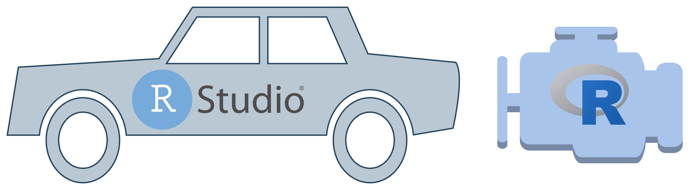
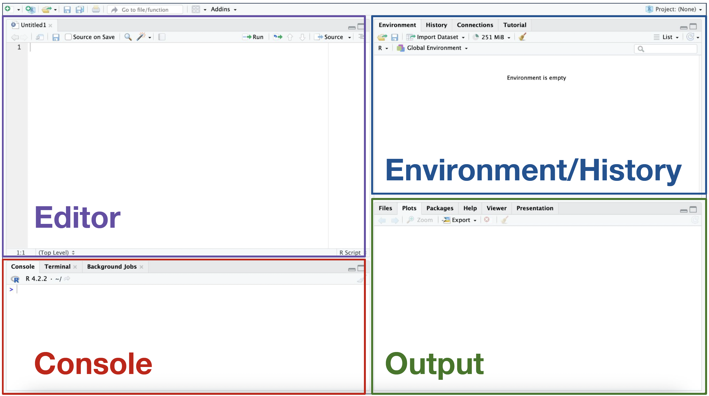
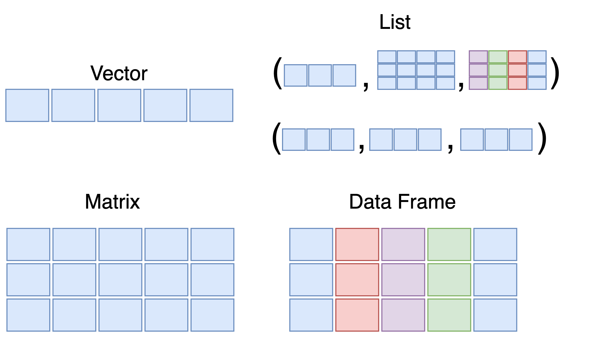
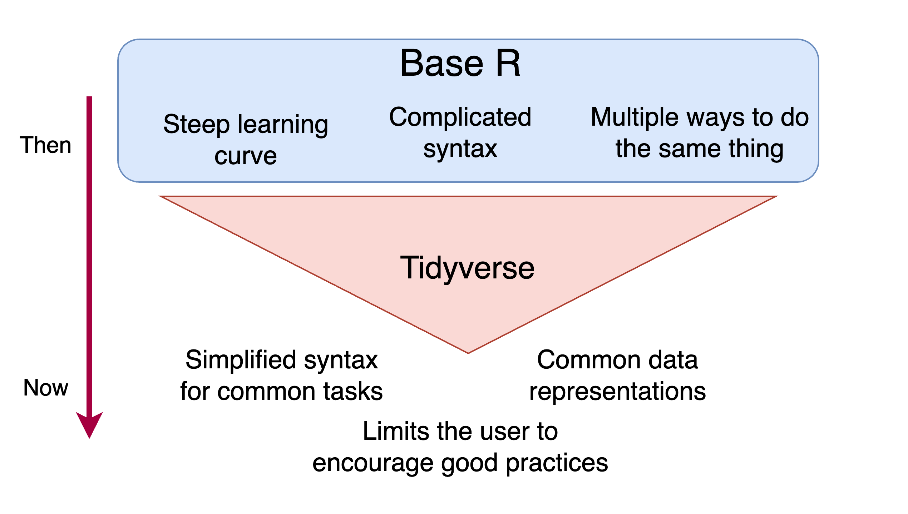

```{r, setup, include=FALSE}
library(tidyverse)
```

## 

<center>*Press the ? key for tips on navigating these slides*</center>

## Introductions

**Natalie Elphick**    
Bioinformatician I   

**Michela Traglia (TA)**     
Senior Statistician    


## Poll 1

**What is your level of experience with coding/data analysis?**

1.  I am fluent in another data analysis programming language (Python, Matlab etc.)
2.  I am use Excel to do linear regression
3.  I know some R
4.  All of the above
5.  None of the above

## Target Audience
-   No background in statistics or computing
-   No prior experience with programming or R/RStudio

## Part 1:

1.  What is R and why should you use it?
2.  The RStudio interface
3.  File types
4.  Error messages
5.  Variables
6.  Types & data structures
7.  Math and logic operations
8.  Functions and packages


# What is R?

## R

-   An open source language developed for statistical computing by **R**oss Ihaka and **R**obert Gentleman
-   Inspired by the **S** language developed at Bell labs in 1976 to make interactive data analysis easier
-   The first official version was released in 2000

## Why use R for data analysis?

- R is and will always be free
- Can easily implement any statistical analysis
- Code serves as a record which enables reproducibility
with minimal effort
- As of March 2023, there were over 19,000 open source packages to extend its
functionality
  - Highly customizable graphics ([ggplot2](https://ggplot2-book.org/))
  - Analysis reports ([knitr](https://cran.r-project.org/web/packages/knitr/index.html))
  - RNA-seq analysis ([DESeq2](https://bioconductor.org/packages/release/bioc/html/DESeq2.html))

## How does it work? 

<section class="shrink">

</section>

# RStudio

## RStudio
- RStudio is an integrated development
environment (IDE)  
- It makes R code easier to write by providing a
feature rich graphical user interface (GUI)

<br>
</br>

<section class="shrink">

</section>


## Layout 




## File types

-   **Rscript** files that end in `.R`
    -   The most basic, a file that contains R code
-   **RMarkdown** files that end in `.Rmd`
-   Let's create a blank Rscript to see how they work, open RStudio and click:  
    -   File -\> New File -\> R Script

## R Markdown

-   A file format combining `R` code with [Markdown](https://www.markdownguide.org/basic-syntax/) for text formatting.
-   Designed for creating reproducible research reports in various formats (HTML, PDF, Word).
-   Let's create an `Rmd` file in `RStudio` to explore the basics of how they work:
-   File -\> New File -\> R Markdown

## R Markdown Advanced Usage

-   **Presentations:** Creating slides (like these) with [revealjs](https://github.com/rstudio/revealjs).
-   **Publications:** Authoring online books that combine narrative, code, and output with [bookdown](https://bookdown.org/).
-   **Interactive Documents:** Developing interactive tutorials or dashboards with [learnR](https://rstudio.github.io/learnr/) and other embedded applications.

# Variables

## Variable definition
-    Variables store information that is referenced and manipulated
in a computer program
-    In contrast to the mathematical definition of a variable,
variables in computer science are _mutable_
-    There are 3 ways to define variables in R, but one is preferred:
```{r}
x <- 1  # Preferred way
x = 1
1 -> x
print(x)
```

## Variable naming

-   Variables names must start with a letter and can contain
underscores and periods
-   It is best practice to use descriptive variable names and stick
to one style of names

```{r}
# Snake case
dog_breeds <- c("Labrador Retriever", "Akita", "Bulldog")

# Period separated
dog.breeds <- c("Labrador Retriever", "Akita", "Bulldog")

# Camel case
DogBreeds <- c("Labrador Retriever", "Akita", "Bulldog")
```

## Poll 2

**Which variable name is not valid in R?**

1.    cat_dog
2.    CatDOG
3.    cat.dog
4.    catD0g


## Excercise 1
-   Open Rscript file part_1.R in Rstudio

# Data Types and Structures

## Data Types
- Integer
    - Whole numbers
- Numeric
    - Decimal numbers
- Logical
    - Boolean (TRUE, FALSE)
    - NA
- Character
    - Letters and strings of letters
    - "A", "Labrador Retriever"

## Data Structures
- Vectors
    - Atomic vectors - one dimensional lists that store values of
    the **same type**
    - Lists - can be multidimensional and contain **different types/structures** (ex. nested lists)
- Factors
    - Ordered list with assigned levels
- Matrix
    - Columns and rows of the **same type**
- Data frames
    - Columns and rows of **mixed types**

##




## Exercise 2: Data Types and Structures
-   Reopen Rscript file part_1.R in Rstudio


# 10 min break

<center>

```{r, echo=FALSE}

countdown::countdown(minutes = 10,
                     seconds = 0,
                     color_border = "black",
                     padding = "50px",
                     margin = "5%",
                     font_size = "5em",
       style = "position: relative; width: min-content;")
```

</center>

# Math and Logic Operations

## Math & Logic

- Built in functions to get common mathematical summaries of data (eg. mean( ), median( ), mode( ) )
- Relational comparison operators to compare values

```{r, eval=FALSE}
x == y  # Equal to
x != y  # Not equal to
x <  y  # Less than
x > y   # Greater than
x <= y  # Less than or equal to
x >= y  # Greater than or equal to

x %in% y # Is x in this vector y?
```

## Logical Operators
  - Logical operators can compare TRUE or FALSE values
```{r, eval=FALSE}
x <- TRUE
y <- FALSE

!x     # Not x
x | y  # x or y
x & y  # x and y

```

## Conditional execution

-   Relational and logical operations allow for conditional
execution of code

```{r}
if ("Akita" %in% dog_breeds) {
  print("dog_breeds already contains Akita")
} else {
  dog_breeds <- c("Akita", dog_breeds)
}

```

# Functions

## Functions

-  A function is block of organized, reusable code that is used to
perform a single action
-  R has many built in functions, these are called **base R** functions
-  Not all arguments are required and some have default values


## Defining a function
-   To define a function we use the function keyword, the output is specified with the **return** keyword:
```{r}
add_dog <- function(dog_to_add,
                    input_vector) {
  if (dog_to_add %in% input_vector) {
    
    message("Already contains this dog")
    
  } else {
    
    output <- c(dog_to_add, input_vector)
    return(output)
    
  }
}
```

## Example
```{r}
add_dog(dog_to_add = "Akita",
        input_vector = dog_breeds)
```

```{r}
add_dog(dog_to_add = "German Shepard",
        input_vector = dog_breeds)
```

# Packages

## Packages
-    Packages are collections of functions that are specialized to a specific task (plotting, data manipulation etc.)
-    The tidyverse is a collection of commonly used data analysis
packages
    -   Learning curve is less steep
    -   Lots of useful packages for data analysis

##



# End of Part 1

## Workshop survey
- Please fill out our [workshop survey](https://www.surveymonkey.com/r/F75J6VZ) so we can continue to improve these workshops

## Upcoming Workshops

1. [Introduction to Statistics, Experimental Design, and Hypothesis Testing](https://gladstone.org/index.php/events/introduction-statistics-experimental-design-and-hypothesis-testing-0) 
    -   Jan 25, 2024 (Session 1 - 10am–12pm) (Session 2 - 1pm–3pm)
    -   Jan 26, 2024 (Session 3 - 10am–12pm)

2. [Intermediate RNA-Seq Analysis Using R](https://gladstone.org/index.php/events/intermediate-rna-seq-analysis-using-r-4)
    -   Feb 1, 2024 (9:30am-12:00pm)


