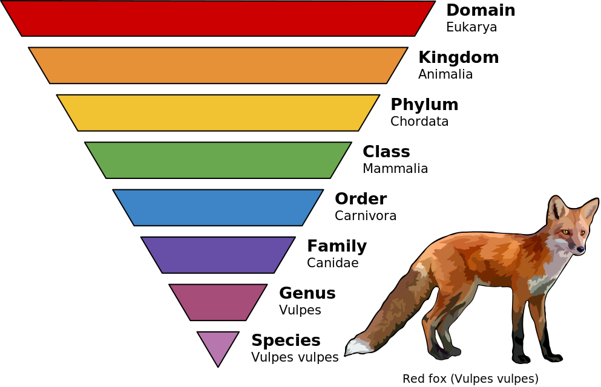

```{r, setup, include=FALSE}
library(kableExtra)
library(tidyverse)
library(readxl)
theme_set(theme_grey(base_size = 16))
```

## 

<center>*Press the ? key for tips on navigating these slides*</center>

# Introductions
**Natalie Elphick**    
Bioinformatician I  

**Yihang Xin (TA)**     
Software Engineer III   

# Schedule

1. Introduction to Tidyverse
2. Filtering and reformatting data
3. Plotting data
4. Hands on data analysis

# Introduction to Tidyverse

## Tidyverse

-   The tidyverse packages work well together because they share
common data representations and design principles
    -   Rows = observations, columns = variables
-   [ggplot2](), for data visualization.
-   [dplyr](), for data manipulation.
-   [tidyr](), for data tidying.
-   [readr](), for data import.
-   [purrr](), for iteration.
-   and more..

## dplyr
-    Offers a common “grammar” of functions for data manipulation   
      -    [mutate()](https://dplyr.tidyverse.org/reference/mutate.html) adds new variables that are functions of existing
    columns
      -    [select()](https://dplyr.tidyverse.org/reference/select.html) picks columns based on their names
      -    [filter()](https://dplyr.tidyverse.org/reference/filter.html) picks rows based on their values
      -    [summarise()](https://dplyr.tidyverse.org/reference/summarise.html) reduces multiple values down to a single summary
      -    [arrange()](https://dplyr.tidyverse.org/reference/arrange.html) changes the ordering of the rows
      -    [group_by()](https://dplyr.tidyverse.org/reference/group_by.html) allows any operation to be done “by group”


## Example Dataframe
-   mpg is a dataframe built into the ggplot2 package
```{r, eval = FALSE}
head(mpg)
```

```{r, echo = FALSE}
head(mpg) |>
  kable() |>
  kable_styling("striped") |>
  scroll_box(width = "100%")
```

## Select Columns

```{r, eval = FALSE}
select(.data = mpg,
       year, cty, hwy, manufacturer)
```

```{r, echo = FALSE}
select(.data = mpg,
       year, cty, hwy, manufacturer) |>
  head() |>
  kable() |>
  kable_styling("striped") |>
  scroll_box(width = "100%")
```


## Filter Rows


```{r, eval = FALSE}
filter(.data = mpg,
       year == 2008)
```

```{r, echo = FALSE}
filter(.data = mpg,
       year == 2008) |>
  head() |>
  kable() |>
  kable_styling("striped") |>
  scroll_box(width = "100%")
```
## Arrange Rows

-   desc() is used to arrange rows in descending order, the default is ascending
```{r, eval = FALSE}
arrange(.data = mpg,
        desc(cyl))
```

```{r, echo = FALSE}
arrange(.data = mpg,
        desc(cyl)) |>
  head(n = 3) |>
  kable() |>
  kable_styling("striped") |>
  scroll_box(width = "100%")
```
## Summarising data
-    The dplyr **summarise()** function computes a table of
summaries for a data frame
-    **group_by()** groups the input data frame by the specified
variable(s)
-    Combining these two allows us to easily create summaries for
different categorical groupings

## Group and Summarise
```{r, eval = FALSE}
summarise(group_by(.data = mpg,
                   manufacturer),
          mean_cty = mean(cty),
          median_cty = median(cty))
```

```{r, echo = FALSE}
summarise(group_by(.data = mpg,
                   manufacturer),
          mean_cty = mean(cty),
          median_cty = median(cty)) |>
  head() |>
  kable() |>
  kable_styling("striped") |>
  scroll_box(width = "100%")
```

## The pipe operator |>
-   Allows "chaining" of function calls to make code more readable
```{r, eval = FALSE}
mpg |>
  group_by(manufacturer) |>
  summarise(mean_cty = mean(cty),
            median_cty = median(cty))
```

```{r, echo = FALSE}
mpg |>
  group_by(manufacturer) |>
  summarise(mean_cty = mean(cty),
            median_cty = median(cty)) |>
  head(n = 4) |>
  kable() |>
  kable_styling("striped") |>
  scroll_box(width = "100%")
```


# Plotting

## ggplot2
-    The most popular tidyverse package
-    Create publication quality, highly customizable plots
      -   See the [R graph gallery](https://r-graph-gallery.com/index.html) for examples
-    ggplots use “layers” to build, modify and overlap visualizations
      - Layers are added using the + symbol and can be added to an existing ggplot
-    Many popular packages output ggplots which can then be easily modified by adding layers


## Creating ggplots

<br>
</br>


## Plot Example

```{r, fig.dim=c(6,4)}
ggplot(data = mpg,                         # Input dataframe
       mapping = aes(x = cty, y = hwy)) +  # Aesthetic mapping
  geom_point()                             # Point graph
```

## Adding and Modifying Layers 

```{r, fig.dim=c(10,4)}
ggplot(data = mpg,
       mapping = aes(x = class, y = cty, fill = class)) +
  geom_violin() +
  geom_boxplot(width = 0.1,
               fill = "white")
```


# 10 min break

<center>

```{r, echo=FALSE}

countdown::countdown(minutes = 10,
                     seconds = 0,
                     color_border = "black",
                     padding = "50px",
                     margin = "5%",
                     font_size = "5em",
       style = "position: relative; width: min-content;")
```

</center>


# Hands-on Data Analysis

## Dataset Description
-   PanTHERIA
    -   A global species-level data set of key life-history, ecological and geographical traits of all known extant and recently extinct mammals compiled from the literature
    -   Macroecological and macroevolutionary research projects
    -   Data is organized by taxonomic rank

## Taxonomic Rank



## Data Preview

```{r, echo = FALSE}
read_xlsx("Intro_to_R_workshop_materials/PanTHERIA.xlsx") |>
  head() |>
  kable() |>
  kable_styling("striped") |>
  scroll_box(width = "100%")
```


## Hands-on Analysis
-   Open part_2.Rmd


# ChatGPT Tips for R

## General Tips

-   Always confirm ChatGPT's outputs are correct
-   Provide as much detail as possible about the problem in the 1st prompt
-   Use separate chats for separate tasks/projects
-   Try the 'Custom Instructions' function that adds additional information to every prompt
-   Can visit webpages (GPT 4 only), which can help get more specific answers

## Code Tips

-   Commented R code yields better responses in my experience
-   Provide the code and error message in the same prompt
-   ChatGPT can work well to convert syntax and improve your code:
    -   "Turn this loop into a function : [your code]"
    -   "Is there a better way to do this : [your code]"
-   Check out the file: `example_code/1_convert_syntax_example.R` for an example use case

# Finding R Packages

## Key Questions

-   What assay was the package designed for?
-   When was the last release?
-   Is it maintained (frequent updates)?
-   Does it work on all operating systems?
-   Are other people using it? (citations)
-   Do they respond to github issues?
-   Is there a benchmarking paper?

## BioConductor and CRAN

-   Both of these have stringent requirements for packages they host (eg. for BioConductor they have to run on all major operating systems)

-   Prefer BioConductor packages if available over CRAN

-   Prefer CRAN packages over ones only hosted on GitHub

## Start with the Assay

-   Click [here](https://www.bioconductor.org/packages/release/BiocViews.html#___Sequencing) to go to BioC views
-   Pick the assay you want to analyse
-   Pick the type of analysis you want to do
-   Find a package that does it
-   Find benchmarking papers to narrow the list of packages down
-   Find the vignette on the package page and refer to the manual for any questions not covered by it


# Additional Resources

## R

-   [R Markdown: The Definitive Guide](https://bookdown.org/yihui/rmarkdown/how-to-read-this-book.html) : Excellent R markdown reference

-   [R for Data Science](https://r4ds.hadley.nz/)

-   [ggplot2: elegant graphics for data analysis](https://ggplot2-book.org/)

-   [Advanced R](https://adv-r.hadley.nz/)

## Statistics

-   [Data Analysis in R](https://bookdown.org/steve_midway/DAR) : This book has more statistics details than *R for Data Science*
-   [Generalized Linear Models](https://bookdown.org/steve_midway/DAR/glms-generalized-linear-models.html)\
-   [Random Effects](https://bookdown.org/steve_midway/DAR/random-effects.html)

## RNA-seq Analysis

-   [RNA-seqlopedia](https://rnaseq.uoregon.edu/) : Everything you need to know about RNA-seq experiments
-   [RNA-seq Expression Units](https://luisvalesilva.com/datasimple/rna-seq_units.html) : Blog post on understanding common units
-   [Introduction to Single-Cell Analysis with Bioconductor](https://bioconductor.org/books/3.17/OSCA.intro/index.html) : Covers the basics of scRNA-seq analysis in R

## Dimensional Reduction

-   [Tutorial on PCA](https://uw.pressbooks.pub/appliedmultivariatestatistics/chapter/pca/) : PCA explained with R code examples
-   [Understanding UMAP](https://pair-code.github.io/understanding-umap/) : Short explanation with great visualizations, mainly useful for scRNA-seq analysis


# End of Part 2

## Workshop survey
- Please fill out our [workshop survey](https://www.surveymonkey.com/r/F75J6VZ) so we can continue to improve these workshops

## Upcoming Workshops

1. [Introduction to Statistics, Experimental Design, and Hypothesis Testing](https://gladstone.org/index.php/events/introduction-statistics-experimental-design-and-hypothesis-testing-0) 
    -   Jan 25, 2024 (Session 1 - 10am–12pm) (Session 2 - 1pm–3pm)
    -   Jan 26, 2024 (Session 3 - 10am–12pm)

2. [Intermediate RNA-Seq Analysis Using R](https://gladstone.org/index.php/events/intermediate-rna-seq-analysis-using-r-4)
    -   Feb 1, 2024 (9:30am-12:00pm)

