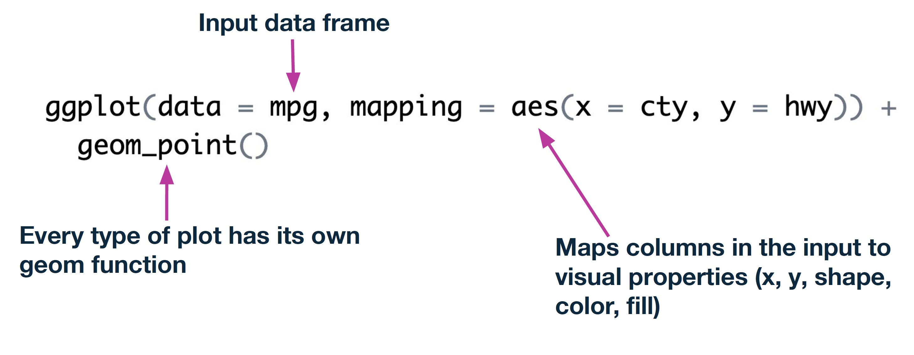
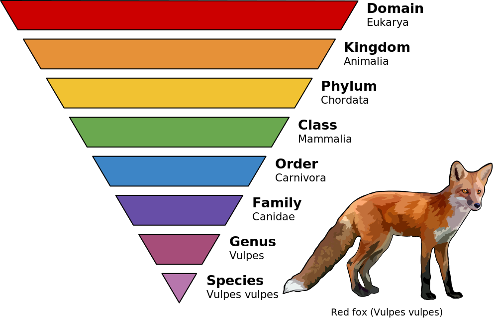

```{r}
#| label: setup
#| include: false
library(kableExtra)
library(tidyverse)
library(readxl)
theme_set(theme_grey(base_size = 16))
knitr::opts_chunk$set(comment = "", echo = TRUE)
```

##

<center>*Press the ? key for tips on navigating these slides*</center>

# Introductions
**Natalie Gill**   
Bioinformatician II


# Schedule

1. Introduction to Tidyverse
2. Filtering and reformatting data
3. Plotting data
4. Hands on data analysis
5. Using AI to learn R
6. Where to get help


# Introduction to Tidyverse

## Tidyverse

-   The tidyverse packages work well together because they share
common data representations and design principles
    -   Rows = observations, columns = variables
-   [ggplot2](https://ggplot2.tidyverse.org/), for data visualization.
-   [dplyr](https://dplyr.tidyverse.org/), for data manipulation.
-   [tidyr](https://tidyr.tidyverse.org/), for data tidying.
-   [readr](https://readr.tidyverse.org/), for data import.
-   [purrr](https://purrr.tidyverse.org/), for iteration.
-   and more..

## dplyr
-    Offers a common "grammar" of functions for data manipulation
      -    [mutate()](https://dplyr.tidyverse.org/reference/mutate.html) adds new variables that are functions of existing
    columns
      -    [select()](https://dplyr.tidyverse.org/reference/select.html) picks columns based on their names
      -    [filter()](https://dplyr.tidyverse.org/reference/filter.html) picks rows based on their values
      -    [summarise()](https://dplyr.tidyverse.org/reference/summarise.html) reduces multiple values down to a single summary
      -    [arrange()](https://dplyr.tidyverse.org/reference/arrange.html) changes the ordering of the rows
      -    [group_by()](https://dplyr.tidyverse.org/reference/group_by.html) allows any operation to be done "by group"


## Example Dataframe
-   mpg is a dataframe built into the ggplot2 package
```{r}
head(mpg)
```


## Select Columns

```{r}
select(.data = mpg,
       year, cty, hwy, manufacturer)
```


## Filter Rows


```{r}
filter(.data = mpg,
       year == 2008)
```


## Arrange Rows

-   desc() is used to arrange rows in descending order, the default is ascending
```{r}
arrange(.data = mpg,
        desc(cty))
```


## Summarising data
-    The dplyr **summarise()** function computes a table of
summaries for a data frame
-    **group_by()** groups the input data frame by the specified
variable(s)
-    Combining these two allows us to easily create summaries for
different categorical groupings

## Group and Summarise

- Get the mean and median city mileage within manufacturer

```{r}
#| echo: true
summarise(.data = group_by(.data = mpg,
                   manufacturer),
          mean_cty = mean(cty),
          median_cty = median(cty)) |>
  head(5)
```


## The pipe operator |>
-   Allows "chaining" of function calls to make code more readable
```{r}
mpg |>
  group_by(manufacturer) |>
  summarise(mean_cty = mean(cty),
            median_cty = median(cty)) |>
  head(5)
```


# Plotting

## ggplot2
-    The most popular tidyverse package
-    Create publication quality, highly customizable plots
      -   See the [R graph gallery](https://r-graph-gallery.com/index.html) for examples
-    ggplots use "layers" to build, modify and overlap visualizations
      - Layers are added using the + symbol and can be added to an existing ggplot
-    Many popular packages output ggplots which can then be easily modified by adding layers


## Creating ggplots


{fig-alt="Annotated ggplot code showing three components: data parameter for input data frame, mapping with aes() for aesthetic mappings like x and y, and geom_point() indicating every plot type has its own geom function" .nostretch fig-align="center" width=85%}


## Plot Example

```{r}
#| fig-width: 6
#| fig-height: 4
ggplot(data = mpg,                         # Input dataframe
       mapping = aes(x = cty, y = hwy)) +  # Aesthetic mapping
  geom_point()                             # Point graph
```

## Adding and Modifying Layers

```{r}
#| fig-width: 6
#| fig-height: 4
ggplot(data = mpg,
       mapping = aes(x = cty, y = hwy)) +
  geom_point(color = "brown") +
  geom_smooth(formula = y ~ x, method = "lm")
```


# 10 min break

<center>

```{r}
#| echo: false
countdown::countdown(minutes = 10,
                     seconds = 0,
                     color_border = "black",
                     color_running_background = "#47d193",
                     color_finished_background = "#a3184e",
                     padding = "50px",
                     margin = "5%",
                     font_size = "5em",
       style = "position: relative; width: min-content;")
```

</center>


# Hands-on Data Analysis

## Dataset Description
-   PanTHERIA
    -   A global species-level data set of key traits of all known extant and recently extinct mammals compiled from literature
    -   Used in macroecological and macroevolutionary research projects
    -   Data is organized by taxonomic rank

## Taxonomic Rank 

{fig-alt="Inverted pyramid showing taxonomic classification of a red fox, from broadest (Domain: Eukarya) to most specific (Species: Vulpes vulpes), with color-coded levels for Kingdom, Phylum, Class, Order, Family, and Genus" .nostretch fig-align="center" width=85%}

## Data Preview

```{r}
#| echo: false
read_xlsx("Intro_to_R_workshop_materials/PanTHERIA.xlsx", na = "NA") |>
  head(10) |>
  kable() |>
  kable_styling("striped", full_width = FALSE)
```

## Hands-on Analysis

-   We will read in the data and explore if the trophic level has a significant impact on the adult body mass of mammals

Steps:   
1. Combine and clean the data   
2. Visualize adult body mass by trophic level   
3. Check for overrepresented groups   
4. Fit a simple linear model   

## Hands-on Analysis
-   Open part_2.Rmd
-   If you just want to follow along and not run code, open part2_filled_out.html


# Using AI to Learn R

## Use AI as a Tutor, Not a Code Generator


-   Generating large blocks of code you don't understand means:
    -   You can't spot subtle bugs or silently wrong results
    -   Hallucinated functions and packages are common
    -   You don't build skills to debug or extend the code later
-   Follow institutional guidelines and **never paste private or patient data into a public chatbot**

## Prompt Engineering

A good prompt has 3 parts:

1.  **Context**: what you're doing, what your data looks like, what you've tried
2.  **A specific question**: one focused ask, not "fix my script"
3.  **How you want the answer**: e.g. *"explain the approach before writing code"*

## Prompts That Build Understanding

Instead of *"Write code to filter and plot this data"*, try:

-   "I have a data frame with columns X, Y, Z. I want rows where X > 10. Which dplyr function fits and why?"
-   "Explain `group_by() |> summarize()` with a small example."
-   "Here's my code \[paste\]. Walk me through what each line does."
-   "What are 2 ways to do this in R, and what are the tradeoffs?"

## Debugging with AI

Paste all three:

1.  The code that produced the error
2.  The full error message
3.  What you expected vs. what happened

Then ask *"What is this error telling me, and what should I check first?"*  instead of *"fix this"*.

## Always Verify

-   Run small examples and check outputs yourself
-   Cross-check unfamiliar functions against official package docs
-   Push back: *"Are you sure that function exists in dplyr?"*

::: {.bottom-message}
Goal: leave each AI conversation knowing more R than when you started.
:::


# Where to Get Help

## Bioinformatics Questions

For any bioinformatics specific questions feel free to reach out to the Gladstone Bioinformatics Core.

-   Email
    -   [bioinformatics@gladstone.ucsf.edu](mailto:bioinformatics@gladstone.ucsf.edu)
-   Slack channel #questions-about-bioinformatics
    -   Contact us at the email above to be added to the channel

## Debugging Errors

-   Try searching the web by pasting the error message and any relevant keywords (package or function name)
-   Websites like [Stack Overflow](https://stackoverflow.com/) and [Posit Community Forum](https://forum.posit.co/) should have the most relevant answers
-   If the problem is package specific, check the documentation and reach out to the authors using their preferred method

# Additional Resources

## Coding Templates

Code templates can be used to avoid typing the same code over and over again.

-   These are templates can be used to automate things like plot appearance and documentation:
    -   [.Rmd Template](https://www.dropbox.com/scl/fi/a9cnyqdajgabbfcxbmm6y/RMD_template.Rmd?rlkey=yntfpo6aptw9b4pgjyzpe5ubi&dl=1)
    -   [.R Script Template](https://www.dropbox.com/scl/fi/cy43b8b1x3nzn17esnmmt/Rscript_template.R?rlkey=zn7b0g8nn0s9213blh70fjjsx&dl=1)

-   Customize these for your use case to save time


## R Resources
-   [R for Data Science](https://r4ds.hadley.nz/)
-   [Top 10 R Errors and How to Fix them](https://statsandr.com/blog/top-10-errors-in-r/)
-   [R Markdown: The Definitive Guide](https://bookdown.org/yihui/rmarkdown/how-to-read-this-book.html)
-   [ggplot2: elegant graphics for data analysis](https://ggplot2-book.org/)
-   [Advanced R](https://adv-r.hadley.nz/)


# End of Part 2

## Workshop survey
- Please fill out our [workshop survey](https://www.surveymonkey.com/r/bioinfo-training26) so we can continue to improve these workshops

## Upcoming Workshops {.small}


**Single Cell RNA-Seq Analysis Using R**  
April 13 - April 14, 2026 9:00am - 12:00pm PDT      
  
**Linear Mixed Effects Models Using R**    
May 4 - May 5, 2026 9:00am - 4:00pm PDT   

**scATAC-seq Analysis Using R**     
May 11-May 12, 2026 9:30am-12:00pm PDT    


