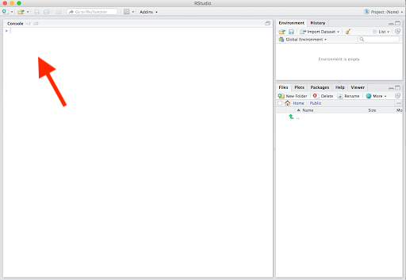

```{r setup, include=FALSE}
library(learnr)
learnr::tutorial_options(exercise.timelimit = 10)
```

## Introduction

This guide will help you get set up for <ins>Intro to R Data Analysis</ins>. There are just a few steps to make sure you'll have the necessary software installed and ready to go on day 1. **Please ensure that you've completed each step by running the validation test prior to the start of the workshop**. 

This guide will help you set up R, RStudio, and a few extra tools we'll use in this course. You can think of R as the engine that powers everything, while RStudio is like the dashboard that makes it easy to control. R is a programming language, and RStudio is a tool that helps you work with it. Even though you'll mainly use RStudio, it needs R to be installed to work, just like a car needs an engine to run.

Please complete the following steps (must be done in this order). If you already have R and Rstudio installed you can skip ahead. Make sure you complete step 5 though!

1. [Install R](#install-r)
2. [Install RStudio](#install-rstudio)
3. [Check you have recent versions of R](#check-you-have-a-recent-version-of-r)
4. [Install required packages](#install-required-packages)
5. [Run verification test](#run-verification-test)

Please consult the links provided for additional tips, and feel free to reach out for help by email [me](mailto:natalie.elphick@gladstone.ucsf.edu) if you get stuck.

## Install R

1. Go to the R project website: https://cloud.r-project.org/
2. At the top of the page click the download link for your operating system

**MacOS**  

- There are separate links for M-series macs and older intel ones
- Click the link to download the .pkg file for your system
- If you are not sure which CPU your Mac has, check the System Information app

**Windows** 

- Click "base", then the "Download R-4.X.X for Windows"
- Run the .exe file, you might need admin permissions for the installation


## Install RStudio

1. Go to the Posit RStudio download page: https://posit.co/download/rstudio-desktop/
2. Skip step 1 on this page since we already installed R
3. It should automatically detect your OS, click the Download RStuido button
4. If it did not detect your OS scroll down and pick yours from the list

**MacOS**   

-  Download the .dmg file
-  Double-click to mount the disk image
-  Drag RStudio to your Applications folder
-  Launch RStudio from Applications 

**Windows**

-  Download and run the .exe installer
-  Follow installation prompts (defaults are typically fine)
-  You may need administrator privileges
-  RStudio will appear in your Start menu once installed


## Install Required Packages
Many of the tools we will want to use do not come prepackaged with R, but rather need to be installed as ‘packages’. There are a few key packages we will be using. Please install the [`tidyverse`](https://www.tidyverse.org/) R package, which we’ll be relying on extensively throughout the workshop.

1. Open RStudio
2. In the Console (the pane with the > symbol), type the following and hit enter:

```
install.packages("tidyverse")
```

3. Double check the installation was successful by running this in the console, it should not throw an error:

```
library(tidyverse)
```


No need to worry about what exactly this is yet, but you can read more [here](https://www.tidyverse.org/) if you like.

## Run verification test
Now it’s time to make sure you have everything installed properly!
First, open Rstudio (remember, you want to open Rstudio, not R). You should see a window that looks something like this:

<center>

</center>

The pane with the ‘>’ symbol is the Console. This is where you enter R commands. 
Copy and paste the following code into your Rstudio console and hit return.

```{r, eval=F}
R_version <- as.numeric(R.version['major']$major)
if (R_version >= 4) {
    library(ggplot2)
    ggplot(iris, aes(x=Sepal.Length, y=Sepal.Width, color=Species)) + 
        geom_point()
} else {
    print('R version is too old')
}
```
You should see a plot that looks like this appear:

<center>

</center>


If you see an error that says “R version is too old” that means you need to update your R version. The update process is the same as the installation process. It will update your R installation. If you see an error that says “There is no package called ggplot2” that means you need to install the tidyverse package (see the *Install Required Packages* section).
