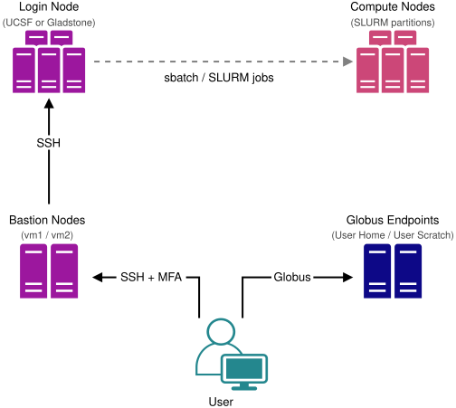

```{r, setup, include=FALSE}
knitr::opts_chunk$set(comment = "")
```

## Introductions


&nbsp;&nbsp;&nbsp;&nbsp;&nbsp;&nbsp;**Natalie Gill**    
&nbsp;&nbsp;&nbsp;&nbsp;&nbsp;&nbsp;*Bioinformatician II*     

##

<center>*Press the ? key for tips on navigating these slides*</center>

## Target Audience

-   Prior experience with UNIX command-line
-   No prior experience on computing clusters
-   **UCSF and Gladstone researchers**: this workshop covers both halves of CoreHPC

## Part 1: {.small-list}

1.  What is CoreHPC?
2.  The Two Halves of CoreHPC
3.  Accessing CoreHPC
4.  Storage
5.  Data Transfer
6.  Software with OpenHPC Modules
7.  Python Environments with Miniforge3
8.  Containers


# What is CoreHPC?

## Overview {.small-bullets}

-   An institutional HPC cluster **hosted by UCSF**
-   Designed and built by **UCSF IT Academic Research Services** in collaboration with **Gladstone**
-   Split into **two halves**: a UCSF half and a Gladstone half (more on this next)
-   Originally focused on **AI / Data Science**, now expanding to general-purpose HPC
-   Becoming the **primary HPC resource** for UCSF and Gladstone researchers

## Architecture

{fig-alt="CoreHPC architecture diagram showing bastion nodes, login node, compute nodes, and Globus endpoints" .nostretch fig-align="center" width=50%}


# The Two Halves of CoreHPC

## One Platform, Two Halves {.small-bullets}

-   CoreHPC is **one platform** split into a **UCSF half** and a **Gladstone half**
-   Each half has its own **bastion, login nodes, storage, and compute nodes**
-   Both run the **same software stack** (Linux, OpenHPC modules, Apptainer, SLURM), so everything in this workshop applies to either
-   Either half is accessed with a **UCSF MyAccess account**
-   **Gladstone researchers have access to both halves**

## The Login Node Selects the Half {.small-bullets}

-   **Which resources you get depends on which login node you connect through**
-   Log into the **Gladstone** login node, and you are using Gladstone compute and storage
-   Log into the **UCSF** login node, and you are using UCSF compute and storage

<center>*This is why hostnames and paths differ throughout these slides.*</center>


## What Differs Between the Halves {.smaller}

| | UCSF half | Gladstone half |
|-------------------|---------------------------|--------------------------|
| Per-user fee | **$155/user/yr** | none |
| Condo buy-in | supported | not supported |
| Persistent storage | FAC (~$52/TB/yr) | HIVE (included) |
| Computing on it | copy to scratch first | HIVE mounted directly |
| Data sensitivity | P1 to P4, incl. patient records | anonymized only, **no PHI** currently |
| Scheduling | fair-share, condo priority on purchased nodes | fair-share |

## Storage Is the Big Difference {.small-bullets}

-   **UCSF half:** persistent data lives on **FAC** capacity storage
    -   **Not intended for active compute**
    -   Do **not** point SLURM jobs at it
    -   Stage datasets onto **scratch** (`/scratch/user/$USER`) first
-   **Gladstone half:** connected **directly to HIVE**
    -   Your lab share is already mounted, nothing to move
    -   **No copying large datasets** just to compute on them
-   The halves do **not** cross over
    -   No FAC on the Gladstone half
    -   No HIVE on the UCSF half

## Scheduling and Priority {.small-bullets}

-   **Both halves** schedule with **fair-share**, favoring users who have **not recently used** the cluster
    -   The goal is to spread resources evenly, not first-come-first-served
-   **UCSF half:** no allocation of core hours, and no hard usage caps today
    -   Labs can **buy condo nodes** for priority on hardware they purchased
    -   Extra priority or wall-time for time-critical work goes to a governance committee
-   **Gladstone half:** per-user limits on running jobs and GPUs keep the queue moving

# Accessing CoreHPC

## Node Types {.small-bullets}

A cluster is made of different kinds of machines, each with its own job:

-   **Bastion:** the gateway you authenticate through
    -   No storage, no compute, no internet
-   **Login:** your launch pad
    -   Submit jobs, stage data, manage files
-   **Compute:** where your jobs actually run
    -   You reach these through SLURM, not by SSH

<center>*Each half of CoreHPC has its own bastion, login, and compute nodes.*</center>

## Prerequisites {.small-bullets}

-   A **UCSF MyAccess account**, for either half
-   A **CoreHPC-provisioned account** (requested via your PI / lab)
-   **UCSF half only:** your lab must already have an **FAC share**, or a submitted request for one, before onboarding
-   **MyAccess MFA / DUO** enrolled on your phone
-   On the right network for the half you want:
    -   **UCSF:** UCSF network (UCSFwpa) or VPN
    -   **Gladstone:** Gladstone network (wired, Gladstone-MB, or Ivanti VPN), Gladstone device

## Step 1: SSH to a Bastion Node {.smaller}

*A **bastion** is a hardened gateway: it authenticates you and lets you SSH onward. It has no storage or compute of its own.*

**UCSF**

```bash
ssh <user>@chpc-ucsf-bastion-vm1.corehpc.ucsf.edu
```

**Gladstone**

```bash
ssh <user>@chpc-gs-bastion-vm1.corehpc.ucsf.edu
```

-   Enter your **UCSF MyAccess password**
-   At the **Duo** prompt, type **`1`** and press enter
    -   Push is currently the only option, so `(1-1)` always means push
-   Approve the push on your phone

## Step 2: Hop to the Login Node {.smaller}

From the bastion, SSH to the login node **for the half you want to use**:

:::: {.columns}

::: {.column width="48%"}
**UCSF**

```bash
ssh chpc-ucsf-login-vm1
```
:::

::: {.column width="48%"}
**Gladstone**

```bash
ssh chpc-gs-login-vm1
```
:::

::::

Example, logging in to the **Gladstone** half:

```{r, engine='bash', eval=TRUE, results='markup', comment=NA, highlight=TRUE, echo=FALSE}
echo '[alice@laptop ~]$ ssh alice@chpc-gs-bastion-vm1.corehpc.ucsf.edu
Password:
Duo two-factor login for alice
Passcode or option (1-1): 1
Success. Logging you in...
[alice@chpc-gs-bastion-vm1 ~]$ ssh chpc-gs-login-vm1
[alice@chpc-gs-login-vm1 ~]$'
```

## The Login Node {.small-bullets}

-   Your launch pad: **submit jobs** and **stage data**, not for heavy compute
-   The **only** node with internet (via a proxy): GitHub, PyPI, conda, Hugging Face, Container registries
-   Do **not** run analyses here
-   Use `salloc` (interactive) or `sbatch` (batch) instead
-   Shares your home directory and scratch with the compute nodes **on that half**

## The Bastion Nodes {.small-bullets}

-   A **gateway only**: authentication and SSH forwarding, no storage or compute
-   Bastions have their **own home directories**, separate from the cluster
-   `scp` / `rsync` through the bastion are **blocked** by security policy
-   Move data with **Globus** or via a mounted **FAC / HIVE share** instead

## Compute Nodes {.small-bullets}

-   Where your analyses actually run
-   You can **not** SSH into them directly
    -   You reach them by submitting a job with `sbatch`, or starting an interactive session with `salloc`
-   **No internet access**
    -   Download data, containers, and packages on the login node first
-   Share your home directory and scratch with the login node
-   Also have fast **local NVMe scratch** that lasts only for the job

<center>*Requesting and running jobs is covered in Part 2.*</center>


# Storage

## Storage Layout {.smaller}

:::: {.columns}

::: {.column width="48%"}
**UCSF**

| Location | Path |
|----------|------|
| Home | `/home/remote/$USER` |
| Scratch | `/scratch/user/$USER` |
| Group scratch | `/scratch/group/<group>` |
| Persistent | FAC share |
:::

::: {.column width="48%"}
**Gladstone**

| Location | Path |
|----------|------|
| Home | `/home/remote/$USER` |
| Scratch | `/mnt/scratch/user/$USER` |
| Group scratch | `/mnt/scratch/group/<group>` |
| Persistent | `/mnt/gladstone/<pi>/<share>` |
:::

::::

*Home is **20 GB** on both halves. Scratch is **volatile** on both halves.*

## Home Directory {.small-bullets}

-   **20 GB** quota, shared across login and compute nodes (not the bastion)
-   Good for scripts, configs, small files, and `environment.yml` recipes
-   Too small for conda envs, data, or container images (push those to scratch / persistent storage)

## Scratch {.smaller}

-   Large, fast shared space for **active job data**
-   **50 TB** per-user cap
-   **Anything older than 30 days may be automatically deleted**
-   Treat it as **volatile**: never your only copy

:::: {.columns}

::: {.column width="48%"}
**UCSF**

```bash
/scratch/user/$USER
```
:::

::: {.column width="48%"}
**Gladstone**

```bash
/mnt/scratch/user/$USER
```
:::

::::

-   Shared scratch is the **VAST** file system, deployed specifically for high-performance compute
-   Compute nodes also have even faster **local NVMe** at `/tmp`, which lasts only for the job
-   Speed order: local `/tmp`, then shared scratch, then persistent storage

## Persistent Storage {.smaller}

:::: {.columns}

::: {.column width="48%"}
**UCSF: FAC capacity storage**

-   **Required** for every CoreHPC account
-   The repository for all project data
-   **Recharge** at roughly **$52/TB/yr**, plus a setup cost
-   ⚠️ **Not for active compute.** Never point a SLURM job at it: it degrades performance for everyone and can cause runtime errors
-   Request a share: <https://tiny.ucsf.edu/getfac>
:::

::: {.column width="48%"}
**Gladstone: HIVE**

-   Your lab share is **already mounted** at `/mnt/gladstone/<pi>/<share>`
-   **No recharge**, and it is **backed up**
-   Connected directly, so you can **compute against it without copying**
-   **Every** share you have access to is mounted, not just your own lab's
:::

::::

## Storage Advice {.small-bullets}

-   Scratch is volatile: keep `environment.yml`, scripts, and small inputs on home or persistent storage
-   Use **FAC** (UCSF) or **HIVE** (Gladstone) for anything you cannot afford to lose
-   **UCSF:** CoreHPC provides **no long-term storage** of its own
    -   FAC is where your data lives
    -   Stage it onto scratch for a job, then copy results back afterward
-   **Gladstone:** only **HIVE** is backed up
-   Avoid huge directories of tiny files on shared storage
    -   It slows the filesystem for **everyone**, not just you
    -   Prefer a single container image ([container guide](Containers_on_CoreHPC.html))


# Data Transfer

## Transfer Options {.small-bullets}

-   **Globus** is the supported way to move data in or out from outside CoreHPC
    -   `scp` / `rsync` through the bastion are **blocked** by security policy
    -   This covers your laptop and other institutions (UCSF <-> Gladstone)
-   **`cp` / `rsync` from the login node** if the data is already on a mounted share
    -   **UCSF:** your **FAC** share
    -   **Gladstone:** your **HIVE** lab share, so most data needs no transfer at all

## Staging Data for a Job {.smaller}

:::: {.columns}

::: {.column width="48%"}
**UCSF: copy FAC to scratch**

FAC is not for active compute, so stage first:

```bash
rsync -av /mnt/fac/<share>/<data> \
      /scratch/user/$USER/
```

Then copy results back when the job finishes.
:::

::: {.column width="48%"}
**Gladstone: nothing to stage**

HIVE is mounted directly, so jobs can read and write it in place:

```bash
ls /mnt/gladstone/<pi>/<share>
```

Use scratch only for **hot** data needing heavy read/write.
:::

::::

## Hands-on

-   Transfer a small file into your scratch space using Globus
-   We will walk through a Globus transfer together


# Software with OpenHPC Modules

## Module Basics {.small-bullets}

-   Cluster software is provided as **OpenHPC modules**
-   A module sets up your `PATH` and environment for a given tool and version
-   Available consistently on the **login and compute nodes**
-   **CBI modules** are available too (e.g. `module load CBI r`)

## Common Commands

```bash
module avail              # list available modules
module load miniforge3    # load a module
module list               # show loaded modules
module unload miniforge3  # unload it
module --help
```

## Example Available Modules {.small-bullets}

```{r, engine='bash', eval=TRUE, results='markup', comment=NA, highlight=TRUE, echo=FALSE}
echo '[alice@chpc-gs-login-vm1 ~]$ module avail

  apptainer/1.4.1      gnu13/13.2.0          nvidia/cuda/12.9.1
  cmake/4.0.0          hwloc/2.12.0          nvidia/cudnn/9.10_cuda_12.9
  cuda/25.1            libfabric/1.18.0      nvidia/nvhpc/25.5
  autotools            miniforge3/25.11.0    ucx/1.18.0
  papi/6.0.0           spack/0.23.1          prun/2.2'
```

*Module versions shown are current as of mid-2026.*


# Python Environments with Miniforge3

## What is Miniforge? {.small-bullets}

-   A minimal **conda** distribution that defaults to the **conda-forge** channel
-   Lets you create isolated **environments**, each with its own Python and packages
-   Available as a module: `module load miniforge3`

## Setup (Once) {.smaller}

Home is only 20 GB, so point conda's environments and package cache at scratch:

```bash
module load miniforge3
conda init bash          # then restart your shell
```

:::: {.columns}

::: {.column width="48%"}
**UCSF**

```bash
conda config --append \
  envs_dirs /scratch/user/$USER/envs
conda config --append \
  pkgs_dirs /scratch/user/$USER/pkgs
```
:::

::: {.column width="48%"}
**Gladstone**

```bash
conda config --append \
  envs_dirs /mnt/scratch/user/$USER/envs
conda config --append \
  pkgs_dirs /mnt/scratch/user/$USER/pkgs
```
:::

::::

*This only needs to be done once; it edits `~/.condarc`.*

## Creating an Environment

```bash
conda create -n project1 python=3.11
conda activate project1
conda install numpy pandas scikit-learn
```

## Exporting an Environment {.small-bullets}

Scratch is volatile, so capture a recipe you can rebuild from:

```bash
conda env export --no-builds > environment.yml   # save to home or persistent storage
conda env create -f environment.yml              # rebuild anytime
```

-   For long-lived environments, build an **Apptainer image** instead
    -   Store the `.sif` on persistent storage
    -   See the [container guide](Containers_on_CoreHPC.html)


# Containers

## Motivation {.small-bullets}

-   Package your code with the **exact versions** of every tool, so it runs the same anywhere
-   **Reproducible**, isolated from the host OS, and great for hard-to-install software
-   One `.sif` file is far friendlier to shared storage than a conda env's **millions of tiny files**

## Apptainer on CoreHPC {.small-bullets}

-   Load the module: `module load apptainer`
-   Pull and run images:

```bash
apptainer pull docker://<user>/<image>:<tag>   # creates image_tag.sif
apptainer exec image.sif <command>
apptainer shell image.sif                       # interactive shell
```

-   **Pull / build on the login node** (the only node with internet)

## Example: Pull a Container

```bash
# On the login node:
apptainer pull docker://natalie23gill/hello-world:1.0
apptainer exec hello-world_1.0.sif hi
```

-   **Building your own image** (from a conda env or Dockerfile): see the [container guide](Containers_on_CoreHPC.html)


# End of Part 1

## Workshop survey

- If you are not attending part 2, please fill out our [workshop survey](https://www.surveymonkey.com/r/bioinfo-training26) so we can continue to improve these workshops

## Upcoming Data Science Training Program Workshops {.smaller}

**Introduction to Machine Learning**  
September 24, 2026 1:00-5:00pm PDT  

**Introduction to RNA-Seq Analysis**  
September 28-September 29, 2026 9:00am-3:00pm PDT  

**AI Fluency for Biologists**  
October 5-October 6, 2026 1:00-4:00pm PDT  

**Single Cell RNA-Seq Analysis Using R**  
October 12-October 13, 2026 9:30am-3:30pm PDT  

**Introduction to Pathway Analysis**  
October 15, 2026 1:00-4:00pm PDT  

*Register at <https://gladstone.org/events?series=189>*
