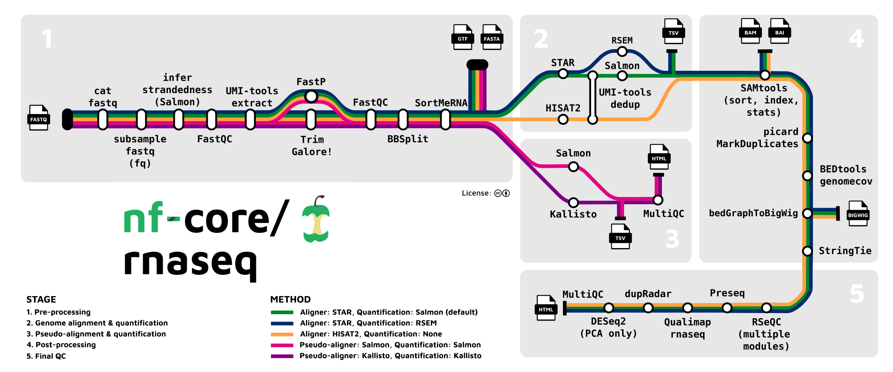

```{r, setup, include=FALSE}
knitr::opts_chunk$set(comment = "")
```

##

<center>*Press the ? key for tips on navigating these slides*</center>

## Introductions


&nbsp;&nbsp;&nbsp;&nbsp;&nbsp;&nbsp;**Natalie Gill**
&nbsp;&nbsp;&nbsp;&nbsp;&nbsp;&nbsp;*Bioinformatician II*


## Target Audience

-   Prior experience with UNIX command-line
-   No prior experience on computing clusters


## Part 2:

1.    SLURM Basics
2.    Submitting Batch Jobs
3.    Requesting CPU, Memory, GPU Resources
4.    Job Arrays
5.    Interactive Jobs
6.    Monitoring & Canceling Jobs
7.    Running Containers in SLURM Jobs
8.    MPI / Multi-Node Jobs
9.    Pipelines on CoreHPC
10.   Jupyter / OpenOnDemand
11.   Best Practices and Troubleshooting
12.   How to Get Help


# SLURM Basics

## What is SLURM? {.small-bullets}

-   SLURM is CoreHPC's **workload manager** (job scheduler)
-   It decides **what runs where and when** across the compute nodes
-   Replaces Wynton's **SGE**; supports **GPUs** and **interactive** jobs natively
-   You describe the resources you need, and SLURM finds a node and runs your job

## Key Concepts {.small-bullets}

-   **Login node:** where you submit jobs (no heavy compute)
-   **Compute nodes:** where jobs actually run
-   **Partition:** a named set of nodes (e.g. `cpu`, `small_gpu`)
-   **Job:** your resource request plus a script; a **job step** is a command run with `srun` inside it
-   You rarely SSH to compute nodes, you reach them through SLURM

## Common Commands {.smaller}

| Command | What it does |
|---------|--------------|
| `sbatch job.sh` | submit a batch job |
| `salloc ...` | start an interactive job |
| `srun <cmd>` | run a command as a tracked job step |
| `squeue -u $USER` | list your jobs |
| `scancel <jobid>` | cancel a job |
| `sinfo` | show partitions and node states |
| `scontrol show job <jobid>` | full detail on one job |
| `sacct -j <jobid>` / `seff <jobid>` | resource usage after a job |


# Submitting Batch Jobs

## Minimal Job Script {.smaller}

```bash
#!/bin/bash
#SBATCH --job-name=hello
#SBATCH --partition=cpu
#SBATCH --time=00:05:00
#SBATCH --ntasks=1
#SBATCH --cpus-per-task=1
#SBATCH --mem=1G
#SBATCH --output=hello_%j.out   # %j = job ID
#SBATCH --error=hello_%j.err

srun echo "Hello from $(hostname)"
```

⚠️ CoreHPC sets **no default** resources. Set `--time`, `--mem`, and `--partition` explicitly.

## Submitting

```bash
sbatch hello.sh
squeue -u $USER
```

```{r, engine='bash', eval=TRUE, results='markup', comment=NA, highlight=TRUE, echo=FALSE}
echo '[alice@chpc-gs-login-vm1 ~]$ sbatch hello.sh
Submitted batch job 152334
[alice@chpc-gs-login-vm1 ~]$ squeue -u alice
   JOBID PARTITION  NAME  USER ST  TIME NODES NODELIST(REASON)
  152334       cpu hello alice  R  0:03     1 chpc-gs-cpu-01'
```

-   Output lands in `hello_152334.out`


# Resource Requests

## CPU and Memory {.small-bullets}

-   `--ntasks` : number of tasks (processes); `--cpus-per-task` : cores per task
-   `--mem=16G` : total memory **per node** (or `--mem-per-cpu=4G`)
-   `--time=HH:MM:SS` : wall-time limit; `--partition=cpu` : which nodes
-   ⚠️ SLURM's `--mem` is **per node total**; SGE's `mem_free` was per core

## GPU Jobs {.small-bullets}

```bash
#SBATCH --partition=small_gpu
#SBATCH --gres=gpu:nvidia_l40s:1     # model:count (per node)
module load cuda
```

-   Generic form `--gres=gpu:1` requests any GPU on the partition
-   GPU types: **L40s** / **H100NVL** (`small_gpu`), **H200** (`large_gpu`, `pod`)
-   For GPU containers, add `--nv` to `apptainer exec`

## Pod Partition Note {.small-bullets}

-   `pod` is **by request only** (a brief consult confirms your code uses multiple GPUs)
-   8x **H200 SXM** per node with **InfiniBand** shared memory across GPUs
-   Comes with a larger GPU allocation and a longer wall-time limit (see current docs)


# Job Arrays

## When to Use {.small-bullets}

-   Many **similar tasks** that differ only by an index (per-sample, per-chromosome)
-   One script, many tasks; SLURM schedules them independently

## Example Array Job {.smaller}

```bash
#!/bin/bash
#SBATCH --job-name=align
#SBATCH --partition=cpu
#SBATCH --array=1-100
#SBATCH --time=01:00:00
#SBATCH --mem=4G
#SBATCH --cpus-per-task=4
#SBATCH --output=align_%A_%a.out   # %A = array job ID, %a = task ID

srun python process.py sample_${SLURM_ARRAY_TASK_ID}.fastq
```

-   `$SLURM_ARRAY_TASK_ID` is 1, 2, ... 100 for each task in turn


# Interactive Jobs

## salloc {.small-bullets}

Get an interactive shell on a compute node:

```bash
salloc --partition=cpu --cpus-per-task=4 --mem=8G --time=01:00:00
```

-   Use it to prototype, test scripts, or run R / Python interactively
-   Replaces Wynton **dev nodes**; for GPU dev add `--partition=small_gpu --gres=gpu:nvidia_l40s:1`
-   Browser-based RStudio / Jupyter via **Open OnDemand** is coming to CoreHPC

## Attaching to a Running Job

Inspect a job that is already running on a node:

```bash
srun --jobid=<JOBID> --pty /bin/bash
# then, e.g. nvidia-smi, top, ls
```


# Monitoring & Canceling

## Checking Status {.small-bullets}

```bash
squeue -u $USER             # your jobs and their state
scontrol show job <jobid>   # full detail on one job
sacct -j <jobid>            # accounting after it finishes
seff <jobid>                # efficiency: did you use what you asked for?
```

## Job / Node Status Codes {.smaller}

:::: {.columns}

::: {.column width="48%"}
**Job states (`squeue`)**

| Code | Meaning |
|------|---------|
| PD | pending |
| R | running |
| CG | completing |
| F | failed |
| TO | timed out |
:::

::: {.column width="48%"}
**Node states (`sinfo`)**

| Code | Meaning |
|------|---------|
| idle | free |
| mix | partly used |
| alloc | fully used |
| drain / maint | unavailable |
| down | offline |
:::

::::

## Canceling

```bash
scancel <jobid>     # cancel one job
scancel -u $USER    # cancel all your jobs
```


# Containers in SLURM Jobs

## Running Apptainer in a Job

```bash
module load apptainer
srun apptainer exec myenv.sif python script.py
```

-   Build / pull the `.sif` on the login node first (compute nodes have no internet)

## GPU-Enabled Containers {.smaller}

```bash
#SBATCH --partition=small_gpu
#SBATCH --gres=gpu:nvidia_l40s:1

module load apptainer cuda
srun apptainer exec --nv myenv.sif python train.py
```

-   `--nv` exposes the GPU drivers inside the container
-   Building images: see the [container guide](Containers_on_CoreHPC.html)

## Hybrid Host + Container Workflow {.smaller}

Mix host tools and a container in one job script:

```bash
# preprocess with a module-provided tool
module load samtools
samtools sort in.bam -o sorted.bam

# analyze inside the container
srun apptainer exec --bind /mnt/scratch/user/$USER analysis.sif python run.py sorted.bam
```


# MPI / Multi-Node Jobs

## MPI Job Script {.smaller}

```bash
#!/bin/bash
#SBATCH --job-name=mpi_example
#SBATCH --partition=cpu
#SBATCH --nodes=2
#SBATCH --ntasks-per-node=8        # 16 MPI ranks total
#SBATCH --cpus-per-task=1
#SBATCH --mem=16G
#SBATCH --time=01:00:00
#SBATCH --output=mpi_%j.out

module load openmpi5/5.0.8         # or the MPI bundled with nvidia/nvhpc
srun ./my_mpi_program
```

-   `srun` launches one rank per task and wires up MPI across the nodes

## Important: Community CPU Partition {.small-bullets}

-   The **`community cpu`** partition has **no InfiniBand**
-   Not for tightly-coupled MPI; it suits **high-throughput** (independent) jobs, Wynton-style
-   For real MPI use `cpu`, `small_gpu` / `large_gpu`, or `pod` (which have the fast interconnect)
-   *Confirm partition names and MPI module versions with `sinfo` / `module avail`.*


# Pipelines on CoreHPC

## Nextflow on CoreHPC {.small-bullets}

-   **Nextflow** runs portable, reproducible workflows; **nf-core** is a community library of pipelines (<https://nf-co.re>)
-   The **head process** submits **each step as its own SLURM job**
-   On CoreHPC the head runs as its **own small SLURM job**, not on the login node (which is submission-only and can drop your session)
-   Compute nodes are **offline**, so stage everything first
-   Example here: the **nf-core/rnaseq** pipeline

## Nextflow RNA-seq {.small-bullets .big-picture}

-   nf-core/rnaseq is the most widely used pipeline

{fig-alt="nf-core RNA-seq pipeline steps shown as a metro map" .nostretch fig-align="center" width=70%}

## Installing Nextflow {.smaller}

There is no Nextflow module, so install it once via conda **on the login node** (it has internet):

```bash
module load miniforge3
conda create -n nextflow -c bioconda nf-core nextflow   # nextflow + nf-core tools (+ a JRE)
conda activate nextflow
nextflow -v
```

## Stage Everything on the Login Node {.smaller}

Compute nodes have **no internet**, so pre-fetch the pipeline and all its containers while you are connected:

```bash
export NXF_SINGULARITY_CACHEDIR=/mnt/scratch/user/$USER/containers
nf-core download rnaseq -r 3.14.0 --container-system singularity
```

-   Downloads the pipeline code, configs, and images so the run needs **no internet**
-   Apptainer runs the Singularity-format images (CoreHPC's runtime is `module load apptainer`)
-   *UCSF (non-Gladstone): use `/scratch/user/$USER/...`*

## Configure the SLURM Executor {.smaller}

```groovy
// corehpc.config
process {
  executor = 'slurm'
  queue    = 'cpu'                 // default partition
  cpus     = 4
  memory   = '8 GB'
  time     = '2h'
  withLabel: gpu { queue = 'small_gpu'; clusterOptions = '--gres=gpu:nvidia_l40s:1' }
}
executor  { queueSize = 50 }       // cap concurrent SLURM jobs
apptainer { enabled = true; autoMounts = true }
```

*No SLURM defaults, so set resources explicitly. Pass the work dir on the command line (next slide) so `$USER` expands.*

## Run It as a Head Job {.smaller}

```bash
#!/bin/bash
#SBATCH --job-name=nf-rnaseq
#SBATCH --partition=cpu
#SBATCH --cpus-per-task=1
#SBATCH --mem=4G
#SBATCH --time=24:00:00              # must cover the whole pipeline
#SBATCH --output=nf_%j.out

module load miniforge3 apptainer
conda activate nextflow
export NXF_OFFLINE=true
export NXF_SINGULARITY_CACHEDIR=/mnt/scratch/user/$USER/containers

nextflow run ./nf-core-rnaseq_3.14.0/workflow \
  -profile test -c corehpc.config \
  -w /mnt/scratch/user/$USER/work -resume
```

Submit with `sbatch run_rnaseq.sh`; the head job orchestrates and submits each step as its own job.

## Why a Head Job (Not the Login Node) {.small-bullets}

-   The login node is **submission only**; long sessions there are discouraged and may be revoked
-   A head job runs **within the scheduler**: it survives disconnects and is policy-compliant
-   Pre-stage everything (pipeline, containers, references) and run with `NXF_OFFLINE=true`
-   Size `--time` to the whole pipeline; `-resume` continues a timed-out run; move results off scratch
-   *Constructed example: confirm nested `sbatch` is allowed and validate the offline / container settings on the cluster*


# Jupyter / OpenOnDemand

## OpenOnDemand Portal {.small-bullets}

-   A **web portal** for launching Jupyter, RStudio, and shells in the browser
-   Replaces the SSH port-forwarding dance from Wynton
-   *Coming to CoreHPC; check the current docs for availability*


# Best Practices and Troubleshooting

## Best Practices {.small-bullets}

-   **Test interactively** in `salloc` before submitting big batch jobs
-   Request **only what you need**, and always set `--time`
-   **No heavy compute** on the login or bastion nodes
-   Compute nodes have **no internet**, so stage data and containers first
-   Keep anything you cannot lose on **FAC / HIVE**, not scratch
-   For GPU jobs, track utilization with `seff` / `nvidia-smi` (low use = wasted reservation)

## Common Errors {.small-bullets}

-   Job stuck **PD (pending):** waiting on resources, or the request is too big for the partition
-   **OOM / killed:** raise `--mem` or reduce memory use
-   **module not found:** check the exact name with `module avail`
-   **container cannot see the GPU:** add `--nv` to `apptainer exec` (and request `--gres`)


# How to Get Help

## CoreHPC Support

- Support request form: <https://tiny.ucsf.edu/Gethpc>
- CoreHPC Slack channel (request access via the form above)

## Bioinformatics Questions

For any bioinformatics specific questions feel free to reach out to the Gladstone Bioinformatics Core.

-   Email
    -   [bioinformatics@gladstone.ucsf.edu](mailto:bioinformatics@gladstone.ucsf.edu)
-   Slack channel #questions-about-bioinformatics
    -   Contact us at the email above to be added to the channel


# End of Part 2

## Notes on Using AI on CoreHPC {.smaller}

-   AI assistants (Claude, ChatGPT, Gemini) are great for **writing and debugging SLURM scripts**
-   But CoreHPC scratch is **volatile** (30-day purge), so **understand any AI-generated script before you run it**
-   Double-check resource flags and file paths so a generated job does not delete or overwrite data
-   See the Bioinformatics Core's guidance on using AI responsibly in research

## Workshop survey

- Please fill out our [workshop survey](TBD) so we can continue to improve these workshops

## Upcoming Data Science Training Program Workshops {.smaller}

*To be filled in closer to the workshop date.*
