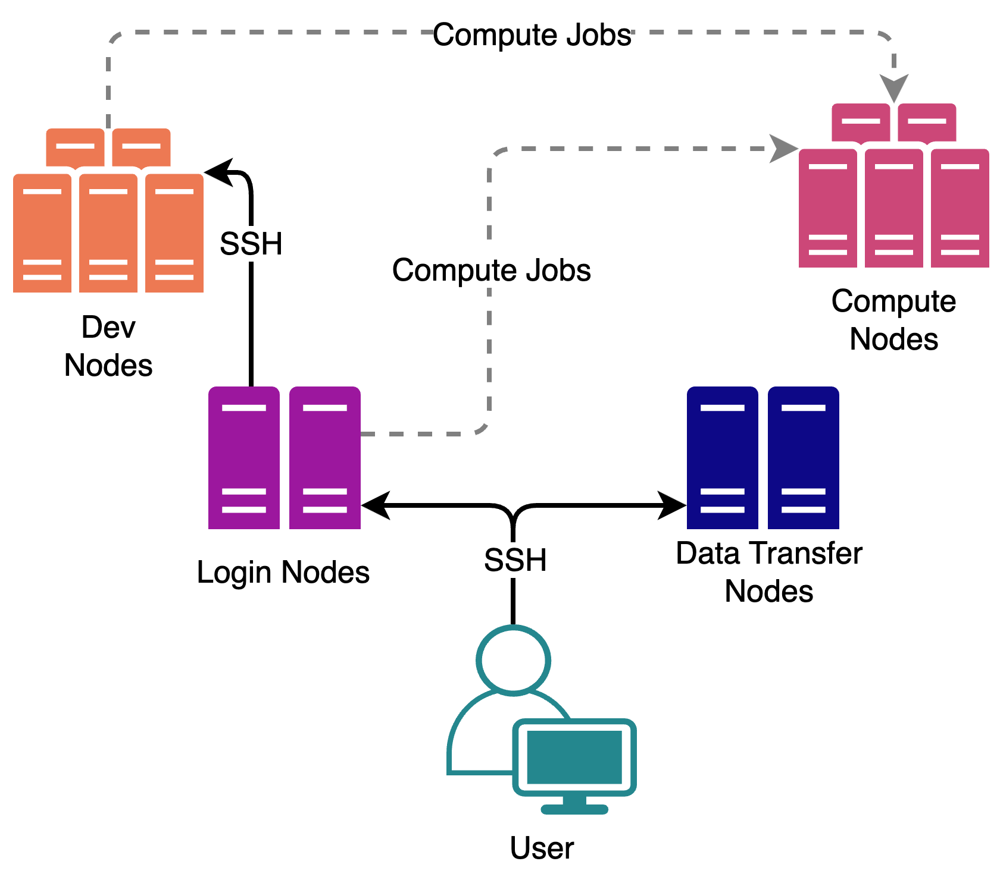

```{r, setup, include=FALSE}
knitr::opts_chunk$set(comment = "")
```

## Who this is for

-   You already use Wynton (SGE, modules, apptainer)
-   You have a CoreHPC account

## Outline

1.  What's the same
2.  What's different
3.  Logging in
4.  Storage and data migration
5.  SGE → SLURM translation (live demo)
6.  Partitions and GPU specifics
7.  Migration checklist


# What's the same / what's different

## What carries over from Wynton

-   **Apptainer/Singularity** containers
-   The Linux `module` system (`module avail`, `module load`)
-   Wynton's **CBI modules are ported over** (e.g. `module load CBI r`)
-   Conda for Python environments (via the `miniforge3` module)

## What's different {.smaller}

| Topic        | Wynton                  | CoreHPC                                          |
|--------------|-------------------------|--------------------------------------------------|
| Scheduler    | SGE                     | **SLURM**                                        |
| Login        | ssh into login node              | **bastion → login**                              |
| Home         | `/wynton/home/$USER`, 500 GB  | `/home/remote/$USER`, **20 GB**                  |
| Scratch      | `/wynton/scratch/$USER`       | `/mnt/scratch/user/$USER`                        |
| Hive         | `/gladstone/<lab>`      | `/mnt/gladstone/<lab>` (`/gladstone` symlink)    |
| Job defaults | yes                     | **none; set all explicitly**                     |
| GPU access   | `-q gpu.q` + `SGE_GPU`  | `--partition=...` + `--gres=...`                 |

## Wynton

{fig-alt="Wynton HPC architecture: nodes connected together on a fast local network" .nostretch fig-align="center" width=65%}

## CoreHPC

{fig-alt="CoreHPC architecture: user connects via bastion to login node, then submits SLURM jobs to compute nodes; Globus endpoints provide data transfer" .nostretch fig-align="center" width=65%}


# Logging in

## How to login {.smaller}

*A **bastion** is a hardened gateway whose only job is to authenticate you and let you SSH onward. No storage or compute of its own.*

**Prerequisite:** on Gladstone network (wired, Gladstone-MB, or Ivanti VPN), Gladstone device.

```bash
# 1. SSH to the Gladstone bastion (address is temporary, will change)
ssh <user>@10.98.160.34          # chpc-gs-bastion-vm1
# -> prompts for your UCSF MyAccess password
# -> approve the DUO MFA push on your phone

# 2. From the bastion, hop to the login node
ssh chpc-gs-login-vm1
```

-   Authentication uses your **UCSF MyAccess password** + **DUO MFA**
-   No further password prompts inside the cluster
-   Login node has limited internet via proxy; compute nodes have none

## No dev nodes: use salloc instead {.smaller}

The CoreHPC login node is for **job submission only**, not prototyping. Anything you'd do on a Wynton dev node (compile, test scripts, interactive R/Python) becomes an interactive `salloc` session on CoreHPC.

:::: {.columns}

::: {.column width="48%"}
**Wynton (SGE)**

```bash
# From a login node:
ssh dev1
# Drops you on a dev node
# with modules, internet, etc.
```
:::

::: {.column width="48%"}
**CoreHPC (SLURM)**

```bash
# From the login node:
salloc --partition=cpu \
       --cpus-per-task=4 \
       --mem=8G \
       --time=02:00:00
# Drops you on a compute node
```
:::

::::

*For GPU dev work, add `--partition=small_gpu` (or `large_gpu` / `pod`) and `--gres=gpu:nvidia_l40s:1`.*

## One-time setup for conda users

Home is only 20 GB. Push conda envs/pkgs onto scratch:

```bash
module load miniforge3
conda config --append envs_dirs /mnt/scratch/user/$USER/envs
conda config --append pkgs_dirs /mnt/scratch/user/$USER/pkgs
```


# Storage and data migration

## Storage mapping {.smaller}

| Wynton                      | CoreHPC                                                |
|-----------------------------|--------------------------------------------------------|
| `/gladstone/<lab>`          | `/mnt/gladstone/<lab>`                                 |
| `/wynton/home/<lab>/<user>` | `/home/remote/<user>` (**20 GB cap**)                  |
| `/wynton/group/<lab>`       | use your Hive mount, or scratch                        |
| `/wynton/scratch`           | `/mnt/scratch/user/$USER` or `/mnt/scratch/global`     |
| local `/scratch`            | local per-node scratch                                 |

⚠️ **Only HIVE (`/mnt/gladstone`) is backed up.**

## Moving your data {.small-bullets}

**Already on HIVE (`/gladstone/<lab>`):** nothing to move. The same share is mounted on CoreHPC at `/mnt/gladstone/<lab>`.

**On Wynton-only paths (`/wynton/home`, `/wynton/scratch`, `/wynton/group`):** you have to migrate.

-   Easiest: copy it to your HIVE lab share on Wynton first; CoreHPC then picks it up automatically at `/mnt/gladstone/<lab>`
-   Otherwise: Globus (standard bastions block `scp` / `rsync`)


# SGE → SLURM Translation

## Containers don't change

```bash
# Works the same on both clusters:
apptainer pull docker://natalie23gill/hello-world:1.0
apptainer exec hello-world_1.0.sif hi
```

The image runs identically. **Only the submission script changes.**

## Command cheat sheet {.smaller}

| Task              | Wynton (SGE)         | CoreHPC (SLURM)                  |
|-------------------|----------------------|----------------------------------|
| Submit a job      | `qsub job.sh`        | `sbatch job.sh`                  |
| Check your jobs   | `qstat`              | `squeue -u $USER`                |
| Cancel a job      | `qdel <jobid>`       | `scancel <jobid>`                |
| Node / queue info | `qhost`              | `sinfo`                          |


## Resource request flags {.smaller}

| Wynton (SGE)                  | CoreHPC (SLURM)                                  |
|-------------------------------|--------------------------------------------------|
| `-l h_rt=02:00:00`            | `--time=02:00:00`                                |
| `-pe smp 4`                   | `--cpus-per-task=4`                              |
| `-l mem_free=4G` *(per core)* | `--mem=16G` *(per node)* or `--mem-per-cpu=4G`   |
| `-q <queue>`                  | `--partition=<partition>`                        |
| `-l gpu=1`                    | `--gres=gpu:nvidia_l40s:1`                       |
| `-o out.txt`                  | `--output=out.txt`                               |
| `-t 1-10`, `$SGE_TASK_ID`     | `--array=1-10`, `$SLURM_ARRAY_TASK_ID`           |

⚠️ **Memory gotcha:** SGE's `mem_free` is **per core**; SLURM's `--mem` is **per node total**. Setting `--mem=4G --cpus-per-task=4` gets you 4 GB total, not 16 GB.

## Same job, two scripts {.smaller}

:::: {.columns}

::: {.column width="48%"}
**Wynton (SGE)**

```bash
#!/bin/bash
#$ -S /bin/bash
#$ -cwd
#$ -l h_rt=00:05:00
#$ -l mem_free=1G

sleep 30   # so we can see the job in qstat
apptainer exec hello-world_1.0.sif hi
```

```bash
qsub hello.sh
qstat
```
:::

::: {.column width="48%"}
**CoreHPC (SLURM)**

```bash
#!/bin/bash
#SBATCH --time=00:05:00
#SBATCH --mem=1G
#SBATCH --ntasks=1
#SBATCH --cpus-per-task=1
#SBATCH --partition=cpu
#SBATCH --output=hello.out

sleep 30   # so we can see the job in squeue
srun apptainer exec hello-world_1.0.sif hi
```

```bash
sbatch hello.sh
squeue -u $USER
```
:::

::::


*`srun` runs your command as a tracked SLURM "job step" (better accounting via `sacct`, required for multi-node/MPI)*

## Live demo: same job, both clusters

<center>*Two terminals, side by side. Reference: previous slide.*</center>

## SLURM Job status codes {.smaller}

| Code | State      | When you see it                                |
|------|------------|------------------------------------------------|
| PD   | Pending    | Submitted, waiting for resources               |
| R    | Running    | Actively executing on a compute node           |
| CG   | Completing | Wrapping up (briefly visible)                  |
| F    | Failed     | Exited non-zero (mostly visible via `sacct`)   |
| TO   | Timeout    | Hit your `--time` wall limit                   |


# Partitions and GPUs

## Partitions + limits {.smaller}

| Partition   | Use                              | Max per user            |
|-------------|----------------------------------|-------------------------|
| `cpu`       | High-memory CPU (gcpu2 nodes)    | 1 node, 42 CPUs/job     |
| `small_gpu` | L40s 48 GB (ggpu1 nodes)         | 1 running, 1 GPU        |
| `large_gpu` | H200 single-node (ggpu3 nodes)   | 1 running, 1 GPU        |
| `pod`       | 1/2 SuperPod, 8× H200 SXM        | 1 running, 4 nodes max  |

## GPU request syntax {.smaller}

```bash
# L40s (small_gpu):
#SBATCH --partition=small_gpu
#SBATCH --gres=gpu:nvidia_l40s:1

# H200, single node (large_gpu):
#SBATCH --partition=large_gpu
#SBATCH --gres=gpu:nvidia_h200:1

# H200, SuperPod (1 node, 8 GPUs):
#SBATCH --partition=pod
#SBATCH --gres=gpu:nvidia_h200:8
```

*`--gres=gpu:<model>:<count>` — count is GPUs **per node**.*

-   For GPU containers: `apptainer exec --nv ...` (same as Wynton)
-   CUDA: `module load cuda` or `module load nvidia/cuda/12.9.1`


# Migrating


## Migration checklist {.smaller}

-   [ ] On Gladstone network (wired / Gladstone-MB / Ivanti VPN), Gladstone device
-   [ ] Logged into `chpc-gs-bastion-vm1` → `chpc-gs-login-vm1`
-   [ ] Confirmed your Hive lab share is visible at `/mnt/gladstone/<lab>` (or `/gladstone/<lab>`)
-   [ ] Anything not on Hive moved over via Globus
-   [ ] Containers re-pulled with `apptainer pull` on the login node
-   [ ] Conda envs re-created (`envs_dirs` pointed to `/mnt/scratch/user/$USER`)
-   [ ] Job script translated SGE → SLURM (`--time`, `--mem`, `--cpus-per-task`, `--partition`, `--gres` all explicit)
-   [ ] First `sbatch` submitted and verified with `squeue -u $USER`
-   [ ] Anything you cannot afford to lose is on HIVE


# Help

## Where to get help {.small-bullets}

-   CoreHPC support form: <https://tiny.ucsf.edu/Gethpc>
-   CoreHPC Slack channel (request access via the form above)
-   UCSF docs (translate bastion/login/partition names to Gladstone-side):
    -   [CoreHPC Access Primer](https://wiki.library.ucsf.edu/x/m2LwKg)
    -   [CoreHPC FAQ](https://wiki.library.ucsf.edu/spaces/CHPC/pages/720396966/CoreHPC+Frequently+Asked+Questions+FAQ+)
    -   [CoreHPC Miniforge Conda Guide](https://wiki.library.ucsf.edu/spaces/CHPC/pages/755894162/CoreHPC+Miniforge+Conda+Guide)
    -   [SGE to SLURM](https://wiki.library.ucsf.edu/spaces/CHPC/pages/755894004/SGE+to+SLURM)

    *(Require Gladstone network + UCSF email to view.)*
-   Gladstone IT