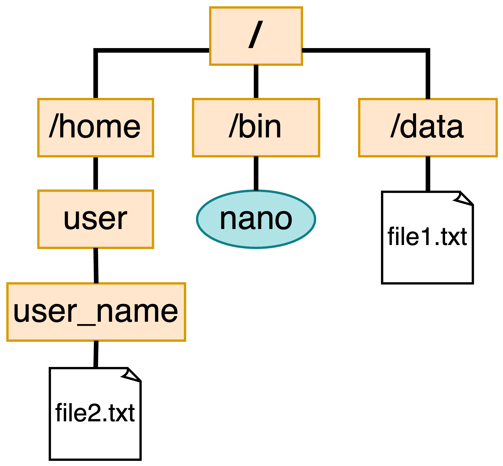

```{r, setup, include=FALSE}
knitr::opts_knit$set(root.dir = './unix_workshop')
```


## 

<center>*Press the ? key for tips on navigating these slides*</center>


## Introductions

**Natalie Elphick**   
Bioinformatician I    

<br>


**Reuben Thomas**    
Associate Core Director 


# The Unix Command-line


## What is Unix?

- A family of operating systems that date back to 1970s
- Designed to run on different types of computer hardware
- macOS and Linux are descendants of Unix
- Often used in industry and scientific research


## What is the Command-line?

- A text-based interface for interacting with the operating system
- Execute commands to perform various tasks like:
  - Navigating the file system
  - Editing files
- Command-line interfaces (CLIs) are how users interacted with computers before graphical interfaces like Windows

## Advantages of using CLIs

- Allows for automation and batch processing of data
- Provides more control and flexibility over data manipulation
- Interact with High-Performance Computing clusters (HPCs) like Wynton
- Speed


## The Terminal

- The software that provides access to the CLI
- Open your terminal

  - Mac: press Cmd + Space and type "terminal"
  - Linux: press Ctrl+Alt+T  
  - Windows: open the Ubuntu app

## Download the workshop materials

- Copy and paste each of these into your terminal, press enter after each one:

```{r, engine='bash', eval=FALSE, results='markup', highlight=FALSE, comment=NA, echo = TRUE}
mkdir unix_workshop
```


```{r, engine='bash', eval=FALSE, results='markup', highlight=FALSE, comment=NA, echo = TRUE}
cd unix_workshop
```


```{r, engine='bash', eval=FALSE, results="hide", highlight=FALSE, comment=NA, echo = TRUE}
curl -L -o unix_workshop.tar.gz 'https://www.dropbox.com/scl/fi/tdzpoivf7mienlenunqhf/unix_workshop.tar.gz?rlkey=6bfxnqgc5n4lgc9mc80ld75z4&dl=0'
```


```{r, engine='bash', eval=FALSE, results='markup', highlight=FALSE, comment=NA, echo = TRUE}
tar -xzf unix_workshop.tar.gz
```


```{r, engine='bash', eval=FALSE, results='markup', highlight=FALSE, comment=NA, echo = TRUE}
cd unix_workshop
```


## The shell

- A shell is a specific type of CLI that provides access to the OS as a whole
- There are several different Unix shells
  - Bash : The most widely used and the default shell on most Linux systems
  - Zsh : an extended version of Bash and is now the default on newer versions of macOS
  
## The shell

- Check which shell you are using by typing:

```{r, engine='bash', eval=TRUE, results='markup', highlight=FALSE, comment=NA, echo = TRUE}
echo $0
```

- We will use bash since it is the most widely used shell
- If your shell is not set to bash, type `chsh -s /bin/bash` and press enter


## Commands

Shell commands are basic instructions used to perform specific tasks.

`command_name -[option(s)] [argument(s)]`


Example:
```{r, engine='bash', eval=FALSE, results='markup', highlight=FALSE, comment=NA, echo = TRUE}
ls -lah part_1
```

Here we are providing multiple options to the `ls` command and the directory **part_1** as an argument

- To cancel a command press CTRL+C

## man: pull up the manual page for a command


```{r, engine='bash', eval=TRUE, results='markup', highlight=FALSE, comment=NA, echo = FALSE}
echo "man echo"
```

```{r, engine='bash', eval=TRUE, results='markup', highlight=FALSE, comment=NA, echo = FALSE}
man -P cat echo | col -b
```

## Manual pages

Use the arrow keys to navigate the manual and press `q` to close it

```{r, engine='bash', eval=TRUE, results='markup', highlight=FALSE, comment=NA, echo = FALSE}
man -P cat man | col -b
```

## echo: print a string or value of a variable

- **Variables** : a named container that holds a value or data
- **Strings** : sequence of characters
```{r, engine='bash', eval=TRUE, results='markup', highlight=FALSE, comment=NA, echo = TRUE}
message="Hello, World"
echo $message
```

Here, we assign the string "Hello, World!" to the variable `message` and use echo to print its value.

## history: list previously run commands
- You can also cycle through previously run commands using the up and down arrow keys
- By default bash stores the last 500 commands, zsh stores the last 1000

```{r, engine='bash', eval=TRUE, results='markup', highlight=FALSE, comment=NA, echo = TRUE}
history
```

- Use the command `clear` to clear the output from the terminal


# Navigating the File System

## The File System  




## Paths


* Root directory  <span style="background-color:#242423; color:white"> &nbsp;/&nbsp; </span>
* Current working directory <span style="background-color:#242423; color:white"> &nbsp;.&nbsp; </span>  
* Directory above the current one <span style="background-color:#242423; color:white"> &nbsp;..&nbsp; </span>
*  User home directory <span style="background-color:#242423; color:white">&nbsp;~&nbsp; </span>
* Absolute: The path starting from root

```{r, engine='bash', eval=TRUE, results='markup', highlight=FALSE, comment=NA, echo = FALSE}

echo "/data/file1.txt"

```

* Relative: Path from the current directory

```{r, engine='bash', eval=TRUE, results='markup', highlight=FALSE, comment=NA, echo = FALSE}

echo "file1.txt"
echo "./file1.txt"

```


## 
<center>What is the absolute path to **file2.txt**?</center>


## 
<center>What is the realative path to **file1.txt** if the working directory is **/home/user** ?</center>


## pwd: print working directory

```{r, engine='bash', eval=TRUE, results="hide", highlight=FALSE, comment=NA}
pwd
```

```{r, engine='bash', eval=TRUE, results='markup', highlight=FALSE, comment=NA, echo=FALSE}
echo "/Users/your_username/unix_workshop"
```

- The default working directory when you log in or open a terminal is your user home directory <span style="background-color:#242423; color:white">&nbsp;~&nbsp; </span>


## ls: list contents of a directory {.small-bullets}


```{r, engine='bash', eval=TRUE, results='markup', highlight=FALSE, comment=NA}
ls .
```


- `-l ` show more information (file permissions and size)
- `-a ` show all (hidden files)
- `-h ` file sizes in human readable format (e.g., 1K, 2G)


```{r, engine='bash', eval=TRUE, results='markup', highlight=FALSE, comment=NA}
ls -lah part_1
```


## cd: move to a directory

```{r, engine='bash', eval=FALSE, results='markup', highlight=FALSE, comment=NA}
cd unix_workshop/part_1
ls -l
```

```{r, engine='bash', eval=TRUE, results='markup', highlight=FALSE, comment=NA,echo=FALSE}
cd part_1
ls -l
```

```{r, engine='bash', eval=TRUE, results='markup', highlight=FALSE, comment=NA, echo=FALSE}
echo "cd .."
echo "ls -l"
```


```{r, engine='bash', eval=TRUE, results='markup', highlight=FALSE, comment=NA, echo=FALSE}
ls -l
```


# Creating and Altering Files


## File Permissions


- Permissions for a file or folder are represented by 10 characters
- Each group of 3 represents the permissions for different users:
  - Owner of the file/folder
  - Group the owns the file
  - Others - everyone else
  
## File Permissions


- There are three types of permissions:
  - r - read/view the contents of a file/folder
  - w - write
  - x - execute the file or access a directory
  
## touch: create an empty file
```{r, engine='bash', eval=TRUE, results='markup', highlight=FALSE, comment=NA}
touch new_file.txt
```

- If the file exists, it will update the time stamp


## mkdir: make a directory
```{r, engine='bash', eval=TRUE, results='markup', highlight=FALSE, comment=NA}
mkdir new_directory
```
- `-p ` make parent directories if they don't exist

## mv: move a file or folder
```{r, engine='bash', eval=TRUE, results='markup', highlight=FALSE, comment=NA}
mv new_file.txt new_directory
```

- Also used to rename files/folders

```{r, engine='bash', eval=TRUE, results='markup', highlight=FALSE, comment=NA}
mv new_directory/new_file.txt new_directory/new_file1.txt
```

## cp: copy a file or folder
```{r, engine='bash', eval=TRUE, results='markup', highlight=FALSE, comment=NA}
cp new_directory/new_file1.txt new_directory/new_file2.txt
```
* `-r ` to copy a folder (recursive)


## rm: remove a file permanently

- This command should always be used with care since the files it is used on **cannot be recovered**

```{r, engine='bash', eval=TRUE, results='markup', highlight=FALSE, comment=NA}
rm new_directory/new_file2.txt
```

## du: check the size of a file or folder

```{r, engine='bash', eval=TRUE, results='markup', highlight=FALSE, comment=NA}
du -h */*
```
- h - Displays the output in human readable format

## Check-in

If you are following along with the commands we have run so far, this is the file structure you should have:
```{r, engine='bash', eval=TRUE, results='markup', highlight=FALSE, comment=NA}
ls *
```

- "*" represents any number of characters, including zero characters so this command runs ls on all of the folders


## Text editors

- Command-line text editors provide lots of key board shortcuts to navigate and alter files
- Some commonly used ones are:
  - Vim : Feature rich, steep learning curve
  - nano : Simple and user friendly

## nano {.big-picture}

```{r, engine='bash', eval=FALSE, results="hide", highlight=FALSE, comment=NA}
nano new_directory/new_file1.txt
```


## Shortcuts for nano {.less-small-bullets}


- Ctrl + X :&nbsp; Exit nano
- Ctrl + O :&nbsp; Save the file (write Out)
- Ctrl + W :&nbsp; Search for a string or regular expression
- Ctrl + K :&nbsp; Cut (remove) the current line or selection
- Ctrl + U :&nbsp; Uncut (paste) the most recently cut text
- Ctrl + A :&nbsp; Move the cursor to the start of the current line
- Ctrl + E :&nbsp; Move the cursor to the end of the current line
- Ctrl + G :&nbsp; Show the help menu

# Installing Software

## Package managers 

- Used to install and manage software

- macOS
  - [homebrew](https://brew.sh/) - not included with the OS and needs to be installed
- WSL/Linux
  - [apt-get](https://help.ubuntu.com/community/AptGet/Howto) - included with Ubuntu

We will not install any software in this workshop but these are how you would 
access additional software/commands.


# Downloading Files


## curl: download files from the internet

- We used curl at the begining download the materials
- curl supports multiple protocols but the most commonly used one is HTTPS

```{r, engine='bash', eval=TRUE, results="hide", highlight=FALSE, comment=NA, echo = TRUE}
curl -o part_2/homo_sapiens.refseq.tsv.gz https://ftp.ensembl.org/pub/current_tsv/homo_sapiens/Homo_sapiens.GRCh38.113.refseq.tsv.gz
```

- `-o` gives the output file name and location

## Other file transfer tools

- wget : like curl, supports fewer protocols and is not always installed
- scp (secure copy) : used to encrypt and transfer files using SSH protocol
  - Commonly used to transfer files on HPCs (Wynton)
Example:  

```{r, engine='bash', eval=FALSE, results="hide", highlight=FALSE, comment=NA, echo = TRUE}
scp /path/to/local/file user@remote.host:/path/to/remote/directory
```

# Searching Files and Combining Commands

## grep: searching files with regular expressions

- Search the contents of the input file and returns the lines that have a match

- **Regular Expressions** : sequence of characters that forms a search pattern

```{r, engine='bash', eval=TRUE, results='markup', highlight=FALSE, comment=NA, echo = TRUE}
grep "7" part_1/list_numbers.tsv
```

## grep options

- -i : ignore case
- -v : invert match
- -r : recursively searches in all files and subdirectories of a directory
- -c : counts the number of matches found in each file

## Regular Expressions

- For a more extensive overview of regular expressions click [here](https://regexone.com/lesson/introduction_abcs)
- Some basic ones are:
  - " ^ "    Matches the beginning of a line
  - " . "  Matches any single character except newline
  - " $ "    Matches the end of a line


```{r, engine='bash', eval=TRUE, results='markup', highlight=FALSE, comment=NA, echo = TRUE}
grep "3$" part_1/list_numbers.tsv
```

## head/tail: view the first or last n lines of a file

```{r, engine='bash', eval=TRUE, results='markup', highlight=FALSE, comment=NA, echo = TRUE}
head -n 1 part_1/list_numbers.tsv
```

```{r, engine='bash', eval=TRUE, results='markup', highlight=FALSE, comment=NA, echo = TRUE}
tail -n 1 part_1/list_numbers.tsv
```

- The default n is 10
- Useful for getting a look at the format of a file

## cat: print the contents of a file

```{r, engine='bash', eval=TRUE, results='markup', highlight=FALSE, comment=NA, echo = TRUE}
cat part_1/list_numbers.tsv
```


## cut: get specific columns from a file

```{r, engine='bash', eval=TRUE, results='markup', highlight=FALSE, comment=NA, echo = TRUE}
cut -f 1-3,6 part_1/list_numbers.tsv
```

- -f : fields that should be returned
- -d : delimiter - character that the columns are separated by  

By default `cut` expects columns to be separated by tab characters.


## Combining Commands

- Pipes "|" connect one command to another
- The output of the previous command is used as the input for the next one
- Chaining commands allows you to do complex operations on text streams

```{r, engine='bash', eval=TRUE, results='markup', highlight=FALSE, comment=NA, echo = TRUE}
grep "3$" part_1/list_numbers.tsv | cut -f 1-3
```

## Output to a file

- The output of any command can be written to a file with the " > " character

```{r, engine='bash', eval=TRUE, results='markup', highlight=FALSE, comment=NA, echo = TRUE}
grep "3$" part_1/list_numbers.tsv | cut -f 1-3 > part_1/subset_list_numbers.tsv
```


## tr: translate or substitute characters

```{r, engine='bash', eval=TRUE, results='markup', highlight=FALSE, comment=NA, echo = TRUE}
cat part_1/list_numbers.tsv | tr "\t" "," > part_1/list_numbers.csv
cat part_1/list_numbers.csv
```

## Check-in

If you followed along with the commands we have run so far, you should have this directory structure:

```{r, engine='bash', eval=TRUE, results='markup', highlight=FALSE, comment=NA}
ls *
```


## sort: sort values

```{r, engine='bash', eval=TRUE, results='markup', highlight=FALSE, comment=NA, echo = TRUE}
cat part_1/list_numbers.csv | cut -d "," -f 1 | sort -n
```

- -n : sort numerically (default is alphabetical)

```{r, engine='bash', eval=TRUE, results='markup', highlight=FALSE, comment=NA, echo = TRUE}
cat part_1/list_numbers.csv | cut -d "," -f 8 | sort -nu
```

- -u :  sort and remove duplicates


# End of Part 1

## Other helpful commands {.small-bullets}

- `wc` : count lines and words
- `chmod` : Change the permissions of a file or directory
- `chown` : Change the owner of a file or directory
- `df` : Display information about disk usage and available space
- `ps` : Display information about running processes
- `kill` : Stop a running process
- `less` : View the contents of a file one page at a time
- `date` : prints the date and time
- `curl wttr.in` : check the weather

## Survey

- Please take some time to fill out the workshop survey:   
https://www.surveymonkey.com/r/F75J6VZ


## Additional learning materials

- Software carpentry provides a self paced course: 
  - [The Unix Shell](https://swcarpentry.github.io/shell-novice/)

- Free online books:
  - [The Unix Workbench](https://seankross.com/the-unix-workbench/index.html)
  - [The Linux Command Line](http://linuxcommand.org/tlcl.php)


## Upcoming Data Science Training Program Workshops
[Introduction to RNA-Seq Analysis](https://gladstone.org/events/introduction-rna-seq-analysis-8)   
February 13-February 14, 2025 1:00-4:00pm PST  

[Intermediate RNA-Seq Analysis Using R](https://gladstone.org/events/intermediate-rna-seq-analysis-using-r-6)     
February 20, 2025 9:00am-12:00pm PST   

[Introduction to Statistics, Experimental Design and Hypothesis   Testing](https://gladstone.org/events/introduction-statistics-experimental-design-and-hypothesis-testing-2)   
February 24-February 25, 2025 1:00-3:00pm PST  

[Complete Schedule](https://gladstone.org/events?series=data-science-training-program)


```{r, engine='bash', eval=TRUE, results='markup', highlight=FALSE, comment=NA, echo=FALSE}
rm -r new_directory
rm part_2/homo_sapiens.refseq.tsv.gz
rm part_1/subset_list_numbers.tsv
rm part_1/list_numbers.csv
```


