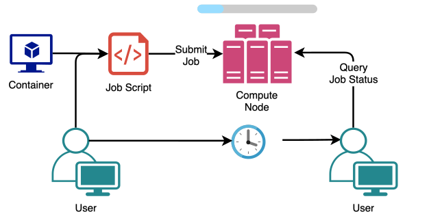

```{r, setup, include=FALSE}

```

## 

<center>*Press the ? key for tips on navigating these slides*</center>

## Introductions

**Natalie Elphick**    
Bioinformatician I   

**Alex Pico**     
Bioinformatics Core Director


## Target Audience
-   Prior experience with UNIX command-line 


## Part 2:

1.    Custom Containers
2.    Submitting Compute Jobs
3.    Array Jobs
4.    GPU Jobs
5.    Running Pipelines
6.    Jupyter Notebooks 
7.    RStudio Server
8.    How to get help


# Custom Containers

## Motivation {.small-bullets}

-   Compute heavy jobs (high RAM, multiple cores) should be run on compute nodes
-   Containers allow us to make additional software available to the compute nodes
    -   Also allows the use of software that might be hard to install on Rocky 8 Linux
    -   Improves reproducibility




## Dockerfile Basics

-   Dockerfiles contain instructions to build an image in **layers**
-   Layers are added using Dockerfile instruction syntax
-   Images are built by navigating to the directory that contains the Dockerfile and running:

```{r, engine='bash', eval=TRUE, results='markup',comment=NA, highlight=TRUE, echo=FALSE}
echo 'docker build .'
```

## Dockerfile Instructions {.small-bullets}
-   First instruction is always **FROM** which specifies the base image
    -   Base images are a starting point with some basics already installed like the OS and build tools, find them on [DockerHub](https://hub.docker.com/)
-   **RUN** : Use before running any shell commands
-   **SHELL** : Set the shell
-   **USER** : Set the user (within the image)
-   **CMD** : Set the default instruction to be run by the image
-   **COPY** : COPY files into the image


See the [Dockerfile documentation](https://docs.docker.com/reference/dockerfile/) for a full list of instructions

## Example Dockerfile {.code-alt}

-   Click [here](https://www.dropbox.com/scl/fi/mdbefp3h8ahdvxtgjypqo/Dockerfile?rlkey=7d4zd9ge1m3wwszlfy78712ky&dl=1) to download the example Dockerfile
-   Open in your preffered text editor


```{r, engine='bash', eval=TRUE, results='markup',comment=NA, highlight=TRUE, echo=FALSE}
curl -s -L -o Dockerfile 'https://www.dropbox.com/scl/fi/mdbefp3h8ahdvxtgjypqo/Dockerfile?rlkey=7d4zd9ge1m3wwszlfy78712ky&dl=0'
cat Dockerfile
rm Dockerfile
```

## Building Example Image

-   Do not run this during the workshop
    -   It requires a lot of RAM
-   On macOS, make sure you have the Docker Desktop App running
-   We can provide an additional argument to the **build** command, -t, to set the name of the docker image
      -   We can add version tags after the name using ":" 
```{r, engine='bash', eval=TRUE, results='markup',comment=NA, highlight=TRUE, echo=FALSE}
echo "docker build -t docker_hub_user/seurat-harmony:1.0 ."
```


## Pushing Images to DockerHub  {.small-bullets}

-   Make sure you are signed in to your DockerHub account locally (Docker Desktop for macOS)
-   The image name must start with your user name

```{r, engine='bash', eval=TRUE, results='markup',comment=NA, highlight=TRUE, echo=FALSE}
echo "docker push docker_hub_user/seurat-harmony:1.0"
```

-   These can then be "pulled" on to Wynton as apptainer image files (image must be public)
```{r, engine='bash', eval=TRUE, results='markup',comment=NA, highlight=TRUE, echo=FALSE}
echo "[alice@dev1 ~]$ apptainer pull docker://docker_hub_user/seurat-harmony:1.0"
```

## Notes on Building Custom Images {.code-small}

-   Time consuming process and uses a lot of RAM on your local machine
-   A good base image can save you a lot of time
-   You must run `apt-get update` and `apt-get install` in the same command
    -   Otherwise you will encounter caching issues
-   Remember to use `apt-get install -y`
    -   You will have no control over the process while it's building

# Compute Jobs


## Submission Script - Basics {.small-bullets .code-alt}

-   [Download](https://www.dropbox.com/scl/fi/fzp33y1ojslw005q8epuz/simple_submission_script.sh?rlkey=xmg3lqec962y3i57a1bkriosx&dl=1) this example job submission script
-   Read the full Wynton [job submission guide](https://wynton.ucsf.edu/hpc/scheduler/submit-jobs.html)
-   Wynton uses the [Sun Grid Engine](https://web.archive.org/web/20210826212738/https://arc.liv.ac.uk/SGE/howto/howto.html) job scheduler


```{r, engine='bash', eval=TRUE, results='markup',comment=NA, highlight=TRUE, echo=FALSE}
curl -s -L -o submission.sh 'https://www.dropbox.com/scl/fi/fzp33y1ojslw005q8epuz/simple_submission_script.sh?rlkey=xmg3lqec962y3i57a1bkriosx&dl=0'
cat submission.sh
rm submission.sh
```

## Submission Script - Apptainer {.small-bullets .code-alt}

-   [Download](https://www.dropbox.com/scl/fi/zzl9fnfcoxu3pyrx5ffd1/apptainer_submission_script.sh?rlkey=w05e18ahw4hvbvaucac379za9&dl=1) this example job submission script that uses a container
-   Paths that the container needs read/write access to need to be mounted with APPTAINER_BINDPATH

```{r, engine='bash', eval=TRUE, results='markup',comment=NA, highlight=TRUE, echo=FALSE}
curl -s -L -o submission.sh 'https://www.dropbox.com/scl/fi/zzl9fnfcoxu3pyrx5ffd1/apptainer_submission_script.sh?rlkey=w05e18ahw4hvbvaucac379za9&dl=1'
cat submission.sh
rm submission.sh
```

## Parallel Processing Jobs {.small-bullets}

-   By default jobs run on a single core
-   Multicore jobs must run in a SGE parallel environment (PE) and tell SGE how many cores the job will use
-   **Do not use more cores than requested**


-   There are four parallel environments on Wynton:
    -   **smp**: for single-host parallel jobs using [Symmetric multiprocessing](https://en.wikipedia.org/wiki/Symmetric_multiprocessing) (SMP)
    -   **mpi**: for multiple-host parallel jobs based on [MPI parallelization](https://en.wikipedia.org/wiki/Message_Passing_Interface)
    -   **mpi_onehost**: for single-host parallel jobs based on MPI parallelization
    -   **mpi-8**: for multi-threaded multi-host jobs based on MPI parallelization

## Example Parallel Job {.small-bullets .code-alt}

-   The simplest parallel environment on Wynton is **smp**, a single node with *n* cores
-   [Download](https://www.dropbox.com/scl/fi/71xo0cioh266pj3uwcdps/smp_submission_script.sh?rlkey=kw7qaz8pip6jveqv317b5swqr&dl=1) this example smp job submission script
```{r, engine='bash', eval=TRUE, results='markup',comment=NA, highlight=TRUE, echo=FALSE}
curl -s -L -o submission.sh 'https://www.dropbox.com/scl/fi/71xo0cioh266pj3uwcdps/smp_submission_script.sh?rlkey=kw7qaz8pip6jveqv317b5swqr&dl=0'
cat submission.sh
rm submission.sh
```


## Array Jobs {.small-bullets .code-alt}

-   This is a good option if the script you want to run operates on discrete sets of data
    - e.g. sample or chromosome
-   [Download](https://www.dropbox.com/scl/fi/upl71jeny62fxfzkxao1f/array_job_submission_script.sh?rlkey=ggkyjxx8nz400e1t96mif5t34&dl=1) this example array job submission script

```{r, engine='bash', eval=TRUE, results='markup',comment=NA, highlight=TRUE, echo=FALSE}
curl -s -L -o submission.sh 'https://www.dropbox.com/scl/fi/upl71jeny62fxfzkxao1f/array_job_submission_script.sh?rlkey=ggkyjxx8nz400e1t96mif5t34&dl=0'
cat submission.sh
rm submission.sh
```

## GPU Jobs  {.small-bullets}

-   To run a [GPU job](https://wynton.ucsf.edu/hpc/scheduler/gpu.html), specify **-q gpu.q** (queue) as a GPU queue
    -   Other GPU queues may be available to you depending on your lab
-   It is important to specify the GPU using the **SGE_GPU** variable so that your job uses its assigned GPU
    -   For CUDA based tools, add **export CUDA_VISIBLE_DEVICES=$SGE_GPU** to your submission script
-   GPU jobs must include a runtime request or they will be removed from the queue


## Submitting and Querying jobs

-   Use **qsub** to submit jobs
```{r, engine='bash', eval=TRUE, results='markup',comment=NA, highlight=TRUE, echo=FALSE}
echo '[alice@dev1 ~]$ qsub job1.sh
Your job 714888 ("job1.sh") has been submitted'
```


-   Use **qstat** to check the status of your jobs

```{r, engine='bash', eval=TRUE, results='markup',comment=NA, highlight=TRUE, echo=FALSE}
echo '[alice@dev1 ~]$ qstat
job-ID  prior   name       user         state submit/start at     queue                          slots ja-task-ID 
-----------------------------------------------------------------------------------------------------------------
 714888 0.06532 job1 alice     r     03/25/2024 19:54:18 member.q@msg-hmio1                 1        
 714889 0.06532 job2 alice     r     03/25/2024 19:54:19 member.q@msg-hmio1                 1        
'
```


Read the [querying jobs](https://wynton.ucsf.edu/hpc/scheduler/list-jobs.html) Wynton documentation for more information.


## Estimating Job Resources

-   Try to estimate the amount of RAM needed using a small test dataset
-   Request a little more RAM than you need to avoid having your job cancelled
-   Check on jobs you are running for the first time with **qstat -j <job-id>** to make sure they are not going over


## Poll 3

Anything that you can run on a compute node can be run on a development node.

1.    True
2.    False


# Running Pipelines


## Nextflow RNA-seq {.small-bullets .big-picture}

-   Scientific workflow system with a community maintained set of core bioinformatics [analysis pipelines](https://nf-co.re/)
-   The most commonly used one is the [RNA-seq pipeline](https://nf-co.re/rnaseq/3.14.0)


## Example - RNA-seq Pipeline {.small-bullets}

**Do not run this during the workshop as it will fill up the Wynton SGE queue**

-   Download the [testing script](https://www.dropbox.com/scl/fi/3c9qdmnwg8vw9x517mo05/nextflow_example.sh?rlkey=e9nxbvpcdtdyi5w0y16z9k7bq&dl=0)
    -   Runs a minimal test on the RNA-seq pipeline
-   Download the [config file](https://www.dropbox.com/scl/fi/befhl3z6nipn1fqcxpqth/nextflow.config?rlkey=pd8d9vup6pnvb7bbrmekayn2j&dl=0)
    -   Configures nextflow to use the SGE job scheduler and sets limits on compute job resources for each process
-   Put these in the same directory (do not use your user home directory for this) and run the script in a screen/tmux session
-   When not running the test, the **-profile** should be apptainer


# Jupyter Notebooks 

## Installing Jupyter Notebooks
-   The preferred way to install and use [Jupyter notebooks](https://wynton.ucsf.edu/hpc/howto/jupyter.html) on Wynton is though pip, not conda
```{r, engine='bash', eval=TRUE, results='markup',comment=NA, highlight=TRUE, echo=FALSE}
echo 'python3 -m pip install --user notebook'
```
-   Jupyter notebooks can only be run on development nodes
-   See the Wynton [python documentation](https://wynton.ucsf.edu/hpc/howto/python.html) for more info on managing python environments on Wynton


## Running Jupyter Notebooks - Step 1

-   You cannot connect from outside Wynton HPC directly to a development node
    -   Instead we need to use SSH port forwarding to establish the connection with a local web browser
-   Find an available TCP port:
```{r, engine='bash', eval=TRUE, results='markup',comment=NA, highlight=TRUE, echo=FALSE}
echo '[alice@dev1 ~]$ module load CBI port4me
[alice@dev1 ~]$ port4me --tool=jupyter
47467'
```

Note the port number returned by port4me, you will need this later.


## Running Jupyter Notebooks - Step 2 {.code-small}
-   Launch Jupyter notebook using the port numer from step 1
```{r, engine='bash', eval=TRUE, results='markup',comment=NA, highlight=TRUE, echo=FALSE}
echo '[alice@dev1]$ jupyter notebook --no-browser --port 47467
[I 2024-03-20 14:48:45.693 ServerApp] jupyter_lsp | extension was successfully linked.
[I 2024-03-20 14:48:45.698 ServerApp] jupyter_server_terminals | extension was successfully linked.
[I 2024-03-20 14:48:45.703 ServerApp] jupyterlab | extension was successfully linked.
[I 2024-03-20 14:48:45.708 ServerApp] notebook | extension was successfully linked.
[I 2024-03-20 14:48:46.577 ServerApp] notebook_shim | extension was successfully linked.
[I 2024-03-20 14:48:46.666 ServerApp] notebook_shim | extension was successfully loaded.
[I 2024-03-20 14:48:46.668 ServerApp] jupyter_lsp | extension was successfully loaded.
[I 2024-03-20 14:48:46.669 ServerApp] jupyter_server_terminals | extension was successfully loaded.
[I 2024-03-20 14:48:46.675 LabApp] JupyterLab extension loaded from /wynton/home/boblab/alice/.local/lib/python3.11/site-packages/jupyterlab
[I 2024-03-20 14:48:46.675 LabApp] JupyterLab application directory is /wynton/home/boblab/alice/.local/share/jupyter/lab
[I 2024-03-20 14:48:46.677 LabApp] Extension Manager is 'pypi'.
[I 2024-03-20 14:48:46.707 ServerApp] jupyterlab | extension was successfully loaded.
[I 2024-03-20 14:48:46.711 ServerApp] notebook | extension was successfully loaded.
[I 2024-03-20 14:48:46.712 ServerApp] Serving notebooks from local directory: /wynton/home/boblab/alice
[I 2024-03-20 14:48:46.712 ServerApp] Jupyter Server 2.13.0 is running at:
[I 2024-03-20 14:48:46.712 ServerApp] http://localhost:44214/tree?token=8e37f8d62fca6a1c9b2da429f27df5ebcec706a808c3a8f2
[I 2024-03-20 14:48:46.712 ServerApp]     http://127.0.0.1:44214/tree?token=8e37f8d62fca6a1c9b2da429f27df5ebcec706a808c3a8f2
[I 2024-03-20 14:48:46.712 ServerApp] Use Control-C to stop this server and shut down all kernels (twice to skip confirmation).
[C 2024-03-20 14:48:46.725 ServerApp]

    To access the server, open this file in a browser:
        file:///wynton/home/boblab/alice/.local/share/jupyter/runtime/jpserver-2853162-open.html
    Or copy and paste one of these URLs:
        http://localhost:44214/tree?token=8e37f8d62fca6a1c9b2da429f27df5ebcec706a808c3a8f2
        http://127.0.0.1:44214/tree?token=8e37f8d62fca6a1c9b2da429f27df5ebcec706a808c3a8f2'
```

## Running Jupyter Notebooks - Step 3

- Set up SSH port forwarding on your local machine in a separate terminal, leave both terminals open
```{r, engine='bash', eval=TRUE, results='markup',comment=NA, highlight=TRUE, echo=FALSE}
echo '{local}$ ssh -J alice@log1.wynton.ucsf.edu -L 47467:localhost:47467 alice@dev1
...
[alice@dev1 ~]$ '
```

The notebook should now be available at the URL from step 2


# RStudio Server

## RStudio Server
-   [RStudio server](https://wynton.ucsf.edu/hpc/howto/rstudio.html) is already available in the CBI module
-   This allows you to set up a personal RStudio instance that only you can access
-   Requires two separate SSH connections to the cluster:\
    -   One to launch RStudio Server
    -   One to connect to it


## RStudio Server - Step 1 {.code-small}

-   Launch your own RStudio Server instance
```{r, engine='bash', eval=TRUE, results='markup',comment=NA, highlight=TRUE, echo=FALSE}
echo '[alice@dev1 ~]$ module load CBI rstudio-server-controller
[alice@dev1 ~]$ rsc start
alice, your personal RStudio Server 2023.09.1-494 running R 4.3.2 is available on:

  <http://127.0.0.1:20612>

Importantly, if you are running from a remote machine without direct access
to dev1, you need to set up SSH port forwarding first, which you can do by
running:

  ssh -L 20612:dev1:20612 alice@log1.wynton.ucsf.edu

in a second terminal from your local computer.

Any R session started times out after being idle for 120 minutes.
WARNING: You now have 10 minutes, until 2023-11-15 17:06:50-08:00, to
connect and log in to the RStudio Server before everything times out.
Your one-time random password for RStudio Server is: y+IWo7rfl7Z7MRCPI3Z4'
```

Note the password and URL, they will be needed to log in to the server instance.


## RStudio Server - Step 2

-   Connect to your personal RStudio Server instance from your local machine in a separate terminal
```{r, engine='bash', eval=TRUE, results='markup',comment=NA, highlight=TRUE, echo=FALSE}
echo '{local}$ ssh -L 20612:dev1:20612 alice@log1.wynton.ucsf.edu
alice1@log1.wynton.ucsf.edu:s password: XXXXXXXXXXXXXXXXXXX
[alice@log1 ~]$ '
```

## RStudio Server - Step 3
-   Open RStudio Server in your local web browser
-   Open the link from step 1
-   Enter your Wynton user name
-   Enter the password from step 1

# How to Get Help

## Wynton Questions

-   Follow the Wynton [question checklist](https://wynton.ucsf.edu/hpc/support/index.html)
-   Email
    -   [support@wynton.ucsf.edu](mailto:support@wynton.ucsf.edu)
-   Slack
    -   [ucsf-wynton](https://join.slack.com/t/ucsf-wynton/signup)
    -   Sign-up using a UCSF email address
    -   Email support if that does not work
-   Zoom office hours every **Tuesday at 11-12pm**
    -   Zoom URL in the message-of-the-day (MOTD) that you get when you log into Wynton


## Bioinformatics Questions

-   Email
    -   [bioinformatics@gladstone.ucsf.edu](mailto:bioinformatics@gladstone.ucsf.edu)
-   Slack channel #questions-about-bioinformatics
    -   Contact us at the email above to be added to the channel


# End of Part 2

## Thank You!

-   Please take some time to fill out the workshop survey:   
[https://www.surveymonkey.com/r/F75J6VZ](https://www.surveymonkey.com/r/F75J6VZ)


## Upcoming Data Science Training Program Workshops


[Introduction to Linear Mixed Effects Models](https://gladstone.org/events/introduction-linear-mixed-effects-models)   
April 25-April 26, 2024 1-3pm PDT

[Single Cell RNA-Seq Data Analysis](https://gladstone.org/events/single-cell-rna-seq-data-analysis)     
April 29-April 30, 2024 9am-4pm PDT

[Single Cell ATAC-Seq Data Analysis Part 1](https://gladstone.org/events/single-cell-atac-seq-data-analysis-part-1-1)    
May 6-May 7, 2024 1-4pm PDT


[Complete Schedule](https://gladstone.org/events?series=189)     


